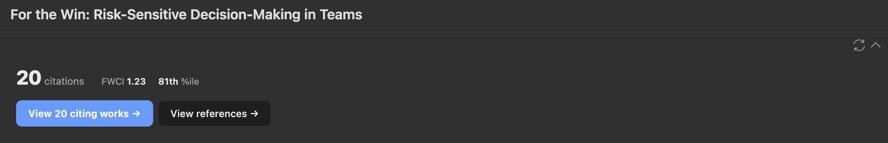

# Summary

Citegeist is a plugin for Zotero 7+ (including Zotero 8) that embeds citation intelligence directly into the reference manager. For any item with a recognizable identifier — DOI, PubMed ID (PMID), arXiv ID, or ISBN — Citegeist retrieves article-level metrics from OpenAlex [@priem2022openalex], a free and open index of over 250 million scholarly works, and displays them as sortable columns and a contextual detail pane. It also provides journal-level metrics from the OpenAlex Sources API and matches journals against four bundled ranking lists covering 3,177 journals. A built-in citation network browser supports forward and backward citation chaining with one-click import of discovered papers into the researcher's Zotero library.

No API key, institutional subscription, or account is required.

# Statement of Need

Citation analysis is integral to scholarly research. Researchers trace citation chains forward and backward &mdash; a method known as snowballing [@wohlin2014guidelines] &mdash; to discover related literature, map intellectual lineages, and evaluate the influence of published work. During tenure cases, grant applications, and hiring decisions, committees increasingly examine citation-based indicators, though the Leiden Manifesto [@hicks2015leiden] and DORA [@dora2012] have called for these to be used responsibly, with field-level context rather than raw counts.

Raw citation counts alone are misleading across disciplines. Citation norms vary widely: a paper in consumer psychology with 50 citations may be well above the field average, while the same count in biomedicine may be unremarkable [@waltman2016review]. Field-Weighted Citation Impact (FWCI) addresses this by comparing a paper's citations to the expected average for papers of the same field, year, and document type [@purkayastha2019comparison]. An FWCI of 1.0 means exactly the world average; 2.0 means twice the expected citations. Percentile rankings provide complementary intuition (e.g., "85th percentile" means cited more than 85% of comparable papers). Citegeist retrieves both metrics from OpenAlex and presents them alongside journal-level indicators &mdash; 2-year mean citedness (an open analogue of the Journal Impact Factor) and journal h-index &mdash; and four journal ranking lists commonly used in business and management research: UTD24, FT50, ABDC (2025), and AJG (2024).

The typical workflow today involves leaving the reference manager, navigating to Web of Science, Scopus, or Google Scholar, searching for each paper individually, and manually recording results. This is especially burdensome during large-scale literature reviews where review articles synthesize hundreds of sources [@palmatier2018review; @snyder2019literature].

Zotero [@zotero] is a widely used free, open-source reference manager, yet it provides no built-in citation metrics. Several existing plugins address parts of this gap. \autoref{tab:comparison} summarizes the landscape.

: Comparison of Zotero citation plugins. Only actively maintained plugins with Zotero 7+ support are included. \label{tab:comparison}

| Feature | Cit.Counts Mgr | Cit. Tally | GS Count | scite | Cita | **Citegeist** |
|---|---|---|---|---|---|---|
| Data source | Crossref, S2 | Crossref, S2 | Google Scholar | scite.ai | Wikidata, OA, S2 | OpenAlex |
| Cost | Free | Free | Free | Paid | Free | Free |
| Raw citation counts | Yes | Yes | Yes | No | No | Yes |
| Non-DOI identifiers (PMID, arXiv, ISBN) | No | No | No | No | No | **Yes** |
| FWCI column (sortable) | No | No | No | No | No | **Yes** |
| Percentile column | No | No | No | No | No | **Yes** |
| Journal metrics | No | No | No | No | No | **Yes** |
| Journal rankings (UTD24, FT50, ABDC, AJG) | No | No | No | No | No | **Yes** |
| Citation trend | No | No | No | No | No | **Yes** |
| Citation network browsing | No | No | No | No | Yes (graph) | **Yes** (list) |
| One-click import to library | No | No | No | No | No | **Yes** |
| Collection filing on import | No | No | No | No | No | **Yes** |
| Retraction detection | No | No | No | No | No | **Yes** |
| Citation context (supporting/contrasting) | No | No | No | Yes | No | No |

ZoteroCitationCountsManager [@zotero_citationcounts_manager] and zotero-citation-tally [@zotero_citation_tally] retrieve raw counts from Crossref and Semantic Scholar, while zotero-google-scholar-citation-count [@zotero_google_scholar_count] scrapes Google Scholar with the associated risk of rate limiting and bot detection. These plugins provide counts without field context, offering no way to judge whether a count is high or low for a given discipline. The scite Zotero plugin [@scite_zotero] classifies citations as supporting, mentioning, or contrasting, but requires a paid subscription and does not provide counts or field-normalized metrics. Cita [@zotero_cita] manages citation metadata via Wikidata, Crossref, and Semantic Scholar, and can visualize a citation network graph, but focuses on metadata curation and Wikidata synchronization rather than field-normalized metrics or literature discovery workflows. The Inciteful plugin [@inciteful_zotero] provides network visualization but launches an external website rather than operating within Zotero.

Citegeist is the only Zotero plugin that combines multi-identifier resolution (DOI, PMID, arXiv, ISBN), field-normalized citation metrics, journal-level indicators, journal ranking lists, citation trend analysis, and in-Zotero citation network browsing with one-click import. By using OpenAlex &mdash; a fully open, free-to-use index &mdash; it requires no authentication and no payment. The citation network browser enables the forward and backward citation chaining foundational to systematic literature discovery [@wohlin2014guidelines], building on the concept of citation indexing introduced by @garfield1955citation, without leaving Zotero.

# Design

{width="100%"}

{width="80%"}

Citegeist adds three components to Zotero:

**Nine sortable columns** display article-level metrics (citation count, FWCI, percentile), journal-level metrics (2-year mean citedness, journal h-index), and journal rankings (UTD24, FT50, ABDC 2025, AJG 2024). Clicking any column header sorts the library by that metric. FWCI sorting surfaces papers that are highly cited relative to their field rather than papers in high-citation disciplines. Journal ranking columns resolve from a bundled ISSN lookup table covering 3,177 journals with zero API calls, providing instant results even offline.

**A Citation Intelligence pane** appears in the item detail sidebar. It displays the citation count, FWCI (with plain-language explanation), percentile ranking, top 1%/10% badges, and a year-over-year citation trend showing whether a paper's influence is growing or declining.

**A citation network browser** lets researchers explore citing works (forward chaining) and references (backward chaining) in a modal dialog. Results show title, authors, venue, year, citation count, open-access status, and retraction warnings. Each result has a split button: the main action adds the paper to a chosen default collection with complete metadata; the dropdown opens a per-item collection picker for filing to specific folders. Duplicate detection prevents re-importing items already in the library. Expandable abstracts are fetched on demand.

All data is cached in each item's Extra field using namespaced keys (e.g., `Citegeist.citedByCount: 42`), preserving data across sessions and through Zotero Sync.

# Implementation

Citegeist is implemented in TypeScript and built with esbuild into a single bundle. It targets Zotero 7 and later (including Zotero 8), using the plugin APIs introduced in Zotero 7: `ItemPaneManager` for the sidebar section, `ItemTreeManager` for custom sortable columns, and standard DOM APIs for the citation network dialog. The plugin communicates with the OpenAlex REST API through a centralized rate limiter that enforces a maximum of 8 requests per second (below OpenAlex's polite-pool limit of 10 req/s), with exponential backoff on HTTP 429 responses. Responses are cached locally with a configurable expiration period (default: 7 days). Users can optionally provide an email to access OpenAlex's polite pool for higher rate limits.

Identifier resolution follows a priority chain: DOI (via the Zotero DOI field), then PubMed ID (parsed from the Extra field), then arXiv ID (from the Extra field, the item's Archive ID field, or an arxiv.org URL), then ISBN (for book and book section item types). Each identifier type maps to a distinct OpenAlex endpoint (`works/doi:`, `works/pmid:`, `works/arxiv:`, `works/isbn:`). This extends coverage to preprints, biomedical literature without DOIs, and books. Because OpenAlex's citation coverage for books is incomplete, zero citation counts for book items are suppressed in the display layer to avoid misleading indicators.

Journal ranking columns use a bundled ISSN-keyed lookup table derived from a comprehensive master list covering 3,177 journals across business, management, economics, finance, information systems, marketing, and psychology. The table includes an alias index mapping electronic ISSNs to their canonical print ISSNs, so lookup succeeds regardless of which ISSN form OpenAlex returns. Rankings are sourced from the ABDC Quality List 2025, the ABS Academic Journal Guide 2024, and the UTD24 and FT50 lists (both 2024 editions).

It should be noted that FWCI values provided by OpenAlex may differ from those reported by proprietary services such as Scopus or SciVal, because the underlying corpus, field classification, and calculation methodology differ [@purkayastha2019comparison]. Citegeist presents OpenAlex's FWCI as provided, without modification. Percentile and FWCI values are suppressed for papers with zero citations to avoid misleading field-relative rankings for recently published work.

The plugin is distributed as a standard Zotero `.xpi` file and supports automatic updates via GitHub Releases. Installation requires no command-line tools &mdash; researchers download a single file, open it in Zotero, and restart.

The project includes automated tests covering utility functions, OpenAlex response parsing, author formatting, abstract reconstruction, cache read/write logic (including journal-level fields), journal ranking lookup, and service-layer orchestration, run via Vitest in continuous integration. An integration test validates live communication with the OpenAlex API against a known DOI. Full documentation, including installation instructions and a getting-started guide, is in the project README. Community contribution guidelines are in `CONTRIBUTING.md`.

# Acknowledgements

Citegeist relies on the OpenAlex open bibliometric index. The author thanks the OpenAlex team for providing free, comprehensive access to scholarly metadata and citation data.

# References
