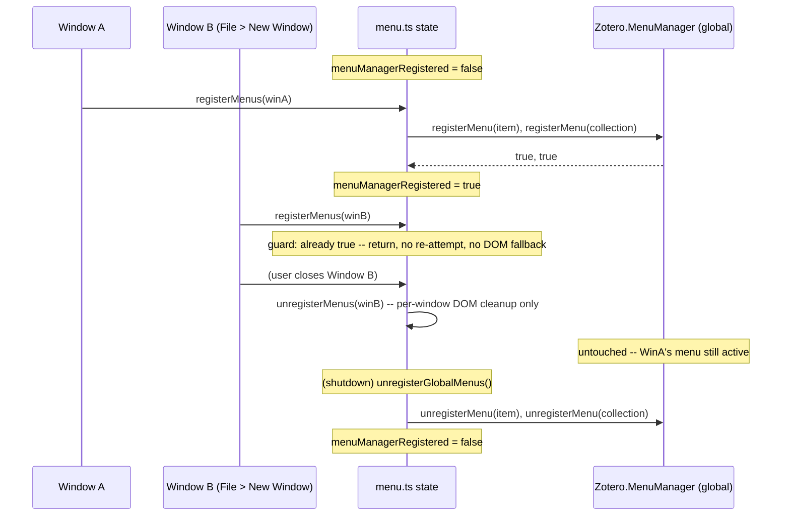

# fix: Repair Zotero MenuManager context-menu registration lifecycle

## Summary

Two independent bugs behind Zotero 8/9's `MenuManager` context-menu path, both root-caused directly against Zotero core's own source: context-menu labels render blank, and the registration entry point mishandles being called more than once per process, which can leave a duplicate DOM menu layered on top of the live MenuManager one, or silently kill the menu in every other open window. Fix is confined to `src/modules/menu.ts`, `addon/locale/en-US/citegeist.ftl`, and `src/hooks.ts`.

## Problem Frame

[GitHub issue #67](https://github.com/phdemotions/zotero-citegeist/issues/67) (two independent reporters, Zotero 9.0.5 / Windows, v2.0.4): right-clicking an item shows Citegeist's menu entries with no visible label text (though they're still clickable), and after using one once, right-click stops responding anywhere in Zotero until the plugin is disabled and re-enabled.

Both root causes were confirmed by reading Zotero's actual core source (`zotero/zotero` at commit `55eceab`), not assumed:

- **Blank labels.** `addon/locale/en-US/citegeist.ftl` defines the four menu strings as bare Fluent messages (`citegeist-menu-fetch = Fetch Citation Counts`). Zotero's `MenuManager` (`chrome/content/zotero/xpcom/pluginAPI/menuManager.js:453-454`) sets `menuElem.dataset.l10nId` on a XUL `<menuitem>`. Fluent's DOM overlay only fills the `label`/`accesskey` **attributes** of a menuitem via the `.label =` attribute syntax — a menuitem has no text-node child for a bare `.value` translation to land in, so it renders empty. `citegeist-pane-refresh` and `citegeist-pane-settings`, two lines above the broken entries in the same file, already use the correct `.title` attribute form for their own tooltip text — the fix is applying that same already-proven pattern to the menu labels.
- **Right-click death.** `src/modules/menu.ts:470-485` (`registerMenus`) treats any `false` return from `Zotero.MenuManager.registerMenu()` as "MenuManager unavailable, fall back to DOM." But `pluginAPIBase.mjs:177-194` (Zotero core) rejects with `false` for one specific, indistinguishable-from-outside reason relevant here: the `menuID` is a **process-global** registry key, already registered. `registerMenus(win)` legitimately runs more than once per process — a second Zotero library window via File → New Window fires `onMainWindowLoad` again (`chrome/content/zotero/xpcom/plugins.js:93-110`) — and each re-invocation currently misreads the resulting "duplicate" rejection as failure, permanently injecting a second, uncoordinated DOM menu system onto the same popup that MenuManager is still actively managing. This dual-registration state is confirmed wrong regardless of the exact freeze mechanism — Zotero's own API contract treats the menuID as a singleton, and nothing in the plugin should inject a second competing system once one is active. The specific causal link from that dual state to "right-click permanently dead" is this plan's best-evidenced working hypothesis from static source analysis, not a traced runtime stack; the manual QA pass below (step 3) is where it gets empirically confirmed. Disable/re-enable is the only existing path that tears both systems down and resets the global registry, incidentally "fixing" it — consistent with the dual-registration theory either way.

A third, related defect was found verifying the teardown side of the same code during planning: `unregisterMenus(win)` is called from `onMainWindowUnload` on **every** window close, but it unconditionally tears down the same process-global MenuManager registration — so closing one secondary Zotero window silently removes Citegeist's context menu from every other window still open, for the rest of the session. This is the same "MenuManager registration treated as per-window" misconception as the main bug, just on the unregister side; fixing the registration guard without also fixing this leaves the underlying defect class half-fixed.

## Requirements

- R1. Context-menu entries (Fetch Citation Counts, View Citing Works, View References, Fetch All Citation Counts) render their configured label text on the MenuManager path (Zotero 8+).
- R2. Calling the menu-registration entry point more than once in a single process lifetime does not inject a second, DOM-based copy of the menu items alongside an active MenuManager registration.
- R3. Closing one Zotero library window does not remove Citegeist's context-menu entries from other windows that remain open.
- R4. The existing behavior for a genuine single-call MenuManager rejection (roll back what succeeded, fall back to DOM) is unchanged.

## Key Technical Decisions

- **Fix labels via Fluent `.label`/`.accesskey` attributes, not textContent.** `menuitem` is attribute-only per Fluent's XUL overlay allow-list (confirmed against Zotero's own `menuManager.js`, which sets `dataset.l10nId` on a bare `<menuitem>` with no text-node child). This exactly mirrors the `.title` pattern already correctly used by `citegeist-pane-refresh`/`citegeist-pane-settings` two lines above in the same file — no new pattern introduced.
- **Idempotency is a local module flag, not a parsed rejection reason.** Zotero's `registerMenu` returns bare `false` for "duplicate" and "genuinely invalid" alike, with no reason string exposed (confirmed in `pluginAPIBase.mjs:_validate`). The only reliable way to distinguish "already active" from "rejected" is tracking our own prior success, mirroring the existing `registered` boolean guard in `src/modules/citationColumn.ts` (`registerCitationColumn`/`unregisterCitationColumn`) rather than inventing a new pattern.
- **Split teardown into per-window (DOM-only) and global (MenuManager) responsibilities.** MenuManager registration is process-global; window close events are per-window. Conflating the two is what causes R3's defect. `unregisterMenus(win)` keeps its existing DOM-node cleanup (still correct and needed for Zotero 7.0.x windows); a new `unregisterGlobalMenus()` owns the MenuManager teardown and only runs from plugin shutdown.
- **No new accesskeys invented.** The DOM fallback path deliberately gives View Citing/References no accesskey ("infrequent; Tab + Enter works"). The MenuManager path's `.accesskey` additions (Fetch → `G`, Fetch All → `I`) mirror the DOM path's existing mnemonics exactly rather than adding new ones.

## High-Level Technical Design

Registration/teardown across two windows and shutdown, before and after:



## Scope Boundaries

- **Checked, confirmed unaffected:** `citegeist-pane-header`/`citegeist-pane-sidenav` use the same bare-value FTL syntax but render into an `ItemPaneManager` header/sidenav slot, not a XUL `menuitem` — a different target element type. This text has shipped and rendered correctly since v2.0.0 with no reports of blank text, unlike the two independent reports specific to the context menu. No change.
- **Checked, already correct:** `citegeist-pane-refresh`/`citegeist-pane-settings` already use `.title` attribute syntax — used as the precedent pattern for this fix, not touched.
- **Out of scope:** `registerViaDOM`'s own element-creation logic (the Zotero-7.0.x-only path) is unchanged — only the guard deciding whether it runs is touched.

## Implementation Units

### U1. Fix Fluent attribute syntax for context-menu labels

**Goal:** Menu item labels render their configured text on the MenuManager path.
**Requirements:** R1
**Dependencies:** none
**Files:** `addon/locale/en-US/citegeist.ftl`, `test/menu.test.ts`
**Approach:** Rewrite the four `citegeist-menu-*` entries from bare-value to `.label` attribute form; add `.accesskey` to `citegeist-menu-fetch` (`G`) and `citegeist-menu-fetch-collection` (`I`) only, matching the DOM path's existing mnemonics. Leave `citegeist-menu-citing`/`citegeist-menu-refs` without an accesskey, matching the DOM path's deliberate omission.
**Patterns to follow:** `citegeist-pane-refresh`/`citegeist-pane-settings` in the same file — already-correct `.title` attribute form.
**Test scenarios:**
- Static: every `citegeist-menu-*` message in `citegeist.ftl` defines a `.label` sub-attribute (file-content regex assertion, mirroring the raw-hex-regex guard in `test/ui-primitives.test.ts`).
- Static: `citegeist-menu-fetch` and `citegeist-menu-fetch-collection` also define `.accesskey`; `citegeist-menu-citing`/`citegeist-menu-refs` deliberately do not.
**Verification:** New test passes; visible label text confirmed in the manual QA pass below.

### U2. Idempotent MenuManager registration guard

**Goal:** A second call to `registerMenus` is a no-op once MenuManager is already active — no re-attempt, no DOM fallback.
**Requirements:** R2, R4
**Dependencies:** none
**Files:** `src/modules/menu.ts`, `test/menu.test.ts`
**Approach:** Add module-level `let menuManagerRegistered = false;` alongside the existing `menuPluginID` state. `registerMenus` returns immediately if the flag is already `true`. Set it `true` only when `registerViaMenuManager` returns `true` (full success for both menus). The existing attempt/rollback/DOM-fallback logic for a genuine single-call rejection is untouched — it only runs while the flag is still `false`.
**Technical design (directional):**
```
registerMenus(win):
  if menuManagerRegistered: return        # new — short-circuits re-attempt AND DOM fallback
  ...existing mm-present branch...
  if registerViaMenuManager(...) succeeds:
    menuManagerRegistered = true; return
  ...existing DOM fallback, unchanged...
```
**Patterns to follow:** The `registered` boolean guard in `src/modules/citationColumn.ts` (`registerCitationColumn`/`unregisterCitationColumn`) — same shape, flag set on success, reset on teardown.
**Test scenarios:**
- Calling `registerMenus(win)` twice in sequence (MenuManager present, mock succeeds both times) results in `registerMenu` invoked exactly twice total, both on the first call — the second call must not invoke it again.
- After two calls, no DOM nodes were injected (`doc.getElementById(MENU_IDS.fetchCitations)` stays `null`).
- The existing "rolls back the item menu and falls back to DOM when the collection registration is rejected" scenario (`test/menu.test.ts:199`) still passes unmodified — a genuine single-call partial failure is unaffected by the new guard.
- Calling `registerMenus` with a second, distinct `win` object after a successful first-window registration is also a no-op — proves the guard is process-global, not per-window.
**Verification:** New and existing tests green; `npm run typecheck`.

### U3. Correct global-vs-per-window teardown

**Goal:** Closing one window never removes the MenuManager registration other open windows still depend on.
**Requirements:** R3
**Dependencies:** U2 (shares `menuManagerRegistered`)
**Files:** `src/modules/menu.ts`, `src/hooks.ts`, `test/menu.test.ts`
**Approach:** Keep `unregisterMenus(win)` as pure per-window DOM cleanup (its existing DOM-node-removal loop — still needed for Zotero 7.0.x windows and to mop up stray fallback nodes). Add `unregisterGlobalMenus()` (no `win` parameter): calls `mm.unregisterMenu` for both menu IDs and resets `menuManagerRegistered = false`. In `src/hooks.ts`, `onMainWindowUnload` keeps calling only `unregisterMenus(win)`. `onShutdown` calls `unregisterGlobalMenus()` **unconditionally**, alongside (not nested inside) its existing `if (win) unregisterMenus(win);` guard — global MenuManager teardown must not depend on whether `Zotero.getMainWindow()` returned a window, since the registration it's undoing was never window-scoped to begin with.
**Patterns to follow:** The existing `onShutdown` error-wrapping style in `src/hooks.ts` (try/catch + `logError` per cleanup call).
**Test scenarios:**
- Calling `unregisterMenus(win)` alone (simulating one window closing) does not call `mm.unregisterMenu` — the global registration stays intact.
- Calling `unregisterGlobalMenus()` calls `mm.unregisterMenu` for both `citegeist-item-menu` and `citegeist-collection-menu` and resets the idempotency flag, so a subsequent `registerMenus` call re-attempts rather than no-ops.
- Integration-shaped: register → `unregisterMenus(winB)` (window B closes) → `registerMenus(winB)` again must still be a no-op (globally, still registered) — proves U2's flag survives a per-window-only teardown.
- The existing "unregisters both MenuManager menus on teardown" scenario (`test/menu.test.ts:211-218`) currently asserts that `unregisterMenus(win)` alone triggers both `mm.unregisterMenu` calls — the direct opposite of this unit's split. Rewrite that scenario to call `unregisterGlobalMenus()` instead of `unregisterMenus(win)` so its assertion matches the new division of responsibility.
**Verification:** New and updated tests green; manual QA step below (close secondary window, menu persists in primary).

### U4. Changelog entry

**Goal:** Document the fix for release notes and issue closure.
**Requirements:** R1, R2, R3
**Dependencies:** U1, U2, U3
**Files:** `CHANGELOG.md`
**Approach:** Add a `### Fixed` bullet under `[Unreleased]` in the existing bold-summary-then-prose style, describing the invisible-label and right-click-death fix in user-facing language and crediting issue #67.
**Test expectation:** none -- pure documentation, no behavior to test.
**Verification:** Entry reads naturally alongside the existing `[Unreleased]` structure.

## Risks & Dependencies

- Manual QA (below) requires a real multi-window Zotero 9.x session — vitest cannot observe live popup/window behavior, so this is the only verification for R2/R3's actual user-visible fix, not just the mocked registration-count assertions.
- Low overall risk: the fix is confined to one module's registration/teardown guards plus a locale file, follows an already-established local pattern (`citationColumn.ts`), and the existing test suite's partial-failure scenario is preserved unmodified (verified during planning, not just assumed).

## Sources / Research

- `chrome/content/zotero/xpcom/pluginAPI/menuManager.js:453-454` (Zotero core, commit `55eceab`) — confirms `l10nID` is applied via `dataset.l10nId` on a bare `<menuitem>`, which requires Fluent's attribute syntax to render.
- `chrome/content/zotero/xpcom/pluginAPI/pluginAPIBase.mjs:177-194` — confirms `registerMenu`'s `false` return is a generic "rejected" signal (duplicate mainKey or failed validation) with no reason exposed.
- `chrome/content/zotero/xpcom/plugins.js:93-110` — confirms `onMainWindowLoad` fires per newly opened window via `Services.wm`'s `onOpenWindow` listener, independent of `onStartup`.
- `src/modules/citationColumn.ts:53-54, 216-242, 493-518` — the existing `registered` module-flag pattern this fix mirrors.

## Documentation / Operational Notes

Manual QA on real Zotero 9.x (this bug is specifically about live popup/window interaction vitest cannot observe):

1. `npm run build:dev`, install the proxy build, restart Zotero.
2. Right-click an item in the main library window — confirm all four Citegeist entries show visible label text (not blank).
3. Run "Fetch Citation Counts" once. Right-click several more items in a row — confirm the context menu keeps opening every time (the reported failure mode).
4. File → New Window to open a second library window. Right-click items in both windows — confirm labels render in both, no duplicated/garbled entries in either.
5. Close the second window. Right-click in the first (remaining) window — confirm Citegeist's entries are still present and functional.
6. Disable and re-enable the plugin (the previous workaround) — confirm it still works cleanly afterward, as a regression safety net.
