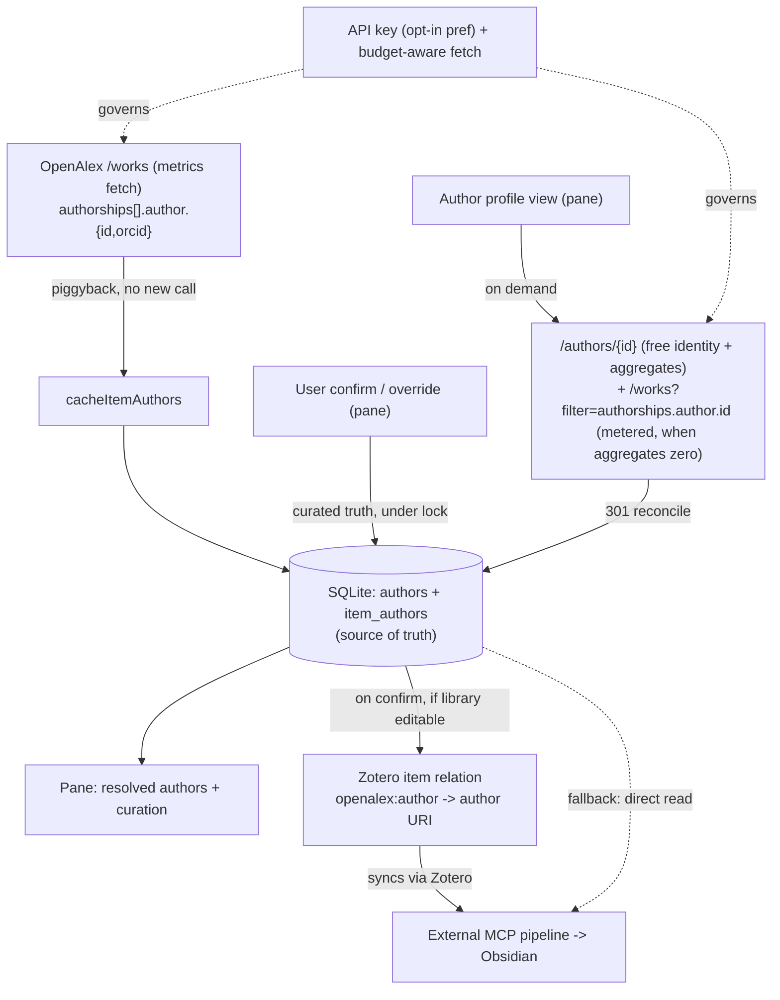

# feat: Author Identity Layer

> Requirement IDs (R1–R13) and Acceptance Examples (AE1–AE3) are defined in the origin doc: `docs/brainstorms/2026-07-16-author-identity-layer-requirements.md`. This plan references them; it does not redefine them.

## Summary

Give Citegeist a first-class author layer. Resolve each library item's authors to their OpenAlex identity as items are fetched, let the user confirm or correct that identity so attribution is trustworthy, and add a Google-Scholar-style author profile in the item pane — an author's works and derived metrics, with one-click add-to-library. Curated identity persists in new normalized SQLite tables and is asserted as a synced, standards-based Zotero relation the user's Obsidian pipeline can read. Because OpenAlex moved to a metered/paid model (July 2026), the plan's foundation is correct API-key handling; identity resolution adds no *new* per-item call but is not retroactively free for an already-cached library (see KTD8).

## Problem Frame

A Zotero creator is a bare name string — no identifier (`typings/zotero.d.ts:34-39`). Two "J. Wang" entries are indistinguishable; one person split across "Baumeister, R." and "Baumeister, R. F." fragments into two apparent authors. OpenAlex already disambiguates authorships to stable author IDs (ORCID-anchored where available), and that data arrives on every work Citegeist fetches for metrics (`src/modules/openalex.ts:47-60`) — but the code discards it at display and creator-mapping time (`src/modules/citationNetwork/actions.ts:327-348`). The result: notes flowing into Obsidian can't reliably attribute a claim to a person, and to see an author's body of work the user must leave Zotero for Google Scholar.

Two constraints discovered during research reshape the build (see origin, and Sources below):
- **OpenAlex is now metered/paid** and has dropped the `mailto` polite pool. Singleton author lookups are free; works-list calls are metered against a daily budget. Citegeist's fetch layer is built on the obsolete `mailto` mechanism and affects *every* current call (citation counts, rankings), not just the author feature — so fixing it is both foundational and urgent (see Delivery & Sequencing).
- **The OpenAlex Authors entity is returning zeroed aggregates** in production while the Works index is healthy — so author metrics are derived from works, with a fallback to the (free, exact) author aggregates when they return non-zero (KTD2).

---

## Key Technical Decisions

- **KTD1 — Metered-API + API-key handling is the foundation (July-2026 best practice).** OpenAlex meters requests ($0.10/day anonymous, $1/day with a free key; singleton lookups free, list+filter ~$0.0001/call). Add an **optional** API key — opt-in, no default baked in (mirrors the no-default-`mailto` stance, `feedback_no_default_openalex_mailto` memory). Store it in a Zotero pref rendered as a password field. Security controls (all in U1):
  - **Redaction is centralized, not per-callsite.** Sanitize the key out of any URL/message **inside `normalizeError`/the throw path**, so no route to `Zotero.debug` can leak it — `openalex.ts` already logs caught errors via direct `Zotero.debug(normalizeError(e))` in its retry paths that bypass `logError`. Redaction scoped only to `logError` is insufficient.
  - **Prefer header auth**; fall back to the `api_key` query param only if OpenAlex has no header form (an Open Question), and rely on centralized redaction when the key rides the URL.
  - **Distinguish three error states, not two:** `OpenAlexBudgetError` (budget exhausted — prompts for a key), `OpenAlexNetworkError` (unreachable), and an invalid/revoked-key state (`401/403` — prompts re-entry). A `429` maps to `OpenAlexBudgetError` **only on a positive discriminator** (e.g. `X-RateLimit-Remaining: 0` or a budget error body code); otherwise it retains the existing transient-`429` retry path (`openalex.ts:149-157`).
  - The key is kept in a plain pref; note the at-rest trade-off (see Risks). Remove the now-dead `mailto` send. This supersedes the brainstorm's "carve `mailto` out" call — per the user's steer (captured this session), correct key handling is in-scope and sequenced first.

- **KTD2 — Author metrics: prefer the free author aggregates, derive from works only when they're zero.** OpenAlex `/authors/{id}` aggregates (`works_count`, `cited_by_count`, `summary_stats`) are currently returning zero while the Works index is healthy. Use the author-object aggregates when present and non-zero (free, exact); **derive from the works list only when they're zero/absent** (`works_count` = `meta.count`, h-index computed from works). This hybrid is robust to both the current degradation and its recovery, and avoids permanently paying metered list+filter budget for a less-precise `≥` metric once the aggregates heal. Use `/authors/{id}` for identity (canonical id, `display_name`, `orcid`) regardless.

- **KTD3 — Persist the canonical author id and reconcile 301 merges.** OpenAlex churns author IDs; a stored `A…` can `301` to a survivor. Persist the `id` returned in the response body, not the id requested. When a profile fetch observes `body.id ≠ requested id`, reconcile: rewrite matching `item_authors` rows to the survivor, GC the orphaned `authors` row, and re-assert the relation URI. (Background piggyback stores the embedded authorship id as-is; reconciliation happens at the next profile/singleton fetch.)

- **KTD4 — Normalized tables, additive-only.** New `authors` and `item_authors` tables via `CREATE TABLE IF NOT EXISTS` in `db.ts` init — idempotent, no schema-version gate, no `ALTER TABLE`. This sidesteps the missing column-add path that deferred `pending_authors` (`docs/BACKLOG.md`); do **not** add an `item_cache` column instead. Composite keys reflect the v3 cache lesson (item keys unique only within a library): `item_authors` keyed `(library_id, item_key, author_id)`, `authors` keyed on the globally-unique `author_id`. The compile-time exhaustiveness and bind-shape gates (`src/modules/cache/types.ts:189-193`, `:238-242`) are hardcoded to `ItemCacheRow` and must be **replicated per new row type**. Validate `author.id` at the write boundary with a length-bounded `/^A\d{1,20}$/`.

- **KTD5 — No second in-memory mirror in v1.** The `item_cache` mirror exists only because the column `dataProvider` is synchronous. v1 surfaces authors solely in the pane (async `onAsyncRender`), so author reads query SQLite asynchronously — no second sync mirror. Because there is no mirror, the curated-row preservation in KTD7 is an async read-modify-write that **must run inside the author sub-module's own per-key lock** (see KTD7).

- **KTD6 — Relations handoff is item-level, with a validated spike first.** Assert a custom `openalex:author` predicate (letters-colon-letters, which Zotero's `setRelations` validation requires) pointing at the author URI, at confirm time, only when `item.library.editable`. Relations are item-level; per-creator/position identity lives in `item_authors`. An **override removes the superseded relation value before asserting the corrected one** (`removeRelation`/`setRelations`, mirroring the replace discipline of `item_authors`). Extend `typings/zotero.d.ts` with the six relation methods **and** a `library` accessor (the gate `item.library.editable` needs it; the hand-rolled `Item` exposes only `libraryID`). The custom-predicate **sync server round-trip is unverified** and load-bearing — validate it in a pre-U5 spike (below) before U6–U8 build on it, and keep the direct-`citegeist.sqlite`-read fallback in scope (Scope Boundaries).

- **KTD7 — Curated identity wins over OpenAlex, enforced under lock.** A confirmed/overridden author id is stored as truth and not overwritten by a later refresh (origin AE1). The private `withKeyLock`/`mutateRow` in `db.ts` are table-specific to `item_cache`; the author sub-module **replicates its own per-`(library_id, item_key)` lock**, and `cacheItemAuthors` performs the `is_curated` preservation as a SELECT-then-UPSERT **inside that lock** so a background resolve (U3) interleaving with a user override (U8) cannot clobber the curated row.

- **KTD8 — Rollout coverage is not free; lazy backfill is a metered re-fetch.** Forward fetches resolve identity with no *new* call (KTD9). But existing users have a cache-fresh `item_cache` (7-day lifetime), so `fetchAndCacheItem` short-circuits at the freshness check (`citationService.ts:205/:233`) **before** the resolution callsite — piggyback does not run for them, and `item_cache` never stored `authorships`. Meaningful day-one coverage therefore requires the metered "resolve all authors" pass (U4), which re-fetches works. Default is lazy (as items naturally refresh) plus that explicit opt-in pass; no eager sweep on upgrade.

- **KTD9 — Identity resolution piggybacks the metrics fetch (three callsites).** The `work` object already carries `authorships` at all three `cacheWorkData` callsites — `src/modules/citationService.ts:212, :255` and `src/modules/citationNetwork/actions.ts:62` (add-from-network). Persist author identity at all three for no new API call on forward items. Repaint via per-item `invalidateColumnCache(item.id)` + the 150 ms debounce (`project_column_repaint` memory). Apply the trashed-item guard.

---

## High-Level Technical Design

Source-of-truth fan-out: OpenAlex work data feeds the SQLite author tables (the authority), which fan out to the pane profile and the Zotero relation; the relation is what the external Obsidian pipeline consumes. The API key governs every metered path.



Diagram is directional; the IDed prose below is authoritative.

---

## Delivery & Sequencing

Ship **one PR per phase**, in order. Phase A is a self-contained, independently valuable release and should ship **first, as its own version, ahead of the author feature** — it rewrites the shared `rateLimitedFetch`/`fetchJson` choke point that every current OpenAlex call already depends on, so the metered-API correctness + key handling benefits (and de-risks) all existing functionality immediately, and isolates that blast radius from the author units (aligns with `project_release_flow`: ship a live-degradation fix isolated). Phase B builds identity + handoff on the schema. Phase C's three units are each independently mockup-gated and land as separate reviewable changes once their mockups clear. Phase D (docs) trails.

- **Phase A (own release):** U1 (metered fetch + key handling), U2 (author schema).
- **Phase B:** U3, U4, U5 (+ the pre-U5 relation-sync spike).
- **Phase C (each mockup-gated):** U6, U7, U8, U9.
- **Phase D:** U10.

---

## Output Structure

```text
src/modules/cache/authors/
  types.ts        # AuthorRow, ItemAuthorRow, per-table COLUMNS + replicated compile-time gates
  db.ts           # CREATE TABLE IF NOT EXISTS authors / item_authors; per-key lock; two-level orphan GC
  read.ts         # async SQLite reads (no sync mirror in v1)
  write.ts        # upsertAuthor (metric-preserving), cacheItemAuthors (curated-preserving, under lock)
  relations.ts    # openalex:author assert/retract/read; editability gate
  index.ts        # public surface
src/modules/openalexAuthors.ts   # /authors singleton (+aggregates) + author-filtered /works + derived metrics + 301 reconcile
test/authorCache.test.ts
test/authorRelations.test.ts
test/openalexAuthors.test.ts
```

Per-unit `**Files:**` remain authoritative; the tree is the expected shape, not a constraint.

---

## Implementation Units

### Phase A — Foundation (ship first, own release)

### U1. Metered-OpenAlex fetch layer + API-key handling

- **Goal:** Make the fetch layer correct for July-2026 OpenAlex: optional API key, centralized redaction, three-way error discrimination, dead-`mailto` removal.
- **Requirements:** Enables R1/R10/R3 under a metered API; realizes KTD1, KTD3.
- **Dependencies:** none (sequenced first).
- **Files:** `src/modules/openalex.ts`, `src/modules/utils.ts` (centralized redaction in `normalizeError`), `src/constants.ts`, `addon/` prefs plumbing (pref key only; the visual field is U9), `test/openalex.test.ts`.
- **Approach:** Add `PREF_OPENALEX_API_KEY` (local pref, no default). Attach the key via request header if OpenAlex accepts it, else `api_key` query param. **Redact the key inside `normalizeError`/the throw path** so every route to `Zotero.debug` is covered, not just `logError`. Widen `fetchJson`'s response destructure to keep `getResponseHeader` (`openalex.ts:125` currently drops it) and parse `X-RateLimit-*` into a budget snapshot. Introduce `OpenAlexBudgetError` (mapped from `429` only on a positive budget discriminator; transient `429` keeps retrying) and an invalid-key state (`401/403`). Add `resolveCanonicalId(response)` reading `body.id`. Stop sending `params.mailto` and the `no-mailto` User-Agent; retire `PREF_MAILTO`.
- **Patterns to follow:** `rateLimitedFetch`/`fetchJson` (`src/modules/openalex.ts:114-173`), three-way outcome discipline (`docs/DESIGN.md`), constants block (`src/constants.ts:1-14`).
- **Test scenarios:**
  - Key present → sent via the chosen mechanism; absent → anonymous request still issued and succeeds.
  - Key never reaches `Zotero.debug` **via any path** — assert on a forced error in the `fetchJson` retry branch (not only a `logError` call).
  - Budget-`429` (positive discriminator) → `OpenAlexBudgetError`, no retry; transient `429` (no discriminator) → retried then `OpenAlexNetworkError`; `401/403` → invalid-key state.
  - `resolveCanonicalId` returns the body id when it differs (301).
  - `mailto` absent from every outgoing request.
- **Verification:** anonymous and keyed fetches succeed; no key in logs on any path; budget/network/invalid-key are distinguishable by callers.

### U2. Author cache sub-module (schema + read/write + lock + test harness)

- **Goal:** Persist author identity in normalized, additive SQLite tables with the same safety guarantees as `item_cache`, under a replicated per-key lock.
- **Requirements:** R2; realizes KTD4, KTD5, KTD7.
- **Dependencies:** none (parallel to U1).
- **Files:** `src/modules/cache/authors/{types,db,read,write,index}.ts`, `src/modules/cache/db.ts` (invoke new `CREATE TABLE`s in `doInit`), `test/_helpers/fakeDb.ts` (teach it the new SQL), `test/authorCache.test.ts`.
- **Approach:** `authors(author_id PK, display_name, orcid, works_count, cited_by_count, h_index, i10_index, last_fetched)`; `item_authors(library_id, item_key, author_id, author_position, is_curated, PRIMARY KEY(library_id,item_key,author_id))`. Define `AuthorRow`/`ItemAuthorRow` with their own `COLUMNS` tuples and **replicated** `_AllColumnsCovered` + `_RowFieldsAreBindShape` gates (template `src/modules/cache/types.ts:158-193`). Replicate a per-`(library_id,item_key)` lock (the `item_cache` one is private). `cacheItemAuthors(item, authorships)` validates each `author.id` (`/^A\d{1,20}$/`), then **inside the lock** SELECTs existing rows, preserves any `is_curated=1` row, and UPSERTs identity fields only. `upsertAuthor` is metric-preserving: it sets `display_name`/`orcid` on the piggyback path and **preserves existing metric columns** (mirror `cacheWorkData`'s `sourceStats ? … : base.X` idiom, `write.ts:112`) — metric columns are written only by the profile fetch (U6). Extend orphan GC with two sweeps: `item_authors` for deleted items, `authors` orphaned of all `item_authors`. No in-memory mirror.
- **Patterns to follow:** `src/modules/cache/{types,db,write}.ts`, v3 amendments in `docs/plans/2026-05-27-001-feat-sqlite-cache-migration-plan.md`, `test/_helpers/fakeDb.ts` (throws on unknown SQL — new statement shapes must be taught in this unit).
- **Test scenarios:**
  - Both tables created; re-init on an existing DB is a no-op.
  - Same item key in two libraries stores distinct `item_authors` rows.
  - Invalid author id (`W123`, empty, over-length) rejected at the boundary.
  - Delete GCs `item_authors`; an author with no remaining refs is GC'd; a still-referenced author is retained.
  - **Concurrent** override + background `cacheItemAuthors` on the same item: the curated row survives (lock holds — not merely a sequential test).
  - `upsertAuthor` on the piggyback path does not null existing metric columns.
  - Compile-time: dropping a `COLUMNS` field fails typecheck.
- **Verification:** author tables populate via the fake harness; typecheck enforces coverage; curated rows and metrics survive concurrent writes.

### Phase B — Identity resolution & handoff

### U3. Background identity resolution (piggyback, three callsites)

- **Goal:** Resolve author identity for every forward-fetched item with no new API call.
- **Requirements:** R1, R3 (forward coverage); realizes KTD9.
- **Dependencies:** U2.
- **Files:** `src/modules/citationService.ts`, `src/modules/citationNetwork/actions.ts`, `test/citationService.test.ts`.
- **Approach:** Call `cacheItemAuthors(item, work.authorships)` after all three `cacheWorkData` callsites (`citationService.ts:212, :255`; `citationNetwork/actions.ts:62`), where `work` is in scope. Guard on `!item.deleted && item.isRegularItem()`. Wrap the identity write so its failure cannot corrupt the already-persisted metrics result (log and continue). Trigger `invalidateColumnCache(item.id)` per item. Note in-code that at rollout this only covers items that (re)fetch — cache-fresh items wait for U4 or natural staleness (KTD8).
- **Patterns to follow:** `cacheWorkData` trust boundary (`write.ts:74-121`), per-item invalidation (`citationColumn.ts:451-491`).
- **Test scenarios:**
  - Each of the three callsites persists one `item_authors` row per authorship with correct positions.
  - A trashed item is skipped.
  - Empty `authorships` writes nothing and does not throw.
  - A thrown identity write does not fail the metrics result.
- **Verification:** after a fetch from any of the three paths, resolved authors are readable; failures isolate from metrics.

### U4. Lazy + opt-in "resolve all authors" backfill

- **Goal:** Cover the existing library without an eager, metered sweep, with honest progress reporting.
- **Requirements:** R3 (existing-library coverage); realizes KTD8.
- **Dependencies:** U1, U2, U3.
- **Files:** `src/modules/citationService.ts`, `src/modules/menu.ts`, `src/constants.ts`, `test/citationService.test.ts`, `test/menu.test.ts`.
- **Approach:** Explicit user-triggered "Resolve authors for selected / library" pass that re-fetches works for items lacking `item_authors`, rate-limited via `rateLimitedFetch`. Add a distinct **"not attempted (budget)"** outcome to the batch result summary (separate from errors — the same miscounting class `summarizeBatch` already had to patch), surfaced in the progress-window final message. On `OpenAlexBudgetError`, stop further calls, report partial progress + the budget prompt (U9), and do not cache "no author". Menu entry behind the process-global registration guard; split per-window vs global teardown (`reference_zotero_menumanager` memory). Provide a cancellation affordance (the pass now spends metered budget).
- **Patterns to follow:** `fetchAndCacheItems` + `onItemDone` (`citationService.ts:324-362`), `summarizeBatch` outcome vocabulary, #67 menu guards.
- **Test scenarios:**
  - Resolves only items missing `item_authors`; resolved items skipped.
  - Budget error mid-pass halts calls; summary distinguishes budget-stopped items from genuine no-match errors.
  - Menu entry registers once across repeat `registerMenus`.
  - Cancellation stops the pass and reports partial progress.
  - `Covers AE3.` No-match items are left unresolved and re-attemptable.
- **Verification:** a mixed library backfills only gaps, respects budget, and reports budget-stops distinctly.

### U5. Zotero relations handoff (+ pre-U5 sync spike)

- **Goal:** Expose curated identity as a native, synced Zotero relation the external pipeline can read — after verifying the round-trip.
- **Requirements:** R8, R9; realizes KTD6.
- **Dependencies:** U2. **Pre-U5 spike (blocks U5):** on two synced devices, write an `openalex:author` relation, sync, and confirm the custom predicate survives the server round-trip and is readable. If it does not survive, fall back to the direct-`citegeist.sqlite` read for the pipeline (Scope Boundaries) and record it before building U6–U8 on the relation.
- **Files:** `typings/zotero.d.ts` (six relation methods + `library` accessor on `interface Item`), `src/modules/cache/authors/relations.ts`, `test/authorRelations.test.ts`.
- **Approach:** On confirm/override, and only when `item.library.editable`, assert `addRelation("openalex:author", "https://openalex.org/" + authorId)` and `saveTx()`. On override, `removeRelation` the superseded value (or `setRelations` the reconciled set) before asserting the new one. Provide `getRelationsByPredicate("openalex:author")` for the pipeline/parity.
- **Patterns to follow:** "offer to add DOI on confirm" (`docs/DESIGN.md`), the Extra-mirror-on-confirm shape (`write.ts:292-333`) as analogue.
- **Test scenarios:**
  - Confirm writes the relation with the correct URI; a non-editable library is skipped.
  - Override removes the superseded relation and asserts the new one (no stale/duplicate URI left).
  - Re-confirming the same author does not duplicate.
  - Predicate is letters-colon-letters.
- **Verification:** spike confirms round-trip; confirmed items expose the relation; read-only libraries untouched.

### Phase C — Profile & curation (front-end gated)

> **Front-end design gate (origin R13):** U7, U8, U9 render new visual surfaces. Each requires an approved static mockup and explicit front-end sign-off **before** implementation (the project-local PreToolUse hook enforces this on `ui/*.ts`, `citationPane.ts`, `citationNetwork/styles.ts`/`results.ts`, `*.xhtml`, `*.css`). Build from `cgComponents` primitives; add new colour as `--cg-*` tokens; keep gallery parity (`test/ui-primitives.test.ts`). The interaction/state decisions specified per unit are settled here regardless of layout.

### U6. OpenAlex authors client

- **Goal:** Fetch author identity + works, derive/choose metrics, reconcile 301 merges.
- **Requirements:** R10, R12; realizes KTD2, KTD3.
- **Dependencies:** U1, U2.
- **Files:** `src/modules/openalexAuthors.ts`, `src/constants.ts` (page size + h-index page cap), `test/openalexAuthors.test.ts`.
- **Approach:** `getAuthor(id)` → `/authors/{id}` singleton (free) for identity + canonical id + aggregates, with a session `authorStatsCache` (template `getSourceStats`, `openalex.ts:516-561`). **Metrics per KTD2:** use author-object aggregates when non-zero; else derive from works. `getAuthorWorks(id, cursor)` → `/works?filter=authorships.author.id:{id}`, `LIST_SELECT`, `sort=cited_by_count:desc`, `per_page=100`, cursor paging (template `getCitingWorks`, `:377-392`). When deriving h-index, cap at `AUTHOR_HINDEX_PAGE_CAP` pages and label the value `≥` when the cap is hit. On `body.id ≠ requested id`, run the KTD3 reconciliation (rewrite `item_authors`, GC orphan `authors`, re-assert relation). All calls through `rateLimitedFetch`.
- **Patterns to follow:** `getCitingWorks` cursor paging, `getSourceStats` singleton + session cache, three-way error handling.
- **Test scenarios:**
  - `getAuthor` returns identity + canonical id when the response id differs (301) and triggers reconciliation.
  - Aggregates non-zero → used directly; aggregates zero → derived from works.
  - Derived h-index matches a fixture; cap hit → value labeled `≥`.
  - `getAuthorWorks` pages via cursor to `next_cursor: null`.
  - Budget error propagates as `OpenAlexBudgetError`.
- **Verification:** identity + metrics correct under both aggregate states; 301 reconciles; cost bounded.

### U7. Author surface — placement (confirmed 2026-07-16, in-context mockups approved)

> **Placement decided with in-context mockups (Josh approved), superseding the original "profile drills down inside the citation section":** the resolved-author LIST lives in its **own dedicated "Authors" pane section** (not nested in Citation details); the Scholar PROFILE opens as a **new "author works" mode of the citation-network dialog** (not an in-pane drill-down). Rationale: one-concern-per-section matches Zotero's native item-pane IA and gives author identity (+ curation U8 + the Obsidian handoff) a first-class, sidenav-discoverable home; the profile is a filtered works list + add/file/paginate — exactly what the network dialog already does, so reuse it for room, consistency ("View citing works" ≈ "View this author's works"), and far less code. Approved visuals: hero h-index + supporting rail (concept **B**) as the dialog header; author rows = name · h-index hint · chevron (**E2**). **Back = the dialog's existing dismiss** (✕ / Esc / backdrop) → returns to the pane's Authors section, consistent with citing/references; a future author↔work↔author navigation stack is an additive seam, deliberately not built in v1.

> The **pure data + view-model layer** for all of U7 is `src/modules/authorProfile.ts` (placement-agnostic: `loadAuthorProfile`, `buildProfileViewModel`, `buildAuthorRowViewModels`, `formatMetric`, `profileErrorState`, `persistProfileMetrics`) — landed + unit-tested in `test/authorProfile.test.ts` (13 tests). It survives the placement pivot untouched.

#### U7a. Dedicated "Authors" pane section  *(front-end gated — mockup approved E2)*

- **Goal:** A second Citegeist item-pane section listing the item's OpenAlex-resolved authors; each row opens the author profile (U7b).
- **Dependencies:** U2 (reads), U7b (the profile a row opens).
- **Files:** `src/modules/citationPane.ts` (or a sibling `authorsSection.ts`) — a second `registerSection` (own header + sidenav icon, namespaced-key teardown symmetry with the existing pane), pane-local CSS for the rows, `test/*`.
- **Approach:** Section body renders `getItemAuthors` + `getAuthor` → `buildAuthorRowViewModels` → E2 rows (name · h-index hint · chevron), each a `createElement` button (never innerHTML) whose click calls `showAuthorWorks(authorId)` (U7b). Empty state: "Authors not linked yet — right-click → Resolve Author Identities" (ties to U4). Read-only library note reserved for U8. Registration mirrors `registerCitationPane`: process-global guard, `namespacedPaneKey`, split per-window/global teardown.
- **Test scenarios:** rows built from a fixture join (covered by `authorProfile.test.ts`); section registers once across repeat register; XML-safe body.
- **Verification:** the Authors section appears below Citation details with its own sidenav icon; rows open the profile — verified in Zotero after mockup approval (done).

#### U7b. "Author works" mode in the citation-network dialog  *(front-end gated — mockup approved B)*

- **Goal:** Open an author's Scholar profile as a dialog: hero-metrics header + that author's works, reusing the browser's add/file/paginate/sort/search.
- **Dependencies:** U6, the network dialog, U7a (entry).
- **Files:** `src/modules/citationNetwork/{dialog,types,results,styles}.ts` + `index.ts` (export `showAuthorWorks`), `test/*`.
- **Approach:** Generalize the dialog subject minimally: `NetworkMode` gains `"author"`; `NetworkState` carries an optional `author: { id; profile }`. A new entry `showAuthorWorks(authorId)` reuses the SAME overlay/skeleton/state/`bindDialogEvents` shell as `showCitationNetwork`, loads identity via `loadAuthorProfile` (header hero from `buildProfileViewModel`, incl. ≥ labels; empty/budget/auth/network states), and `loadResults` branches on `mode === "author"` → `fetchAuthorWorks(id, cursor)`. Header variant: author hero instead of the source-meta line; hide the Cited-By/References tabs in author mode. Everything else (row render, add via `handleAdd`, file, sort, search, infinite scroll, focus-trap, close/back) reuses unchanged.
- **Test scenarios:** `loadResults` author branch paginates via cursor to null; header renders hero + ≥ labels; add reuses `handleAdd`; tabs hidden in author mode; dismiss returns to pane.
- **Verification:** an author profile opens roomy + actionable, consistent with the citation browser — verified in Zotero after mockup approval (done).

### U8. Confirm / override curation UI in the pane  *(front-end gated)*

- **Goal:** Confirm or correct an item's resolved authors; persist as truth; drive the relation; communicate state honestly.
- **Requirements:** R5, R6, R7, R13; realizes KTD7.
- **Dependencies:** U2, U5, U6.
- **Files:** `src/modules/citationPane.ts`, `test/citationPane.test.ts`.
- **Approach:** Per-creator display with confirm/override affordances (model `renderSuggestion`/`makeGuardedButton`). Confirm/override writes the curated `item_authors` row (under lock, U2) and drives the relation (U5). **Override input** accepts pasting any OpenAlex author URL/ID or an ORCID (singleton lookup) — not author name-search (degraded) — so AE2's "correct author isn't a co-author" case is satisfiable. **State copy** distinguishes "not linked yet" (never attempted / in-flight) from "no OpenAlex match" (R7); the open pane re-renders when a background resolution completes for the selected item. **Read-only library:** confirm/override still saves locally but shows a visible "Saved locally — not synced (read-only library)" note, since the relation write is skipped.
- **Patterns to follow:** `renderSuggestion` confirm/dismiss + guarded buttons (`citationPane.ts:651-853`), curated-wins contract (KTD7 / AE1).
- **Test scenarios:**
  - `Covers AE1.` Override persists; a later refresh does not overwrite it.
  - `Covers AE2.` Over-split corrected via pasted author id; no auto-merge offered.
  - `Covers AE3.` No-match creator shows the "no match" state; never-attempted shows "not linked yet".
  - Confirm in an editable library triggers exactly one relation write; a read-only library writes none and shows the local-only note.
  - Guarded confirm acts once on double-click.
- **Verification:** curation persists, wins over refresh, drives the relation, and communicates read-only + pending honestly — verified after mockup approval.

### U9. API-key entry UX — pref field + right-time prompt  *(front-end gated)*

- **Goal:** Get the user's optional key entered at the right moment, the best-practice way, with correct copy for every state.
- **Requirements:** Supports KTD1.
- **Dependencies:** U1.
- **Files:** `addon/` preferences XHTML, `src/modules/citationPane.ts` (inline prompt), `src/modules/ui/components.ts` (reuse `.cg-banner`), `test/citationPane.test.ts`.
- **Approach:** A password-type key field in preferences with a one-line rationale + link to the free key page. Plus an **inline, dismissible** `.cg-banner` surfaced only when a budget-limited action is blocked or `OpenAlexBudgetError` occurs — never on startup. **Dismissal persists until the next budget reset** (a `dismissed-until` pref), not permanently and not per-render. **Copy branches on key presence:** no key → "add a free API key to raise your daily budget"; keyed-and-exhausted → "today's OpenAlex budget is used up — resets tomorrow" + remaining-budget from the `X-RateLimit-*` snapshot. The field writes the U1 pref; the key is never rendered back in full or logged.
- **Patterns to follow:** existing preferences pane, `.cg-banner`, `feedback_no_default_openalex_mailto` (opt-in; anonymous still works).
- **Test scenarios:**
  - Entering a key persists it; clearing reverts to anonymous.
  - The prompt appears only after a budget-limited action / budget error; dismissal persists until the next reset window, then re-prompts.
  - Copy differs for no-key vs keyed-and-exhausted.
  - The key is not echoed in full in the DOM nor logged.
  - With no key, all flows work at the anonymous budget.
- **Verification:** key entry works from pref and inline prompt; copy is correct per state; anonymous unaffected — verified after mockup approval.

### Phase D — Durability

### U10. Promote hard-won patterns to `docs/solutions/`

- **Goal:** Close the documentation gap on patterns this feature relies on and re-touches (surfaced in research; approved in scope synthesis). Ships as a trailing docs-only change.
- **Requirements:** Long-term-health follow-through (not an origin R — a plan-local durability unit).
- **Dependencies:** none.
- **Files:** `docs/solutions/ui-bugs/` (pane `bodyXHTML` XML/CDATA safety), `docs/solutions/` (Zotero 8/9 column repaint via `refreshAndMaintainSelection`).
- **Approach:** Write two short OKF solution docs from the existing project-memory notes (`project_pane_bodyxhtml_xml_safety`, `project_column_repaint`), matching existing `docs/solutions/` frontmatter.
- **Test scenarios:** Test expectation: none — documentation only; `npm run okf:check` must pass.
- **Verification:** both docs conform to OKF and pass `okf:check`.

---

## Scope Boundaries

**Deferred for later (v2+, per origin):**
- A browsable, deduplicated "My Authors" library-wide index (logged in `docs/BACKLOG.md`).
- Full merge/split correction of OpenAlex author clusters.
- New-work / new-citation author alerts.
- An author column in the item tree (would require the second sync mirror, KTD5).

**Outside this feature's identity (per origin):**
- Citegeist writing into Obsidian directly, or a companion Obsidian plugin — the external pipeline consumes the Zotero relation (or, if the sync spike fails, reads `citegeist.sqlite` directly — the retained fallback).
- Re-implementing author disambiguation; OpenAlex remains the identity engine.

**Deferred to follow-up work:**
- None. The `mailto → api_key` migration is folded into U1 per the user's steer (metered-API handling is foundational). U10 (docs) is in-scope as a trailing durability unit, not a separate PR.

---

## Provider Resilience (posture, not v1 code)

Author *identity* is provider-specific — an OpenAlex `A…` id is a different namespace from a Semantic Scholar `authorId`, built by a different model; the only cross-provider anchor is **ORCID**. This shapes how v1 stays swap-friendly *without* building a second provider (a provider abstraction is explicitly out of scope):

- **ORCID is the durable identity spine.** Where an author has an ORCID, treat it as the authoritative "who," with the OpenAlex `A…` id as the fetch handle — a stable ORCID-anchored identity survives a future provider swap because it is not vendor-specific. v1 already captures ORCID in the `authors` table (KTD4); prefer it as the reconciliation key wherever present.
- **Keep the seam, not the wall.** The isolated fetch layer (U1) and normalized `authors` / `item_authors` tables (U2) make a future `source` column (`openalex` / `semanticscholar`) a small, non-foreclosing addition. Do not build the abstraction in v1.
- **Named fallbacks if OpenAlex becomes untenable:** **Semantic Scholar** is the designated identity + metrics fallback (the only other free source with real author entities and h-index); **Crossref** is the works / DOI / reference backup (no author disambiguation). Verify Semantic Scholar's live API status and limits before betting on it.
- The plan already hedges the *observed* OpenAlex Authors-aggregate degradation via works-derived metrics (KTD2) — no second provider is needed for that failure mode.

---

## Risks & Mitigations

- **Rollout coverage is not free (KTD8).** Cache-fresh libraries get near-empty forward coverage until items refresh; day-one coverage needs the metered U4 pass. The Summary and KTD8 state this honestly so the "free" framing doesn't mislead.
- **Custom-predicate sync round-trip (R8/R9) is unverified and load-bearing.** Mitigated by the pre-U5 spike on two synced devices before U6–U8 build on the relation, and the retained direct-`citegeist.sqlite` fallback.
- **Curated-wins write race.** The `is_curated` preservation runs as an async read-modify-write **inside the replicated per-key lock** (KTD7); a concurrent (not just sequential) test asserts it.
- **301 author merges of already-persisted ids.** KTD3 reconciles at the next profile/singleton fetch (rewrite `item_authors`, GC orphan, re-assert relation); background piggyback stores the embedded id until then. (Not a live server-merge watcher — reconciliation is fetch-triggered, stated as such.)
- **OpenAlex Authors degradation.** KTD2's hybrid uses free exact aggregates when non-zero and derives from works only when zeroed — robust and cost-minimal in both states.
- **Budget vs transient `429`.** U1 maps to `OpenAlexBudgetError` only on a positive discriminator; the actual signal is an Open Question to confirm live.
- **Key leakage.** Redaction is centralized in `normalizeError`/the throw path (KTD1), covering the direct-`Zotero.debug` retry calls that bypass `logError`; a U1 test forces an error in that path.
- **Key at rest.** The key lives in a plaintext pref; a user syncing their whole Zotero profile directory via a cloud folder would carry it across devices. Documented trade-off; if unacceptable, evaluate Zotero's Login Manager (`Services.logins`) — noted, not adopted in v1.
- **Reused pane `body`.** The `paneGeneration` guard wraps every await in U7/U8.
- **Fake-DB coupling.** `test/_helpers/fakeDb.ts` throws on unknown SQL — each new statement shape is taught in U2.

## Dependencies / Assumptions

- **Zotero relations API** lives on `Zotero.DataObject` (inherited by `Item`), stable across Zotero 7/8/9; `typings/zotero.d.ts` gains the six methods **and** a `library` accessor (U5). Local acceptance verified against source; **server sync round-trip is the pre-U5 spike**.
- **OpenAlex:** singleton lookups free; list+filter metered; `mailto` dead; author aggregates currently zeroed but the Works index healthy; `/works?filter=authorships.author.id:{id}` healthy. Header vs query-param key transmission unconfirmed (Open Question); U1 handles both.
- **`authorships` stays in the fetch selection** (`openalex.ts:255, :262`, `normalizeWork:464-468`).
- **Additive `CREATE TABLE IF NOT EXISTS`** needs no schema-version machinery (verified: no `ALTER TABLE`/`user_version` in `db.ts`).

## Open Questions (deferred to implementation)

- OpenAlex's actual budget-exhaustion signal (status + header/body discriminator) — required to close U1's `429` mapping.
- Whether OpenAlex accepts the API key via request header or query param only (U1 handles both; prefer header).
- Exact `AUTHOR_HINDEX_PAGE_CAP` value (bounds budget for prolific authors; `≥` label applies when hit).
- Final placement of the confirm/override affordance and the profile↔curation transition within the pane (mockup-gated, U7/U8).

## Sources & Research

- **Local architecture:** additive-tables path and absent column-add path (`src/modules/cache/db.ts:96-111`, `docs/BACKLOG.md`), replicated exhaustiveness gates (`cache/types.ts:189-193, :238-242`), three `cacheWorkData` callsites (`citationService.ts:212, :255`; `citationNetwork/actions.ts:62`), pane lifecycle + XML/CDATA safety (`citationPane.ts:186-589`), rate-limit choke point (`openalex.ts:114-173`), `getResponseHeader` dropped at `openalex.ts:125`, fake-DB coupling (`test/_helpers/fakeDb.ts:112`).
- **Institutional learnings:** SQLite migration v3 amendments (`docs/plans/2026-05-27-001-feat-sqlite-cache-migration-plan.md`) — composite PKs, two-level orphan GC, ID validation, per-key serialization; column repaint (`project_column_repaint` memory); pane XML safety (`project_pane_bodyxhtml_xml_safety` memory); tokens + gallery parity (`feedback_zotero_css_vars` memory, `test/ui-primitives.test.ts`).
- **Zotero relations API** (verified against source): methods on `DataObject`; custom predicate must match `^[a-z]+:[a-z]+$`; external URIs stored verbatim and skipped by relation GC; relations sync via item JSON; writes gated on editability. https://www.zotero.org/support/dev/client_coding/javascript_api
- **OpenAlex Authors API** (verified live 2026-07-16): metered pricing + dropped `mailto` (https://developers.openalex.org/api-reference/authentication); Authors aggregates zeroed while Works healthy; `/works?filter=authorships.author.id:{id}` with cursor paging + `sort`; 301 merges (https://developers.openalex.org/api-reference/errors); author response shape (https://developers.openalex.org/api-reference/authors).
