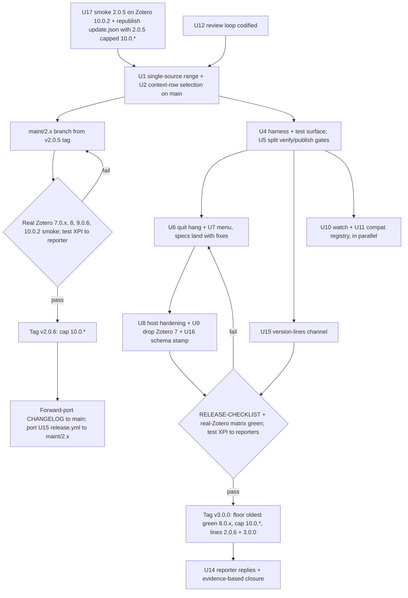
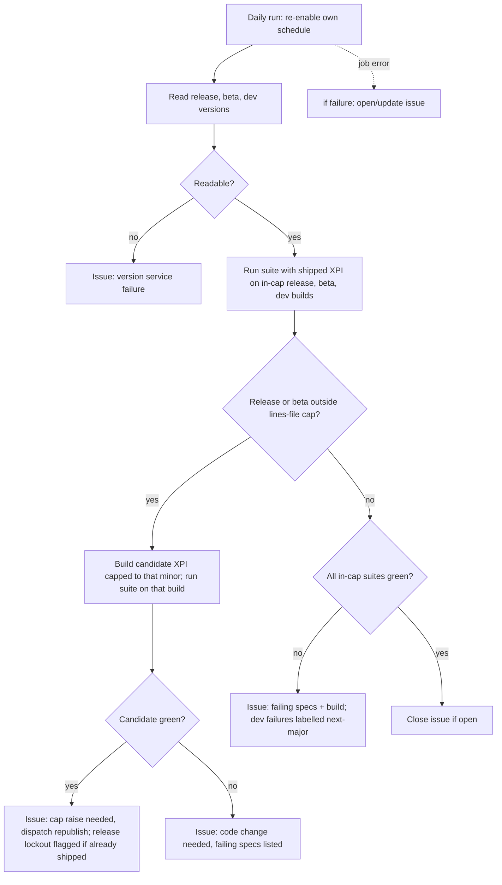

# fix: Zotero 10 compatibility, open host bugs, and a standing Zotero-version gate

## Summary

The work runs in four steps:

1. **Same-day bridge.** Re-enable installed v2.0.5 copies on Zotero 10 by raising 2.0.5's cap in `update.json`, after a smoke test on real Zotero 10. No new release is needed.
2. **v2.0.6 hotfix.** Cut it from the v2.0.5 tag, with the Zotero 10 selection fix, tested on Zotero 7 through 10.
3. **Fixes on `main`.** Fix the quit hang (#78) and the right-click menu that dies after one use (#72, #67), each root-caused on the real host first.
4. **v3.0.0.** Release for Zotero 8, 9 and 10 through the existing checklist.

Alongside the fixes, the plan builds three safeguards:

- Tests that run inside real Zotero gate every pull request.
- A scheduled watch compares Zotero's beta and release versions with the published cap and tests dev builds, so it raises an issue before a lockout.
- An update channel serves each supported version line and can raise a released version's cap without a new release.

Every code change passes a multi-lens review loop that ends after two consecutive clean rounds.

---

## Problem Frame

On 2026-09-13 a forum user on Zotero 10.0.2 and Windows 11 could not install Citegeist v2.0.5: "The add-on "Citegeist" could not be installed. It may be incompatible with this version of Zotero." Both the v2.0.5 manifest and the live `update.json` cap the plugin at `strict_max_version: "9.*"`. Zotero 10.0 shipped on 2026-08-17. The lockout ran 27 days before a user reported it, and nothing in the project noticed. Zotero's dev channel already serves `11.0-dev.5`.

All 519 tests run against a mocked Zotero. Every host-contract break has reached users before a test caught it:

- The Zotero 9 blank pane, blank icon and broken sync (`docs/solutions/integration-issues/zotero-9-plugin-blank-ui-and-sync-break.md`).
- The v2.0.5 right-click menu fix, which three users confirmed did not work. #67 was closed on GitHub anyway.
- A quit hang on Zotero 9.0.6 (#78).
- On Zotero 10, `getSelectedCollection()` and `getSelectedLibraryID()` throw on multi-row selections. Citegeist calls them at `src/modules/menu.ts:305`, `:316`, `:435`, `:441` and `src/modules/citationNetwork/dialog.ts:257`, `:433`, and v2.0.5 carries the same calls.

The release path adds its own hazards. `release.yml` fires on any `v*` tag and overwrites `update.json` with a single entry for the tag being built. A release-candidate tag would therefore go to every user, and a 2.0.x tag cut after 3.0.0 would move the channel backwards. GitHub runs a tag's workflow from the tagged commit, so a maintenance-branch tag runs that branch's old `release.yml`. `addon/manifest.json` hardcodes `9.*` instead of the build placeholder, so raising the cap in `package.json` alone would publish an update Zotero 10 still rejects.

The tracker points the wrong way. `docs/ISSUES.md` says the v3.0.0 shutdown rework "may" fix #78. But `addon/bootstrap.js:48` returns early on `APP_SHUTDOWN` in both v2.0.5 and `main`, so `onShutdown` and `closeCache()` never run on quit. v3.0.0 has waited on `main`, untagged, since 2026-08-01: 40 files and 4,286 added lines since v2.0.5.

---

## Requirements

**Zotero 10 access**

- R1. A Zotero 10.0.x user can install Citegeist from the GitHub release page, and an installed copy updates through `update_url`.
- R2. No reachable code path calls a Zotero API that throws on Zotero 10. Selection-dependent actions act only on row types they support and never widen to a whole library.
- R3. `package.json` is the only source of the compatibility range an XPI ships with. The update channel's range for a version never falls below the range in that version's XPI.

**Host bugs**

- R4. Quitting, disabling or upgrading Citegeist exits cleanly on Zotero 9.0.6 and 10.0.x, including while a fetch batch is running (#78).
- R5. The item and collection right-click menus open repeatedly, with visible labels, in every open window, on Zotero 8, 9 and 10 on Windows and macOS (#72, #67).
- R6. The pane, sidenav icon (light and dark), columns, preference pane, citation-network dialog and author-works dialog render on every supported Zotero major.

**Verification and future Zotero versions**

- R7. Tests that run inside real Zotero cover every supported major on every pull request, and a failure blocks merge and release.
- R8. A scheduled job runs the real-Zotero suite against Zotero's release, beta and dev channels. It checks release and beta versions against the published cap and raises a GitHub issue before users hit a break or a lockout. A failure of the job itself also raises the issue.
- R9. A documented runbook covers adopting each new Zotero minor and major, and every public "supported Zotero" claim is checked against one list.
- R10. Code adapts to the host by detecting features, not by comparing version numbers, and every host API the plugin calls maps to a contract test.

**Release, review and reporters**

- R11. v3.0.0 ships through `docs/RELEASE-CHECKLIST.md` supporting Zotero 8, 9 and 10, and Zotero 7 users keep a working 2.0.x.
- R12. Every code change passes a review loop across several lenses that ends only after two consecutive full rounds find nothing at P2 or above.
- R13. Every reporter gets a reply and, before a tag, a test build. An issue closes on the reporter's confirmation, a green real-Zotero spec on the reporter's OS and Zotero major, or 30 days without response after the fix ships.

**Release channel and data**

- R14. `update.json` serves an entry for each supported version line, and a released version's cap can be raised without publishing a new release. Only final version tags reachable from `main`, or tags on the `maint/2.x` branch, can publish; only the former move the channel's latest line.
- R15. The cache database carries a schema version, and a Citegeist build that finds a database from a newer schema major stops writing to it.

---

## Acceptance Examples

- AE1. **Covers R8.** Given the 3.x line capped at `10.0.*`, when Zotero's release channel reports 10.0.3, the watch passes. When it reports 10.1.0, the watch builds a candidate XPI capped `10.1.*` and runs the suite on 10.1.0. It then opens or updates one `zotero-compat` issue that reports the candidate result and the shipped XPI's disabled state.
- AE2. **Covers R8.** Given Zotero's version service cannot be fetched or parsed, or the watch job itself errors, the job raises the issue rather than reporting "compatible".
- AE3. **Covers R2.** On Zotero 10 with two collections selected, "Fetch All Citation Counts" fetches items from both, each item once. With a saved search, feed, Unfiled, Trash or Duplicates row in the selection, the Citegeist collection entries are hidden. With one collection on Zotero 9, the action matches v2.0.5.
- AE4. **Covers R5.** On Zotero 9.0.6 and Windows with Citegeist enabled, right-clicking five different items in a row opens a labelled menu every time, before and after running one Citegeist command.
- AE5. **Covers R14.** After v3.0.0 ships, a Zotero 7 profile on 2.0.6 stays on 2.0.6 with no error, and a Zotero 8 profile on 2.0.6 updates to 3.0.0 on its next update check.
- AE6. **Covers R14.** Given Zotero 10.1 passes the suite, republishing `update.json` with the 3.0.0 entry capped at `10.1.*` re-enables an installed 3.0.0 on its next update check. No new XPI is involved.
- AE7. **Covers R8.** Given the 3.x line capped at `10.0.*`, when the beta channel reports `10.1.0-beta.1` and the candidate XPI passes on it, the watch opens a "cap raise needed before release" issue while the release channel is still on 10.0.x.

---

## Scope Boundaries

- Feature requests stay in `docs/BACKLOG.md`: #71 fallback data sources, #29 references in paper order, #3, #4, #5, #7, #8.
- OKF spec drift (#79) and the JOSS submission stay on their own schedules.
- DEBT-009, DEBT-011, DEBT-013 and DEBT-014 stay deferred unless a unit below edits the same lines.
- The #78 quit hang is not fixed in v2.0.6. It is listed as a known issue in the v2.0.6 release notes.

### Deferred to Follow-Up Work

- Confirm the Renovate GitHub App is installed and running on this repo, then remove `.github/dependabot.yml`. Renovate has never opened a pull request here, while Dependabot has opened 33, none merged.
- Repair `.github/workflows/okf-watch.yml`, whose scheduled run fails every day (checked 2026-09-08 through 2026-09-13).
- Add server-side sort to the citation-network browser (BACKLOG).

---

## Key Technical Decisions

- **KTD1. Cut v2.0.6 from the v2.0.5 tag on a `maint/2.x` branch, not from `main`, and tag it before any v3.0.0 tag.** `main` carries +4,286 unreleased lines, new SQLite tables, and a sync-sensitive relation purge that still needs the 2-device gate. The hotfix contains only U1, the U2 selection fix at the v2.0.5 call sites, and the cap raise. The cost: Zotero 10 users keep v2.0.5's menu bug and quit hang until v3.0.0.

- **KTD12. Bridge the lockout the same day by raising 2.0.5's cap in `update.json`, after one real Zotero 10.0.2 smoke test.** Zotero's developer page: "If no changes are required, you can simply update `strict_max_version` in your plugin's update manifest without releasing a new version." The override touches only copies whose Zotero is outside 2.0.5's cap. A reviewer's reading of v2.0.5 found that the throwing getter is caught inside the async command handler, so a multi-select collection action fails without widening scope. The smoke test confirms that before publishing. The cost: Zotero 10 users get v2.0.5's known menu bug and quit hang a few days before v2.0.6.

- **KTD2. The cap follows Zotero's documented value, `10.0.*`. A new Zotero minor that passes the suite gets a same-version cap raise through the lines file and republish, not a looser cap.** Zotero's page says to "update `strict_max_version` in your manifest.json to `10.0.*`", and staff guidance warns against far-future caps. A loose cap installs an untested plugin on a changed host, which is how the Zotero 9 blank-UI incident reached users.

- **KTD3. `package.json` is the source of the range an XPI ships with, and `release-lines.json` is the source of the channel's published range for each line.** `addon/manifest.json` uses the `__zoteroMinVersion__`/`__zoteroMaxVersion__` placeholders that `scripts/build-metadata.mjs` already defines. At a tag build, the tagged version's lines-file entry must equal `package.json`. At any other time, a line's published cap may exceed the cap in its XPI, which is how a same-version override works, but never falls below it.

- **KTD4. Menu actions read the selection and the window from the MenuManager context, not from the active pane.**
  - **Selection source:** `collectionTreeRows` where it exists (Zotero 10), otherwise `collectionTreeRow` (Zotero 8 and 9). On v2.0.5's Zotero 7 DOM path, which has no context, the pane's singular getters feed the same helper.
  - **Supported rows:** collections and libraries only, and a library row subsumes its own collections. Any other row type hides the Citegeist collection entries.
  - **Ruled out:** wrapping a throwing getter in catch-and-return-null. The null would read as "library root" and fetch the whole library against the OpenAlex budget.

  Better BibTeX shipped the same context-rows change for Zotero 10.

- **KTD5. #78 and #72 are root-caused on the real host before a fix lands.** The Zotero 9 solution doc records three guessed fixes that shipped, and the v2.0.5 menu fix failed for three users. Each bug is reproduced with Debug Output on the reporter's platform, and the suspected contract is read in Zotero or Firefox source. Fail-first evidence is a real-Zotero spec that fails before the fix and passes after it. Where no automated runner reproduces the bug, a recorded manual reproduction on the reporter's platform counts instead: Debug Output from before and after the fix, plus the reporter's confirmation on a test build.

- **KTD6. Real-Zotero tests use `zotero-plugin-scaffold`, pinned to an exact version at 0.9.2 or later, for its test runner only.**
  - **Unchanged:** the esbuild build and the vitest suite stay.
  - **Build options switched off:** Fluent message and locale-file prefixing, pref-key prefixing, and manifest generation. Each would rewrite Citegeist's output.
  - **Shipped files under test:** the runner loads the plugin as a temporary add-on from a directory, so CI unzips the built XPI into that directory.
  - **Pinned Zotero:** each matrix cell sets `ZOTERO_PLUGIN_ZOTERO_BIN_PATH`, because scaffold otherwise downloads the beta channel.
  - **Platforms:** Linux (`ubuntu-24.04`) is scaffold's supported headless platform and the required gate.
  - **Cost:** the repo is public, so Actions minutes cost nothing. The monorepo's Vercel-first CI rule covers Vercel-deployed sites, and Citegeist has no Vercel deploy.

- **KTD7. v3.0.0 drops Zotero 7: the floor rises to the oldest Zotero 8.0.x build that passes the suite, and the DOM menu fallback is deleted.** A major version is where the floor moves. The DOM fallback exists for Zotero 7, and it also runs when MenuManager rejects a registration on Zotero 8+, layering a second menu system onto a popup MenuManager owns. On Zotero 8+ a rejection records a new append-only `CG-*` code instead.

- **KTD8. The review loop reuses the #77 bar and is run by the maintainer.**
  - **Lenses:** correctness, adversarial, security, reliability (shutdown, timers, unawaited promises), host compatibility (each touched Zotero API checked against Zotero source at a named tag), testing, and maintainability.
  - **Method:** finders report and default-refute verifiers confirm.
  - **Exit rule:** rounds repeat until two consecutive full rounds confirm nothing at P2+, and any confirmed P0 or P1 resets the count.
  - **Where it's recorded:** the round log goes in a pull request comment. Outside contributors are asked only for tests and verification.

- **KTD9. The watch reports through one labelled GitHub issue it opens, updates and closes itself, and it never publishes to users on its own.** A cap raise reaches every installed copy with no canary, so it stays a one-click manual dispatch after a green run. The watch re-enables its own schedule on every run and files the issue when the job itself fails. Its model, `.github/workflows/okf-watch.yml`, fails every scheduled run without updating its issue, and a silent watch is how the Zotero 10 lockout went unnoticed.

- **KTD10. `update.json` is generated from a committed `release-lines.json` holding version, floor and cap per line, with hashes computed by CI.**
  - **Hashes:** the XPI hash exists only after CI builds the tag, because the build stamps a git SHA and a timestamp. CI hashes the XPI it just built for the tagged version, and downloads and hashes the published release asset for every other line.
  - **Updater behaviour:** Firefox's add-on updater, which Zotero 10 runs on Firefox 140 ESR, installs the highest compatible entry and treats a same-version entry as a compatibility override.
  - **Which tags publish:**
    - A final tag reachable from `main` moves the channel and badges.
    - A final tag on `maint/2.x` publishes with `make_latest: false` and regenerates `update.json` from `main`'s lines file.
    - A prerelease tag publishes a GitHub prerelease only.
    - Any other final tag fails the workflow.
  - **Maintenance branch:** `maint/2.x` carries the same `release.yml`, so its tags cannot overwrite the channel.

- **KTD11. The cache database stamps its schema major and minor in `PRAGMA user_version`, and schema changes stay additive within a major.** Rollback is fix-forward, because Zotero's updater never downgrades. Only the older binary can protect a newer database, so from v3.0.0 on, finding a newer schema major switches the cache to read-only and records a coded diagnostic, while a newer minor continues normally. v2.0.5 and `main` share the `item_cache` schema and the author tables are additions, so no refusal fires today.

- **KTD13. CI that runs third-party code never holds a write-scoped token.** The release workflow's `verify` job runs every gate, including scaffold and downloaded Zotero binaries, with `contents: read`. A separate `publish` job needs `verify` and alone holds `contents: write`. The new workflows declare least-privilege `permissions:` blocks.

---

## High-Level Technical Design

Release sequencing across the bridge, the maintenance line and `main`:

The standing watch for new Zotero builds:

---

## Implementation Units

### Phase A. Unblock Zotero 10

### U17. Same-day compatibility bridge for v2.0.5

**Goal:** Installed v2.0.5 copies on Zotero 10 work again within a day, before v2.0.6 exists.
**Requirements:** R1
**Dependencies:** none
**Files:** the `update.json` asset on the `release` GitHub Release; `docs/RELEASE-CHECKLIST.md` (bridge procedure)
**Approach (KTD12):**
- Install v2.0.5 on real Zotero 10.0.2 on Windows 11 and macOS through a local `update.json` override.
- Confirm the pane, columns and single-item fetch work.
- Confirm a multi-select collection action fails without fetching anything.
- Record the known menu and quit issues.
- With Josh's approval, re-upload `update.json` with the same 2.0.5 entry (same link, same hash) capped at `10.0.*`.
- Write the procedure into the checklist, because U11's minor runbook reuses it.

**Test scenarios:**
- Test expectation: none -- release-channel operation with no code change; verified on real hosts.

**Verification:**
- An installed v2.0.5 that Zotero disabled as incompatible on Zotero 10.0.2 is re-enabled through Add-ons → gear → Check for Updates.
- Installing the published v2.0.5 XPI from file on Zotero 10.0.2 is attempted, and the result is recorded: either Zotero consults `update_url` and installs it, or it refuses on the manifest cap. That result decides whether the forum reply offers the bridge or waits for v2.0.6.

### U1. Single-source compatibility range

**Goal:** The built XPI manifest and its own `update.json` entry read the Zotero range from `package.json` only.
**Requirements:** R3, R1
**Dependencies:** U12
**Files:** `addon/manifest.json`, `scripts/build-metadata.mjs`, `scripts/build.mjs`, `package.json`, `test/buildMetadata.test.ts`
**Approach:** Replace the literal range values in `addon/manifest.json` with the existing placeholders. After packaging, the build fails if any placeholder survives, or if the `update.json` entry for the version being built differs from `package.json`. Land on `main` first, then port to `maint/2.x`. U15 extends the check to other lines.
**Patterns to follow:** `readBuildMetadata`, `placeholdersFor` and `updateManifestFor` in `scripts/build-metadata.mjs`; `test/buildMetadata.test.ts`.
**Test scenarios:**
- `addon/manifest.json` contains both placeholders and no literal version string.
- With `config.zoteroMaxVersion` of `10.0.*`, the placeholder map and the built version's `update.json` entry both yield `10.0.*`.
- A built version's `update.json` entry whose range differs from `package.json` fails the build with both values in the message.
- An unreplaced `__zoteroMaxVersion__` in a built file fails the build naming the file.
- A missing or empty `zoteroMaxVersion` still throws the existing `requiredString` error.
**Verification:** Changing only `package.json` changes both `build/addon/manifest.json` and the built version's entry in `build/update.json`.

### U2. Context-row selection

**Goal:** Selection-dependent actions work with any selection on Zotero 7 through 10 and never widen scope on an unrecognised row.
**Requirements:** R2, R5
**Dependencies:** none
**Files:** `src/modules/host/selection.ts` (new), `src/modules/menu.ts`, `src/modules/citationNetwork/dialog.ts`, `typings/zotero.d.ts`, `test/hostSelection.test.ts` (new), `test/collection-menu.test.ts`, `test/menu.test.ts`, `test/citationNetwork-dialog.test.ts`
**Approach (KTD4):**
- **Targets.** One module turns a selection source into supported targets plus a window. The source is a MenuManager context on Zotero 8+, or the pane's singular getters on the Zotero 7 DOM path.
- **Menu visibility.** `onShowing` hides the collection entries when any selected row is unsupported.
- **Batch actions.** `runFetchCollection` and `runResolveAuthorsCollection` iterate the targets, let a library subsume its collections, deduplicate item IDs, and run against the source's window instead of `Zotero.getMainWindow()`.
- **Empty-state alert.** The copy names what was selected ("these 2 collections", "this library") instead of a hard-coded "this collection".
- **Dialog default.** A second helper returns selected collections for the dialog, preferring `getSelectedCollections()`, and sets a default filing collection only when exactly one is selected.
- **On `maint/2.x`.** The same change applies to v2.0.5's `menu.ts:231`, `:242` and `dialog.ts:203`. Failures log through `logError`, because v2.0.5 has no diagnostics module.

**Patterns to follow:** Feature detection at `src/modules/citationColumn.ts:483` and `src/modules/menu.ts:151`; the `guard` boundary and `logError` funnel.
**Test scenarios:**
- Covers AE3. A context whose `collectionTreeRows` holds two collections fetches both collections' items, each ID once.
- A library row plus one of its collections fetches the library alone.
- A saved search, feed, Unfiled, Trash or Duplicates row, alone or mixed with a collection, hides the collection entries in `onShowing`, and invoking the command anyway starts no fetch.
- A Zotero 9 context with only `collectionTreeRow` for one collection matches v2.0.5.
- On the Zotero 7 DOM path with no context and one collection selected in the pane, the fetch runs on that collection.
- A context with neither property hides the entries, throws nothing, and records a coded diagnostic (on `main`) or a `logError` line (on `maint/2.x`).
- Two selected collections with no eligible items show an alert naming "these 2 collections".
- A right-click in the second of two windows attaches the progress window and alerts to that window.
- In the dialog, two selected collections give no default filing collection, one gives that collection, and a pane without the plural getter falls back to the singular one.

**Verification:** No `getSelectedCollection(` or `getSelectedLibraryID(` call remains outside `src/modules/host/selection.ts` on `main`, unit tests are green, and the U4 multi-select spec passes on Zotero 10.

### U3. v2.0.6 hotfix release

**Goal:** Zotero 7 through 10 users can install, and auto-update to, a Citegeist with the Zotero 10 fixes.
**Requirements:** R1, R2, R3, R13
**Dependencies:** U1, U2, U17
**Files:**
- On `maint/2.x`, cut from the `v2.0.5` tag: `addon/manifest.json`, `package.json`, `package-lock.json`, `CITATION.cff`, `CHANGELOG.md`, `scripts/build.mjs`, `scripts/build-metadata.mjs`, `src/modules/host/selection.ts`, `src/modules/menu.ts`, `src/modules/citationNetwork/dialog.ts`, `typings/zotero.d.ts`, and their tests.
- On `main`: `CHANGELOG.md` (the 2.0.6 section and comparison link).

**Approach:** Apply U1 and U2 at the v2.0.5 call sites. Set the cap to `10.0.*` and keep the floor at `7.0.10`. List the quit hang and menu bug as known issues in the release notes. Run the review loop on the hotfix diff.

Before tagging:
- Send a test XPI to the forum reporter.
- Run the release checklist's section 1 smoke on real Zotero 10.0.2 on Windows 11 and macOS.
- Smoke the item and collection menus on Zotero 7.0.x and the latest Zotero 8.
- Run a Zotero 9.0.6 regression pass.

The tag's own `release.yml`, the v2.0.5 version, moves the `release` channel. That is correct while no 3.x tag exists. The README badge stays at 2.0.5 until v3.0.0.
**Execution note:** Manual real-host smoke gates this tag. U4's matrix does not exist yet, and nothing here waits for it.
**Test scenarios:**
- Test expectation: the U1 and U2 unit tests ported to the branch pass; no other behaviour changes.

**Verification:**
- The XPI installs on Zotero 10.0.2 on Windows and macOS.
- An installed v2.0.5 on Zotero 9 and on Zotero 7 auto-updates to v2.0.6 on restart.
- The Zotero 7 collection menu still fetches.
- `update.json` on the `release` Release lists 2.0.6 capped at `10.0.*`.

### Phase B. Real-Zotero verification

### U4. Real-Zotero harness, test surface and baseline smoke suite

**Goal:** A suite that launches real Zotero with the shipped files proves the host contracts current `main` already meets, on every supported major.
**Requirements:** R7, R6, R10, R1
**Dependencies:** U1, U2
**Files:** `test/real-zotero/` (new Mocha specs), `zotero-plugin.config.ts` (new), `package.json`, `vitest.config.ts` (exclude the new folder), `src/hooks.ts`, `src/modules/openalex.ts`, `src/constants.ts`, `.github/workflows/ci.yml`, `docs/solutions/workflow-issues/zotero-plugin-dev-install-proxy-vs-xpi-2026-04-19.md`, `scripts/start.mjs` or removal of the dead `npm start` script
**Approach:** Configure scaffold per KTD6.
- **Test surface.** Extend the existing `Zotero.Citegeist` bridge (`src/hooks.ts:52`) with a read-only ready flag, which `waitForPlugin` uses, and entry points for the fetch and resolve commands.
- **OpenAlex stub.** Add an OpenAlex base-URL override pref that is honoured only for loopback hosts, so a user's `api_key` can never reach another host. Set it from scaffold's profile prefs to point at a local stub server.
- **Pull-request matrix.** The latest pinned patch of Zotero 8, 9 and 10 on `ubuntu-24.04`, with `fail-fast: false`, an explicit per-job timeout, and logs uploaded on failure. U9 adds a permanent floor cell.
- **Error check.** Specs fail on any Citegeist error line in Debug Output.
- **Cap check.** Each release-build cell asserts that `AddonManager` reports Citegeist active and not `appDisabled`. This is the assertion that catches a cap bug, because beta and dev builds ignore `strict_max_version`.
- **Windows and macOS.** Attempt the same runner. If a runner cannot launch a pinned Zotero reliably, record the attempt, and that platform stays a manual gate in the release checklist while Linux remains the required automated gate.
- **Scope.** This unit carries only specs that pass on current `main`. The menu spec lands with U7 and the quit and upgrade specs land with U6.
- **Dev loop.** Repair `npm start` to launch scaffold's dev Zotero, or delete the script.

**Execution note:** Prove each spec against a deliberately broken build first: a plain `label` on `registerSection`, a missing `darkIcon`, and a `9.*` cap on a Zotero 10 cell.
**Test scenarios:**
- On a release build of each major, Citegeist is active, not `appDisabled`, and the bridge's ready flag is true.
- A build capped `9.*` fails the activation assertion on the Zotero 10 cell.
- After startup, Debug Output has no Citegeist error and no "No chrome package registered".
- Selecting an item renders a non-empty Citegeist section with the hero element.
- The sidenav icon's computed image resolves to a real URL in light and dark themes, never `url('undefined')`.
- Columns register and repaint after a fetch against the loopback OpenAlex stub.
- A multi-collection items view with library header rows raises no column error.
- Covers AE3. On Zotero 10, multi-selecting two collections, then two collections plus a saved search, produces the documented menu state.
- The preference pane registers and opens.
- Disable, re-enable and in-place upgrade leave one set of menu entries and one pane section.
- The base-URL override pref set to a non-loopback host is ignored, and requests go to the default OpenAlex host.

**Verification:** Every spec fails against the build carrying its target regression and passes on current `main` across the Linux matrix.

### U5. CI and release gates

**Goal:** Nothing merges or tags unless every automated gate passes, and no job running third-party code can publish.
**Requirements:** R7, R14
**Dependencies:** U4
**Files:** `.github/workflows/ci.yml`, `.github/workflows/release.yml`, `package.json` (`release` script), `CLAUDE.md` (Release Process, CI Notes), `docs/RELEASE-CHECKLIST.md`
**Approach (KTD13):**
- **CI gates.** Remove `continue-on-error` from lint and format in `ci.yml`, and add `okf:check` and the real-Zotero matrix.
- **Release jobs.** `release.yml` splits into a `verify` job and a `publish` job. `verify` has `contents: read` and runs typecheck, lint, format, OKF, unit tests and the real-Zotero matrix. `publish` needs `verify` and holds `contents: write`.
- **Branch protection.** `main` requires these checks, so the release commit lands through a pull request and the tag is pushed after merge.
- **Release steps.** The `release` script and the `CLAUDE.md` release steps stop pushing to `main` directly.

**Patterns to follow:** The existing `ci.yml` job shape; section 0 of the release checklist.
**Test scenarios:**
- Test expectation: none -- workflow configuration. Proven by a pull request with a deliberate lint error failing CI, and a tag on a commit with a failing real-Zotero spec publishing nothing.

**Verification:** Both deliberate failures block, a clean pull request passes every required check, and the `verify` job's token cannot push a tag.

### Phase C. Host bugs on `main`

### U6. Quit, disable and upgrade during work (#78)

**Goal:** Zotero quits, and Citegeist disables or upgrades, promptly and without stray work, whatever the plugin is doing.
**Requirements:** R4
**Dependencies:** U4
**Files:** `addon/bootstrap.js`, `src/hooks.ts`, `src/modules/cache/db.ts`, `src/modules/citationService.ts`, `src/modules/citationColumn.ts`, `src/modules/menu.ts`, `src/constants.ts`, `test/hooks.test.ts`, `test/cache.test.ts`, `test/citationService.test.ts`, `test/menu.test.ts`, `test/real-zotero/` quit and upgrade specs
**Approach:** Reproduce the hang on macOS with Zotero 9.0.6, using Debug Output and the shutdown timeline. Confirm the blocker in Zotero and Firefox source (KTD5). Unconfirmed leads:
- The early `APP_SHUTDOWN` return leaves `citegeist.sqlite` open with in-flight statements.
- `bootstrap.js` drops the promise from `citegeist.shutdown()`, so nothing awaits the close. A Firefox shutdown blocker may be the correct owner.
- `closeCache()` awaits `initPromise` and `closeDatabase(true)` without a bound (`src/modules/cache/db.ts:140`, `:164`).
- `fetchAndCacheItems` and `processFetchQueue` cannot be cancelled. After close, each remaining item still calls OpenAlex and then fails in `requireDb`.

Whatever the root cause, the shutdown sequence changes:
- **Order.** `onShutdown` first sets an abort signal that every batch loop checks per item, then drains, then closes. Each wait is bounded by a constant in `src/constants.ts`.
- **Upgrade.** An in-place upgrade must not leave the old copy's loop running beside the new copy's connection.
- **Stopped summary.** `FetchBatchResult` gains a `cancelled` field. `summarizeBatch` then swaps "Done" for "Stopped" and keeps its counts, the same way the author backfill already does (`src/modules/menu.ts:190`, `src/modules/citationService.ts:557`).

The quit and upgrade specs land in this unit's pull request.
**Execution note:** Characterization first. The real-Zotero quit spec must reproduce the hang before any change.
**Test scenarios:**
- Quitting with an idle cache exits Zotero within the deadline.
- Quitting during a 50-item batch against a slow loopback stub exits within the deadline. No request starts after the abort, and no write lands after close.
- Quitting while cache init is pending exits within the deadline.
- Disabling during a batch stops the loop at the next item. The progress window reads "Stopped" with the counts fetched so far.
- An in-place upgrade during a batch stops the old loop, and the new copy opens exactly one connection.
- If `closeDatabase` never resolves, `closeCache()` returns after the bound and records a coded diagnostic.
- Disabling then quitting causes no double close and no Debug Output error.

**Verification:** The quit and upgrade specs pass on Linux across the matrix, and on macOS for Zotero 9 and 10 through a runner or the manual gate. The #78 reproduction no longer hangs.

### U7. Right-click menu (#72, #67)

**Goal:** Citegeist's menus never break Zotero's context menu.
**Requirements:** R5
**Dependencies:** U4, U2
**Files:** `src/modules/menu.ts`, `addon/locale/en-US/citegeist.ftl`, `src/modules/diagnostics/codes.ts`, `docs/ERROR-CODES.md`, `test/menu.test.ts`, `test/collection-menu.test.ts`, `test/real-zotero/` menu spec
**Approach:** Reproduce on Windows with Zotero 9.0.6 and 10.0.2, using the #72 steps and bwegge's #67 report: the menu dies after the first right-click, before any command runs. Read Zotero's `menuManager.js` at the matching tags to see how `onShowing` and `setVisible` run. Where no automated runner reproduces the bug, a recorded manual reproduction satisfies KTD5. Unconfirmed leads:
- `onShowing` reads `ctx.items` in a shape that throws or hides every entry.
- `guardMenus` writes explicit `onShowing: undefined` and `menus: undefined` keys (`src/modules/menu.ts:91`). v2.0.5 did not have these, so they are not the v2.0.5 cause.
- Zotero 10's MenuManager DOM-removal fix changes teardown.

The menu spec lands in this unit's pull request. U9 removes the DOM fallback, not this unit.
**Execution note:** Characterization first on Windows. macOS may not reproduce the bug.
**Test scenarios:**
- Covers AE4. Real Zotero, on the Linux matrix and on Windows through a runner or the manual gate.
- `guardMenus` omits absent handler and submenu keys rather than setting them to `undefined`.
- `onShowing` with `ctx.items` empty, undefined, or holding a non-regular item hides the entries and throws nothing.
- A throwing `onShowing` is contained by `guard`: the popup still opens and a coded diagnostic is recorded.
- With two windows open, closing one leaves the menu opening in the other.

**Verification:** The menu spec is green for Zotero 8, 9 and 10. The #72 steps reproduce the bug on v2.0.5 and not on the fixed build.

### U8. Host-contract hardening

**Goal:** A Zotero change surfaces as a coded failure, not a blank surface, on every host call path the inventory found silent.
**Requirements:** R6, R10
**Dependencies:** U4
**Files:** `src/modules/citationPane.ts`, `src/modules/citationColumn.ts`, `src/hooks.ts`, `src/modules/cache/migration.ts`, `test/citationColumn.test.ts`, `test/hooks.test.ts`, `test/ui-visibility-invariants.test.ts`
**Approach:** Fix each silent path:
- The `registerSection` error swallowed at `src/modules/citationPane.ts:787-790` propagates to the fail-closed block at `src/hooks.ts:194`.
- `unregisterColumn` at `src/modules/citationColumn.ts:525` is awaited.
- FTL unload stops assuming the link element's shape (`src/hooks.ts:344`).
- The `chrome://citegeist/` icon at `src/modules/cache/migration.ts:370` builds its URL from the stored `rootURI`, which resolves for both packed and directory installs.
- The column's `dataProvider` ignores non-object rows, such as Zotero 10 library header rows.
- The repaint chain either proves `refreshAndMaintainSelection` works on Zotero 10 in the real-Zotero suite, or falls through to `refresh()`, which Zotero 10 documents as unchanged.

**Patterns to follow:** `guard`/`guardAsync` and total service functions in `src/modules/diagnostics/`; `test/ui-visibility-invariants.test.ts`.
**Test scenarios:**
- If `registerSection` throws, startup records the pane's coded failure and reports no success.
- If `unregisterColumn` rejects asynchronously, the rejection is logged and teardown completes.
- On an items view without `refreshAndMaintainSelection`, repaint uses `refresh()`.
- A `dataProvider` called with a header row returns an empty cell without throwing.
- FTL unload with no matching link element does not throw.
- The migration icon URL resolves when the plugin loads from a directory.

**Verification:** Unit tests are green, and the real-Zotero suite shows no Citegeist error line on any cell.

### U9. Drop Zotero 7 in v3.0.0

**Goal:** v3.0.0 supports Zotero 8, 9 and 10, and every public claim says so.
**Requirements:** R11, R9
**Dependencies:** U1, U4, U7
**Files:** `package.json`, `.github/workflows/ci.yml`, `src/modules/menu.ts`, `src/modules/cache/migration.ts`, `src/modules/diagnostics/codes.ts`, `docs/ERROR-CODES.md`, `test/menu.test.ts`, `test/public-claims.test.ts` (new), `README.md`, `CITATION.cff`, `CLAUDE.md`, `docs/paper/paper.md`, `docs/RELEASE-CHECKLIST.md`, `docs/DESIGN.md`, `.github/ISSUE_TEMPLATE/`
**Approach:**
- **Floor.** Run a one-off sweep of the real-Zotero suite on Zotero 8.0.x builds, oldest first. Set `zoteroMinVersion` to the oldest green build and add that build as a permanent matrix cell.
- **Menu fallback.** Delete `registerViaDOM`, its `popupshowing` listener and the fallback branches. A MenuManager rejection records a new `CG-*` code (KTD7).
- **Public claims.** Rewrite every "Zotero 7, 8 & 9" claim, and add a static test that checks named majors against the `package.json` range.

**Test scenarios:**
- If MenuManager returns `false` for the item menu, no DOM nodes are injected and the new code is recorded.
- A public doc naming a Zotero major outside the `package.json` range fails `test/public-claims.test.ts`, which names the file and line.

**Verification:** No Zotero 7 branch or DOM menu code remains, the claims test passes, and the floor cell is green.

### U16. Cache schema version stamp

**Goal:** Every cache database records the schema that wrote it, and a build that finds a newer schema major never writes to it.
**Requirements:** R15
**Dependencies:** none
**Files:** `src/modules/cache/db.ts`, `src/modules/cache/write.ts`, `src/constants.ts`, `src/modules/diagnostics/codes.ts`, `docs/ERROR-CODES.md`, `docs/DESIGN.md`, `test/cache.test.ts`
**Approach:** On init, read `PRAGMA user_version`, encoded as major × 1000 + minor. What happens next depends on the stored stamp (KTD11):
- **Unstamped:** stamp it with the current schema.
- **Newer minor:** continue normally.
- **Newer major:** switch the cache to read-only, so writes resolve as coded no-ops and reads still serve the mirror. Record a coded diagnostic.

`docs/DESIGN.md` records the additive-only rule and the major bump that any non-additive change requires.
**Test scenarios:**
- A fresh database has a `user_version` equal to the schema constant after init.
- An existing unstamped v2.0.5-shaped database gets stamped with its rows intact.
- A database stamped with a newer minor accepts reads and writes.
- A database stamped with a newer major serves reads from the mirror. Writes change no row and record the diagnostic.
- If the stamp write fails, init still completes and the failure is logged.

**Verification:** Opening a v2.0.5 profile's `citegeist.sqlite` with the new build stamps it and loses no rows.

### Phase D. Future Zotero versions

### U15. Version-lines update channel

**Goal:** The update channel serves every supported line, publishes only from recognised tags, and accepts a cap raise without a release.
**Requirements:** R14, R11, R3
**Dependencies:** U1, U5
**Files:** `release-lines.json` (new, committed), `scripts/build-metadata.mjs`, `scripts/build.mjs`, `.github/workflows/release.yml`, `.github/workflows/republish-update-channel.yml` (new), `test/buildMetadata.test.ts`, `docs/RELEASE-CHECKLIST.md`; the same `release.yml` and build-metadata changes ported to `maint/2.x`
**Approach (KTD10):**
- **Lines file.** `release-lines.json` lists each supported line's latest version, floor and cap.
- **Hashes.** `updateManifestFor` emits one entry per line. Hashes come from the XPI built for the tag, or from the downloaded published asset for other lines. A missing asset fails the job.
- **Tag handling.** `release.yml` classifies the tag:
  - A final tag reachable from `main` moves the channel and badges and creates a Latest release.
  - A final tag on `maint/2.x` creates a release with `make_latest: false` and regenerates `update.json` from `main`'s lines file.
  - A prerelease tag creates a GitHub prerelease only.
  - Any other final tag fails.
- **Republish workflow.** A manual dispatch workflow with least-privilege `permissions:` republishes `update.json` from `main`'s lines file. It is the path for cap raises (KTD2) and for U10's "cap raise needed" issue.
- **Build check.** At a tag build, the tagged version's lines entry must equal `package.json` (KTD3).
- **Maintenance port.** Right after v2.0.6 ships, port this `release.yml` and build-metadata to `maint/2.x`. The release checklist confirms that the tagged commit carries the classification step.

**Test scenarios:**
- Covers AE5. With lines 2.0.6 (floor `7.0.10`) and 3.0.0 (the Zotero 8 floor), both capped `10.0.*`, `update.json` has two entries with correct links, and hashes match the fixture assets.
- Covers AE6. Raising 3.0.0's cap to `10.1.*` in the lines file changes only that entry's range and passes the build.
- Tag classification: `v3.0.0` on `main` is final-main, `v3.0.0-rc.1` is prerelease, `v2.0.7` on `maint/2.x` is final-maintenance, and a final tag on any other unmerged branch fails.
- At a tag build, a lines entry for the tagged version that differs from `package.json` fails with both ranges.
- A lines file with a duplicate line, a missing published asset for a non-tag line, or a cap beyond the tested major fails the build.

**Verification:**
- Unit tests pass after U1 and U5.
- On real profiles during U13: Zotero 7 stays on 2.0.6 and Zotero 8 moves to 3.0.0 (AE5).
- A same-version cap raise re-enables an installed copy on a Zotero build outside the old cap (AE6).
- Installing the unchanged XPI from file on that build is attempted and the result recorded.
- A prerelease tag leaves `update.json` unchanged.

### U10. Scheduled Zotero watch

**Goal:** A Zotero release, beta or dev build that breaks Citegeist or outruns the cap produces a GitHub issue before users report it.
**Requirements:** R8
**Dependencies:** U4, U15
**Files:** `.github/workflows/zotero-watch.yml` (new), `scripts/check-zotero-compat.mjs` (new), `test/checkZoteroCompat.test.ts` (new)
**Approach (KTD9):** A daily scheduled, manually dispatchable workflow with `contents: read`, `issues: write` and `actions: write`. Each run:
1. Re-enables its own schedule through the GitHub API.
2. Reads `https://www.zotero.org/download/client/version?channel=release|beta|dev`.
3. Runs the U4 suite with the shipped XPI on every in-cap build.
4. Compares the release and beta versions against the current line's cap in `release-lines.json`, using Zotero's `strict_max_version` matching.
5. For any version outside the cap, builds a candidate XPI capped to that minor and runs the suite on it, reporting the shipped XPI's disabled state separately.
6. Opens, updates or closes one `zotero-compat` issue.

An `if: failure()` step raises the issue when the job itself errors. The dev channel is the next-major canary (`11.0-dev.5` today). Version matching and issue-body composition live in a pure module so they are unit-tested.
**Test scenarios:**
- Covers AE1. With cap `10.0.*`, release `10.0.3` is within cap. Release `10.1.0` is outside cap: the candidate runs, and the issue names 10.1.0 with the candidate result.
- Covers AE7. With cap `10.0.*`, release `10.0.2` and beta `10.1.0-beta.1` with a green candidate, the issue reads "cap raise needed before release".
- Covers AE2. An unreachable version service or malformed JSON gives the result "unknown", which raises the issue.
- A red candidate on an out-of-cap build raises "code change needed" with the failing spec names.
- A failing spec on dev `11.0-dev.5` is labelled next-major, and the release and beta results are unaffected.
- With an issue already open, a new failure updates it, and a later all-green run closes it.

**Verification:**
- A manual dispatch against a fake cap of `9.*` opens the issue.
- Restoring the cap and re-running closes it.
- A deliberately failing job step opens the issue through the failure step.

### U11. Host-contract registry and runbook

**Goal:** Every Zotero API Citegeist calls is listed with its covering test, and adopting a new Zotero minor or major follows written steps.
**Requirements:** R9, R10
**Dependencies:** U8
**Files:** `docs/ZOTERO-COMPAT.md` (new, OKF `type: runbook`), `docs/index.md`, `test/host-contract-registry.test.ts` (new), `CLAUDE.md`
**Approach:** The registry lists each host API from the inventory, with the calling file, its feature detect, and the unit or real-Zotero spec that covers it.

The runbook for a new Zotero minor:
1. The watch issue reports "cap raise needed" with a green candidate.
2. Raise the line's cap in `release-lines.json`.
3. Dispatch the republish workflow.
4. Verify on an installed copy and a fresh install, using U17's procedure.

The runbook for a new major:
1. Read "Zotero N for developers".
2. Diff Zotero source for each registry API between the old and new tags.
3. Fix against the dev-channel suite.
4. Raise the cap in `package.json` and `release-lines.json`.
5. Release through the checklist.

`CLAUDE.md` gains the rule: detect features, never compare Zotero versions outside an allowlist.
**Test scenarios:**
- A `Zotero.<Api>` or `Services.<Api>` reference in `src/` that is missing from the registry fails the test, naming the file and API.
- A registry row that names no covering test fails the test.
- A new `Zotero.version` or `platformMajorVersion` comparison outside the allowlisted migration check fails the test.

**Verification:** The registry test passes on `main`, and adding an unlisted API call fails it.

### Phase E. Review, release and reporters

### U12. Review loop codified

**Goal:** Every code change in this plan goes through the same maintainer-run multi-lens review with a fixed exit bar.
**Requirements:** R12
**Dependencies:** none; lands first
**Files:** `docs/RELEASE-CHECKLIST.md`, `.github/pull_request_template.md`, `CONTRIBUTING.md`
**Approach (KTD8):** Document the lenses, the finder and default-refute verifier split, the round log kept as a pull request comment, and the exit rule in the release checklist. The host-compatibility lens cites the Zotero source file and tag it checked. The pull request template and `CONTRIBUTING.md` ask contributors only for tests and verification, and say the maintainer runs the review.
**Test scenarios:**
- Test expectation: none -- process documentation.

**Verification:** U1's pull request carries a round-log comment ending in two consecutive clean rounds.

### U13. v3.0.0 release

**Goal:** v3.0.0 reaches users on Zotero 8, 9 and 10 with every gate green.
**Requirements:** R11, R6, R7, R13
**Dependencies:** U3, U5, U6, U7, U8, U9, U12, U15, U16
**Files:** `package.json`, `package-lock.json`, `CITATION.cff`, `CHANGELOG.md`, `release-lines.json`, `docs/STATUS.md`, `docs/ISSUES.md`
**Approach:** Send a test XPI to the #72, #67 and #78 reporters outside the update channel. Then run `docs/RELEASE-CHECKLIST.md` in full:
- Automated gates.
- The real-Zotero matrix.
- Diagnostics end-to-end.
- The 2-device sync check (VERIFY-002).
- A day or two of self-dogfooding.

Confirm `maint/2.x` carries U15's `release.yml`. Add the 3.0.0 line to `release-lines.json` through a pull request, and tag from `main` after merge.
**Test scenarios:**
- Test expectation: none -- release execution; the gates are defined by earlier units and the checklist.

**Verification:** The Release and a two-entry `update.json` are published. An installed v2.0.6 on Zotero 9 updates to v3.0.0, and the 2-device sync completes with no 400.

### U14. Tracker and reporter loop

**Goal:** Every reporter hears back, the tracker matches reality, and issues close on evidence.
**Requirements:** R13
**Dependencies:** U17 (first reply), U3, U13 (closures)
**Files:** `docs/ISSUES.md`, `docs/archive/issues-closed.jsonl`, `docs/STATUS.md`
**Approach:**
- Reopen #67, or link it to #72.
- Open a Zotero 10 issue linking forum comment 518143.
- Correct BUG-QUIT's status text in `docs/ISSUES.md`.
- Draft replies for Josh to post:
  - The forum thread after U17: Check for Updates steps, or the v2.0.6 wait if U17 found fresh installs refused.
  - The forum thread again after v2.0.6.
  - #78, #72 and #67: the test XPI before v3.0.0, then the release.
- Close each issue by the R13 rule, citing its evidence.

**Test scenarios:**
- Test expectation: none -- tracker and communication work.

**Verification:** `docs/ISSUES.md` and GitHub agree on every open item, and each closed issue cites its evidence.

---

## System-Wide Impact

- **Auto-update reach.** `update_url` delivers to every installed copy on its next update check, with no canary. U17 changes no code, U3 stays minimal, U5 gates every tag, and U15 keeps prerelease and unrecognised tags off the channel.
- **Release credentials.** Only U5's `publish` job and U15's republish workflow hold write access to releases and tags, and neither runs third-party test code.
- **OpenAlex budget and key.** U2 forbids silent widening to a whole library, and U6 stops loops on abort. U4's base-URL override is honoured only for loopback hosts, so the `api_key` never reaches another host.
- **Diagnostics registry.** U2, U6, U7, U9 and U16 add `CG-*` codes. They are append-only public identifiers, mirrored in `docs/ERROR-CODES.md`.
- **Library sync.** v3.0.0's relation purge touches synced item data, so VERIFY-002 stays a hard gate in U13.
- **Guard tests.** `test/ui-visibility-invariants.test.ts` and `test/diagnostics-guard-invariants.test.ts` stay hard gates. Fixes change code, never these tests.

---

## Risks & Dependencies

| Risk | Mitigation |
|---|---|
| The menu bug reproduces only on Windows; local development is macOS with Zotero 9.0.6 | A Windows 11 VM for interactive Debug Output in U7; KTD5 accepts a recorded manual reproduction |
| Scaffold's headless mode supports only Ubuntu; Windows and macOS runners may not launch Zotero | Linux matrix is the required gate; Windows and macOS stay manual gates in the checklist until a runner works (U4) |
| Scaffold's build defaults rename FTL messages and rewrite the manifest | KTD6 disables them; the suite fails on blank labels, which renaming produces |
| A compromised test-runner release runs in CI | Exact version pin; `verify` job holds only `contents: read` (KTD13) |
| Real-Zotero CI flakes on headless timing | Bridge ready flag, deadline-based waits, per-job timeouts, one retry per spec, and a quarantine that raises an issue instead of skipping |
| GitHub disables scheduled workflows after 60 days without activity; Renovate has never opened a pull request here and `okf-watch.yml` fails every scheduled run | The watch re-enables its own schedule each run and raises its issue on job failure (KTD9); Renovate is not counted on |
| The `10.0.*` cap locks users out when Zotero ships 10.1 | U10 compares beta against the cap before release (AE7); U15's republish raises the cap without a release (AE6) |
| Zotero 10 may refuse a fresh file install of an out-of-cap XPI even with a raised `update.json` cap | U17 and U15 record the fresh-install result; if refused, a new release is the path for fresh installs |
| A v3.0.0 defect reaches the whole install base | U5 gates, reporter test builds and dogfooding in U13; Zotero never downgrades, so a defect is fixed forward with a patch tag |
| `maint/2.x` and `main` drift | U3 forward-ports the CHANGELOG; U15 ports the release workflow to `maint/2.x` and makes `main`'s lines file the only channel source |
| Branch protection breaks the documented direct-push release steps | U5 moves the release commit to a pull request and tags after merge |
| Dependabot pull requests (33, none merged) multiply matrix runs | Follow-up task confirms Renovate is live before removing Dependabot |

---

## Open Questions

### Deferred to Implementation

- The root causes of #78 and #72. U6 and U7 name leads only.
- If #72 cannot be reproduced on any Windows host, and no reporter confirms a test build after sustained attempts, does v3.0.0 ship with #72 documented as a known issue? This is Josh's call when U7 stalls.
- The oldest Zotero 8.0.x build that passes the suite, which sets v3.0.0's floor.
- Whether Zotero waits for the promise returned from bootstrap `shutdown`, which decides the shape of U6's shutdown blocker.
- Whether Windows and macOS GitHub runners can run scaffold's test runner with a pinned Zotero.
- Whether `refreshAndMaintainSelection()` still exists on Zotero 10's split items tree.
- Whether Zotero 10 consults `update_url` when installing an out-of-cap XPI from file. U17 records the answer.
- How soon Zotero checks for updates to an add-on it disabled as incompatible. U17 verifies the manual Check for Updates path.

---

## Sources & Research

**Zotero documentation and data**
- Zotero 10 for developers: the `10.0.*` cap, the update-manifest cap raise without a release, singular getters throwing, MenuManager `collectionTreeRows`, menu DOM removal on shutdown, and the unchanged Firefox 140 ESR base. https://www.zotero.org/support/dev/zotero_10_for_developers
- Zotero changelog: 10.0 on 2026-08-17 and 10.0.2 on 2026-09-09. https://www.zotero.org/support/changelog
- Zotero version service, on 2026-09-13: release `10.0.2`, beta `10.0.2-beta.9`, dev `11.0-dev.5`. https://www.zotero.org/download/client/version?channel=dev
- zotero-dev threads on caps and getter changes: https://groups.google.com/g/zotero-dev/c/KqkZGjYHcJs, https://groups.google.com/g/zotero-dev/c/21hDW54U6Lw
- Zotero commits in `zotero/zotero`: d62b044 (getters), dc6d55a (MenuManager context), 55672ba (menu DOM removal). Plugin API tests are at `test/tests/pluginAPITest.js`.
- Beta builds ignore `strict_max_version` (Zotero forum, 2026-04-13): https://forums.zotero.org/discussion/130871

**Platform and tooling**
- Firefox ESR 140 add-on install and update checks: `toolkit/mozapps/extensions/internal/XPIInstall.sys.mjs` and `AddonUpdateChecker.sys.mjs`, https://hg.mozilla.org/releases/mozilla-esr140/
- zotero-plugin-scaffold test runner (0.9.2, config keys, CI headless behaviour): https://zotero-plugin.dev/zotero-plugin-scaffold/test.html, https://github.com/zotero-plugin-dev/zotero-plugin-scaffold
- GitHub Actions limits and scheduled-workflow disabling: https://docs.github.com/en/actions/reference/limits

**Prior art and reports**
- Zotero 10 fixes in other plugins: windingwind/zotero-better-notes 8c7e54b; retorquere/zotero-better-bibtex 25bab0e and its nightly CI matrix.
- Forum report: https://forums.zotero.org/discussion/comment/518143#Comment_518143
- GitHub #67 comments (MattGiulP 2026-07-10, bwegge 2026-07-13, scolino 2026-07-23): the menu is still broken on v2.0.5.

**Repo history**
- `docs/solutions/integration-issues/zotero-9-plugin-blank-ui-and-sync-break.md`: host contracts and the cost of guessed fixes.
- `docs/solutions/ui-bugs/zotero-menumanager-blank-labels-and-wedged-right-click.md`: the v2.0.5 menu fix users reported as still broken.
- `docs/plans/2026-07-06-001-fix-menu-manager-registration-lifecycle-plan.md`: precedent for the menu lifecycle.
