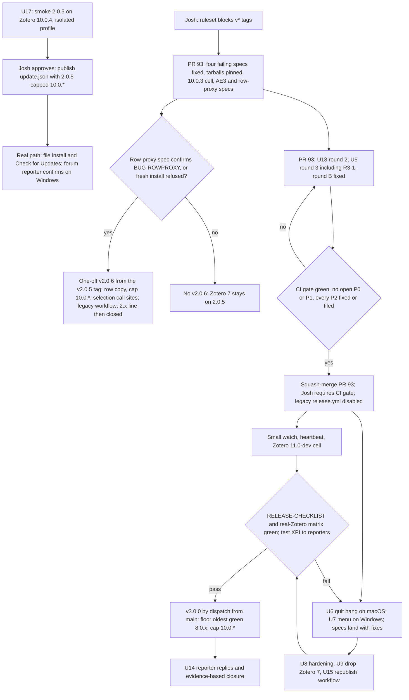
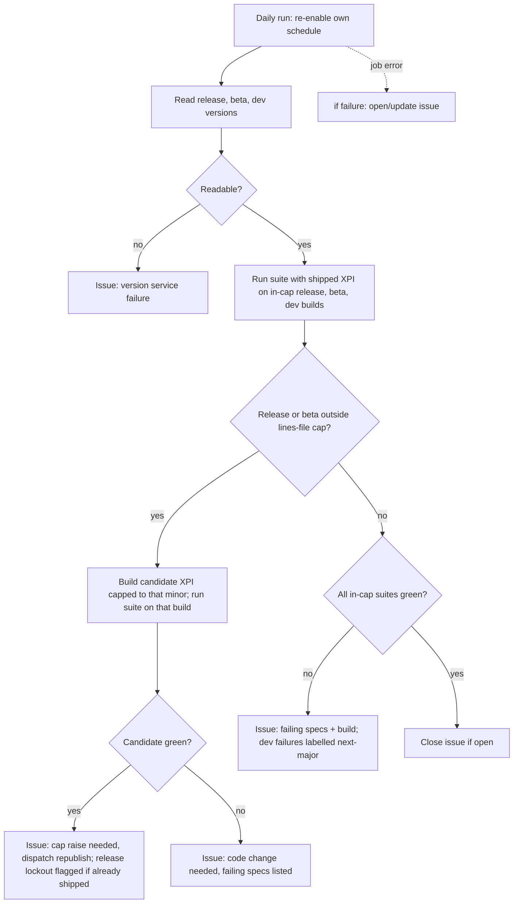

# fix: Zotero 10 compatibility, open host bugs, and a standing Zotero-version gate

## Summary

_Revised 2026-09-28. This is the one live plan for Zotero 10 compatibility, the open host bugs and the v3.0.0 release. `docs/STATUS.md` orders it, `docs/ISSUES.md` tracks the bugs it fixes, and `docs/RELEASE-CHECKLIST.md` holds the release gates._

Zotero 10 users have been locked out for 42 days, and the one step that needs no code, the bridge (U17), has not run. It goes first. The integration branch, draft PR #93, then reaches a green real-Zotero run, gets its open review findings fixed, and merges to `main`, so every later unit lands as a small pull request behind the real-Zotero gate. v3.0.0 ships for Zotero 8, 9 and 10 once the quit hang and the right-click menu are root-caused on real hosts, and once releases start only from a dispatch on `main`.

The work runs in five steps:

1. **v2.0.6 (U3), in place of the bridge.** The U17 smoke run failed on 2026-09-28: released v2.0.5 renders no pane, shows blank menu labels and crashes Zotero on quit, on Zotero 9.0.6 and 10.0.4 alike. A v2.0.6 cut from the v2.0.5 tag ports `main`'s host-contract fixes, fixes the quit crash and SEC-001, and caps at `10.0.*`; it is proved with the same local smoke run on Zotero 9 and 10 before Josh approves the release.
2. **SEC-001, green CI and the open findings on #93.** Fix SEC-001 in its own small pull request to `main`. On #93, fix the four specs that failed on the first real run, pin the Zotero tarballs, move the Zotero 10 cell to 10.0.3, and fix the open P0–P2 findings from U5 round 3, U18 round 2 and round B.
3. **Merge #93.** Run the review loop to its exit on #93's current scope, squash-merge it to `main`, then apply the one-time repository settings.
4. **Host bugs and the version gate, one pull request per unit.** U6 quit hang, U7 menu, U8 hardening, U9 Zotero 7 removal, U15 republish workflow, U10 watch, and U11 registry when the Zotero 11 port starts.
5. **v3.0.0 and the reporters (U13, U14).**

A one-off v2.0.6 (U3) is recommended, because a security defect the review found (SEC-001) reaches every shipped version. It needs Josh's decision; see "Decisions" under the status section.

The safeguards stay as designed on 2026-09-13, with one addition:

- Tests that run inside real Zotero gate every pull request.
- A scheduled watch compares Zotero's beta and release versions with the published cap and tests dev builds, so it raises an issue before a lockout. It also pings an outside heartbeat that emails the maintainer when the pings stop, because a watch cannot report that it never ran: the billing lock of 2026-08-27 to 2026-09-15 stopped every job without a sound.
- The update channel can raise a released version's cap without a new release, through a reviewed republish workflow (U15).

Every code change passes the multi-lens review loop. Its exit rule stays two consecutive clean rounds for the pull requests that follow; "Decisions", item 3, sets the bar for #93, which is too large to converge on it.

---

## Status on 2026-09-28

### What changed since 2026-09-13

- **The lockout is still live.** The published `update.json` still caps 2.0.5 at `9.*`, because U17 never ran. Zotero is now at 10.0.3 on Linux and Windows and 10.0.4 on macOS; beta is 10.0.3 and dev is `11.0-dev.5`. The `10.0.*` cap covers all of them.
- **GitHub Actions ran nothing for three weeks.** From 2026-08-27 to 2026-09-15 every job failed with "The job was not started because your account is locked due to a billing issue". That lock, not the workflow, is why `okf-watch.yml` failed daily; it has passed every day since 2026-09-16. No commit on this branch ran on GitHub until 2026-09-28.
- **The 2026-09-13 session stopped on a usage limit.** At 03:43 UTC on 2026-09-14 it had just dispatched three fix batches and review round B, and none of them finished. Their findings are written out under "Open findings" below. The reporter reply drafts lived in that session's scratch folder and are gone.
- **The first real-Zotero run** (CI run 34803412726, 2026-09-28) passed the unit-test job, and on each of Zotero 8.0.4, 9.0.6 and 10.0.2 passed 23 of 27 specs. The same four failed on all three versions; see "First real-Zotero run" below.
- **Local gates on `8a8ef46`**, Node 22.22.3: typecheck clean, 1,574 unit tests pass, lint has 0 errors (the 3 old `any` warnings), format and OKF clean, and the build produces `citegeist-3.0.0-alpha.0.xpi` (110.4 KB, Zotero 7.0.10 to `10.0.*`).

### U17 smoke run: failed, bridge withdrawn (2026-09-28)

The smoke run behind the bridge used Zotero 10.0.4 (installed at `~/Applications/Zotero 10.app`, signature and notarization checked) and, as a baseline, the Zotero 9.0.6 already on this Mac. Both ran fresh isolated profile folders with the published v2.0.5 (its cap raised to `10.0.*` in a copy for Zotero 10; the unmodified XPI on Zotero 9). A small local driver add-on ran the checklist through Zotero's own APIs and logged each result, with positive controls: its own menu item and pane section, and a run without Citegeist. Results were the same on both versions:

- **The pane never renders.** Zotero reports "not well-formed XML" for Citegeist's section and then fails to initialise it (`itemPaneCustomSection.js` at 10.0.4, line 140; `itemPaneSection.js` at 9.0.6, line 288). v2.0.5's embedded `<style>` holds a `<strong>` inside two CSS comments and no CDATA wrapper, and Zotero parses the section body as XML (BUG-PANE-XML). The damage spreads: the driver's control section renders without Citegeist and does not render beside v2.0.5, so other plugins' item-pane sections disappear too.
- **Menu entries have blank labels.** The three item entries are present, with no text in five opens of five. v2.0.5 loads its strings only when a window opens, and the main window is already open when it starts (BUG-MENU's blank-label half).
- **Quitting takes 61 s and crashes** (exit code 139) with v2.0.5, and takes 0.5 s with exit code 0 without it: #78, reproduced and attributed on Zotero 9.0.6 and 10.0.4 (BUG-QUIT).
- **Startup can stall Zotero's database.** Citegeist's nine column registrations hold a Zotero main-database transaction; in two of eight startups ten of Zotero's own transactions timed out waiting (BUG-STARTUP-TX).

Re-enabling v2.0.5 on Zotero 10 would therefore give those users a crash on every quit and no pane, and would hide other plugins' panes, so the bridge is not published. The fix for Zotero 10 users is a v2.0.6 that ports the host-contract fixes `main` already has, and that fix is equally urgent for Zotero 8 and 9 users, who have these bugs today. See Decisions, item 2, and U3.

### v2.0.6 candidate: smoke run passed (2026-09-28, evening)

v2.0.6 was built on the local branch `release/v2.0.6` from the v2.0.5 tag. It stays off GitHub until Josh approves the release, because it carries a security fix (SEC-001). The candidate XPI (SHA-256 `6961327f…3e41`) ran the same driver, now hardened so each step records its own result and every run reaches quit. It ran in fresh profiles on Zotero 10.0.4 and 9.0.6, beside control runs with no Citegeist installed. On both versions:

- **The pane renders with data** (85,142 citations, FWCI, percentile, the citing-works and references buttons), and the driver's own control section renders beside it.
- **Menus are labelled** on five builds of five, and again after a forced garbage collection.
- **A fetch lands:** the column cell shows 85142.
- **Refreshing an item cached in the previous launch works.** On both versions, spreading a row from a Zotero `DBConnection` throws ("DB column 'getResultByName' not found"), so every v2.0.x refresh of such an item failed: BUG-ROWPROXY is confirmed and fixed by copying rows at load.
- **Disabling leaves no Citegeist element or strings link behind**, the item menu builds and translates while Citegeist is off, and every entry is labelled again after re-enabling. Translating the whole main window rejects in stock Zotero with no Citegeist installed, so that check cannot attribute a fault; spec 90 now checks fragments instead.
- **Quit exits with code 0 in 2.0 to 5.8 s** (seven runs). The control quit in 1.0 to 3.1 s (four runs). In the slowest run Zotero logged 0.55 s of work after the quit began, and Citegeist's cache close added no visible gap; the rest is process teardown. v2.0.5 took 61 s and crashed.

Still to run before the release: the same smoke on Zotero 8.0.4 and on 7.0.10, the oldest version 2.0.6 supports, and one review round over the v2.0.6 diff.

**Publishing (recommended, waiting on Josh).** Publish 2.0.6 by hand from the tested XPI and its `update.json`, not through v2.0.5's tag workflow. That workflow rebuilds the XPI with a plain `zip -r`, so users would get bytes nobody tested, and it runs `npm install` with install scripts while holding `contents: write`. The v2.0.6 tree drops `release.yml`, so creating the tag runs nothing, and a local publish script checks the version, cap, link and `update_hash`, lifts ruleset 24140405 for the one tag and restores it, points the channel at the release, then downloads both files and compares them with what was tested. The cost: 2.0.6 has no CI build record.

### Unit ledger

| Unit | State | Commits | Review |
|---|---|---|---|
| U12 review loop | Done | 979f800 | — |
| U1 single-source range and build | Done | 4a51fa0, f45945a, 8dd2106, 6e1f5ef, 8a8ef46 | 4 rounds, none clean; round B below |
| U2 context-row selection | Done on this branch; not ported to `maint/2.x` | a35c42e, cbfd680, 657c4e4, 0b91826 | 3 rounds, none clean; round B below |
| U4 real-Zotero harness | Done except the AE3 multi-select spec, still `09-multiselect-collections.todo.ts`, and the Windows and macOS runner attempt. Triage fixes landed 2026-09-28: pane reveal through `scrollToPane`, all three tarballs pinned (10.0.3 from its first run, matched by an independent download), suite-hook error lines judged | f5bd47f, c9cdf7e, f1b4c51, b4f2f37, c8ebae8, 0a68b39, c897d94, e9b51e9, 750be72 | 1 round; round B below |
| U5 CI and release gates | Code done; round 3 open, with a P1 | d03af69, 384a412, 1f2a4ab | 3 rounds, none clean |
| U16 cache schema stamp | Done | c80d189, e14d538, 318885c | 2 rounds, none clean; round B below |
| U18 preference names | Done; round 2 open, with a P1 | 6215ec0, 330c9a0, efa2107, fc936a3 | 2 rounds, none clean |
| U17 bridge | Smoke run failed 2026-09-28; bridge withdrawn in favour of v2.0.6 | — | — |
| U3 v2.0.6 | Built on local branch `release/v2.0.6`; smoke run passed on Zotero 9.0.6 and 10.0.4; waits for Josh's approval | local: 639618b, f446324, d3ad191, 0474fd7 | none yet |
| U6 quit hang (#78) | Root cause fixed in v2.0.6 (the cache closes on quit); not yet on this branch | — | — |
| U7 right-click menu (#67, #72) | Not started; the menu split in 0b91826 prepares it | — | — |
| U8 host hardening | Not started. Spec 05 passing on 10.0.2 shows columns repaint on Zotero 10 | — | — |
| U9 drop Zotero 7 | Not started; every deletion is marked in the code | — | — |
| U15 release lines | Not started | — | — |
| U10 Zotero watch | Not started | — | — |
| U11 host-contract registry | Not started | — | — |
| U13 v3.0.0 | Not started | — | — |
| U14 reporter loop | Tracker entries done (23301f4, 467960f); replies not drafted | — | — |

### First real-Zotero run

CI run 34803412726 re-ran the checks for `8a8ef46` on 2026-09-28, the first time Actions could start them.

- **Passed on 8.0.4, 9.0.6 and 10.0.2:** Citegeist active and not `appDisabled`; no Citegeist error line after startup; `chrome://citegeist/` survives a forced garbage collection; sidenav and header icons resolve in light and dark themes; every column registers and paints the stub's count after a fetch without sending the `api_key`; the settings pane registers and opens; a non-loopback base-URL override is ignored; one set of menu entries at start, after re-enable and across an in-place upgrade; all five schema-stamp specs.
- **Failed on all three:** the item-pane hero (timed out after 20 s); "leaves no menu entries or pane section while disabled" ("Promise rejected with no or falsy reason"); the citation-browser page size (timed out waiting for the "Citing works" button); and the migration-flag positive control (a restart with no flag did not migrate). A triage agent traced all four through the Debug Output and Zotero and Gecko source:
  - **The hero and "Citing works" timeouts are test bugs.** A scripted `click()` carries a click count of 0, and Zotero's sidenav scrolls to a section only for a count of 1 (`itemPaneSidenav.js` at 10.0.2, lines 811–818), so the section, which sits below the built-in ones, never scrolled into view and never rendered. Users are unaffected. Fix: one helper that dispatches a click with `detail: 1`, or calls `scrollToPane`, used by specs 03 and 92.
  - **The disable failure is a real bug (BUG-DISABLE-L10N).** Shutdown leaves Citegeist's `<link rel="localization" href="citegeist.ftl">` in the main window; Zotero then unregisters the plugin's translations, the window holds a required resource nobody serves, and every translation it rebuilds fails, so the right-click menu build rejects (`translateFragment`) and new text renders blank until Zotero restarts. On Zotero 8.0.4 stale menu entries also stay, because that version's MenuManager never removes rendered entries and Citegeist's own unregister uses the wrong key (ADV-B1). Fix: before `onShutdown`'s first `await`, remove the link and Citegeist's rendered menu items from every main window, as Zotero's sample plugin does, and unregister menus with the key `registerMenu` returns.
  - **The migration failure is a real bug from v2.0.0 (BUG-MIGRATION).** `migration.ts` calls `await Zotero.Sync.Runner.delaySync(async () => { … })`, but Zotero's `delaySync(ms)` takes a number of milliseconds and never calls a function (`syncRunner.js` at 8.0.4, line 1037, and every version since). The migration loop has never run for anyone: no v1.3.x profile was migrated, no backup was written, the done flag was set anyway, and while the cache is empty the scan repeats at every launch. Nothing was stripped from anyone's Extra field. The typings declare a signature Zotero does not have, and three unit-test mocks call the function, which is how the suite missed it.
  - **Noise that reaches users.** On Zotero 8, 9 and 10, `Zotero.warn` lands in Help → Report Errors as an error, because Zotero's logger still passes Gecko 115's argument list to Gecko 140's `scriptError.init`. Citegeist's unregister-before-register adds 10 such entries per startup, and Zotero's own `defaultIn`/`disableIn` check adds 18 more for Citegeist's nine columns, so each startup pushes every earlier error out of the 25-entry buffer users send with a report (BUG-ERRFLOOD). Citegeist can remove its 10 by unregistering only what exists (`Zotero.ItemTreeManager.isCustomColumn`, `Zotero.ItemPaneManager.customSectionData`, both since 7.0.10); the other 18 need a Zotero fix.
- **Tarball hashes to pin** in `ZOTERO_TARBALL_SHA256`: 8.0.4 `be7e77d33a6bdc27db61df558d5868d5bd73de4f1ee42900cb7c267e9c249673`, 9.0.6 `0db6e8f94bd0d84e862e6ef5c3e217030e173c0cd3c6dfbc836252c650fea3dd`, 10.0.2 `5f7ed486bf2daac703b905500dd8236b5b6982f7759f0699610ac926764b2a90`. Zotero 10.0.3's Linux tarball exists (HTTP 200); 10.0.4, 9.0.7 and 8.0.5 do not (HTTP 403), so the matrix becomes 8.0.4, 9.0.6 and 10.0.3, and 10.0.3's hash is pinned from its first run.
- **Not run:** the negative control, which follows the suite step and was skipped.

### Open findings

Each list below is one fix batch. The IDs are the reviewers' own, so a finding traces back to its round.

**U5 round 3** (CI and release; reviewed 2026-09-14; not clean, nothing fixed yet)

- **P1 R3-1.** A pushed tag runs the workflow stored in the tagged commit. The reviewers counted 23 older commits that carry the unguarded `release.yml` and say version 3.0.0, so tagging the wrong merge commit publishes old code to every installed copy. Fix: delete `release.yml`; add a release workflow at a new path, triggered only by `workflow_dispatch` (inputs `version` and an optional `commit`) and refused unless dispatched from `main`; `Publish` creates the tag itself after every gate; a test asserts that no workflow has a `push: tags` trigger. After it merges, the maintainer disables the legacy workflow, adds a ruleset that lets only GitHub Actions create `v*` tags, and proves on a fork that a tag on an old commit starts no run. Until then, push no `v*` tag.
- **P1 R3-2.** Re-running a half-finished release needs reproducible bytes. 8a8ef46 made production builds reproducible; still missing are an invariant that `Build` takes `SOURCE_DATE_EPOCH` from the commit on the pinned `ubuntu-24.04` image, and recovery text rewritten to match.
- **P2 R3-3.** `npm run build` puts `node_modules/.bin` first on `PATH`, so a locked package that declares a `zip`, `git` or `unzip` command would run inside `Build`. Fix: run `node scripts/build.mjs` directly, add a test that fails when a locked package declares a command named after a tool `Build` uses, and set `package-manager-cache: false` on every setup-node step.
- **P2 R3-4.** The version-bump check compares against the pull request's `base.sha`, which GitHub records when the pull request was opened, not when it merged. Compare against `commit^1` on `main`, and require the version before the release to be `X.Y.Z-alpha.0`, which also refuses a `30.0.0` typo.
- **P2 R3-5.** The build and the release scripts order versions with two different functions that disagree. Move both onto one `scripts/version.mjs`, with test pairs where text order and number order differ (3.0.9 and 3.0.10).
- **P2 R3-6.** The test fakes are simpler than GitHub: the channel server never redirects or fails once, and the `gh` stub runs without a token. Make them match.
- **P2 R3-7.** `gh release view` can report "release not found" on a transient error. Use `gh api …/releases/tags/<tag>` and treat only HTTP 404 as absent, and pin `X-GitHub-Api-Version: 2022-11-28`, because the newest API version drops `merge_commit_sha`.
- **P2 R3-8.** The allowlist of commands a write-capable job may run is keyed to two job names; key it to write permissions.
- **P2 R3-9.** The `maint/2.x` release path is undocumented, and the release guard hard-codes `main`.
- **P2 R3-10.** Release rules are written in several places and two copies have drifted. One `npm run verify` becomes the pre-commit line, and CLAUDE.md's release sections become pointers.
- **P3 R3-11 to R3-13.** Split the 374-line checklist into a per-release checklist and a runbook; retries and timeouts in the release scripts; the badges job's empty tag; CODEOWNERS missing `vitest.config.ts`.

**U18 round 2** (preferences and background lookups; reviewed 2026-09-14; not clean, nothing fixed yet)

- **P1 R2-1.** Every background lookup that lands calls `refreshColumns`, which makes every item tree in every window reload all its items (`itemTree.jsx`, `refreshAndMaintainSelection`). Fix: collect the landed item IDs and refresh only those rows with `Zotero.Notifier.trigger("refresh", "item", ids)`, at most once every 1–2 s and once at the end of a pass. `refreshColumns` stays for registration changes, and the menu's fetch uses the same path.
- **P2 R2-2.** The background queue becomes its own module, `backgroundFetch.ts`, with explicit phases (idle, scheduled, running, paused, stopped) and a `stop()` that resolves when a pass ends. U6 builds its quit handling on it.
- **P2 R2-3.** A network error, a 5xx or a DNS failure marks the row as tried and logs once per row, so rows drawn while offline stay blank all session, and 60 offline rows fill the 50-entry diagnostics buffer. Pause with a growing cool-down instead, log once per pause, and map HTTP status 0 to a network error.
- **P2 R2-4.** Pauses end by rule: a rejected key when the key changes (or after a timeout, if no key was sent); a spent budget when the key changes or at the next UTC midnight; an unwritable cache at restart. Observe the auto-fetch and key preferences so a change takes effect without a scroll.
- **P2 R2-5.** A pass that throws leaves rows stuck at "…".
- **P2 R2-B1.** Nothing proves the cache-lifetime setting takes effect: hard-coding seven days passes every test.
- **P3.** The no-match hold-off should apply only to items without identifiers; skip feed items, and non-items in the trash view; a clock set backwards; an integer-typed `lastOrphanGcAt` made in about:config runs GC at every launch; four ways around the preference guard; `setPref` accepts numbers an integer pref cannot hold; a page-size unit test; a key-redaction test against Zotero's own log filter; docs.

**Round B** (U1, U2, U4 and U16; reviewed 2026-09-28; seven lenses; not clean)

```text
Round B · 7 lenses · confirmed P1 ×1 (pre-existing), P2 ×6 (1 pre-existing), P3 ×21 · RB-SEC-1 and RB-REL-01 sent to default-refute verifiers: injection confirmed; deadlock confirmed with a corrected ending (a crash, not a partial write) · ADV-B1 and RB-REL-01 each found by two lenses · not clean
```

Security:
- **P1 RB-SEC-1, now SEC-001.** A markup-handling defect in the citation browser, present in every released version, confirmed by a verifier. Details are held in a private GitHub security advisory until users have the fix; the fix and its regression test land with v2.0.6 (next steps, step 3).
- **P3 RB-SEC-2 (U1).** `zip -@` reads one name per line and treats CR and LF as line ends, so a committed path containing a newline can make the build pack a file from outside `addon/` (shown with `/etc/hosts`), and `verifyPackagedAddon` never compares the XPI's entries with the staging copy. Fix: refuse control characters in staged paths; compare entry names and hashes with staging.
- **P3 RB-SEC-3, now DEBT-015.** Diagnostics redaction misses home folders outside `/Users` and `/home`.
- Cleared: every override address Node's URL parser accepts resolves to loopback or falls back to the default host, and the key is withheld whenever an override is active; the bridge exposes nothing that reads the key; the build lock refuses a planted symlink; no `${{ }}` reaches a `run:` block.

Reliability:
- **P2 RB-REL-01 (U16), a Zotero crash; fix before #93 merges.** On every Zotero 10.0.x, when a Citegeist write transaction starts while Zotero's idle vacuum is running `VACUUM INTO` on `citegeist.sqlite`, the two wait on each other: the vacuum's close waits for the transaction, and the transaction's first statement waits for the vacuum's reopen. A verifier traced it through Zotero 10.0.0–10.0.4 and Gecko 140 source and corrected the ending: Firefox's shutdown watchdog aborts Zotero after 60 s (`toolkit.asyncshutdown.crash_timeout`, which Zotero does not override), so Zotero crashes about six minutes into idle. No data is lost, and the vacuum retries at the next idle. Other Citegeist writes fail after 30 s and async reads hang until then. Zotero 8 and 9 have no idle vacuum. The window is narrow, but the branch creates it: v2.0.5's autocommit writes never hold a transaction open across the vacuum. Recommended fix, from the host-compatibility lens (HC-1): open the cache by absolute path, which makes it an external database to Zotero (`db.js` at 10.0.2, line 83) and takes it out of Zotero's idle backup, vacuum and idle observer altogether. The cache can be rebuilt from OpenAlex and needs neither; the change also stops Citegeist resetting the `vacuum.lastTime` pref that every database shares, which today can delay the vacuum of Zotero's own `zotero.sqlite`. The cost is setting the WAL and locking pragmas Citegeist relies on itself. Transactions stay, for multi-statement atomicity. The alternative, running each statement on the connection `executeTransaction` hands to its callback, works on Zotero 8, 9 and 10 but carries four conditions, the first of which HC-2 confirms as a live hazard: those rows are raw storage rows, so `plainRow` reads every column as undefined and the curated-author check inside the transaction would downgrade curated links unless it reads with `getResultByName`; Zotero's parameter rewriting is bypassed; 8.0.4 and 9.0.6 skip the corruption check inside a transaction; and the fake database and the invariant test must change. The host-compatibility lens reads the ending differently (the 300 s Sqlite timeout, then one statement committed in autocommit while the caller is told it failed); the verifier, which also read AsyncShutdown, found the 60 s crash timer fires first. Either way it is fixed before merge. Zotero's own writes use the same pattern, so Zotero may crash the same way on 10.x; worth a report upstream.
- **P3 RB-REL-02 (U1).** The stale build-lock check trusts pid liveness alone, so a reused pid blocks every build until someone deletes the lock. Fix: compare the process start time with the lock's `startedAt`.
- Cleared for U2 and U4; see U6's notes for the expected quit stall at the end of each CI cell.

Maintainability (all P3; verdict: a sound base for U6 to U9):
- **M3, the change that would most cut future cost.** `test/_helpers/fakeDb.ts` emulates SQLite with about 30 regular expressions matched against exact statement text, so every SQL edit needs a matching fake edit, and only the Linux real-Zotero job checks real SQL. Put a real in-memory SQLite (sql.js, which needs no install scripts) under the existing host shim.
- **M2.** Author reads name their columns twice, in the SQL and in a tuple; a column added to one but not the other passes both suites and fails in Zotero. Build the SELECTs from the tuples.
- **M5.** `refusalCode()` casts away a typed field, and the stop clauses are duplicated between the two summaries; U6 should route its abort through the existing, unused `shouldCancel` callback.
- **M6.** U9 gaps: the migration gate's version check is unmarked, the `hooks.ts` marker sits inside a function whose global call must stay, and `registerMenus(win)`'s window loops are unmarked leftovers.
- **M7.** All 281 menu tests reload the module graph (`menu.test.ts` alone took 46 s); reset with `unregisterGlobalMenus()` instead.
- **M8.** The invariant tests pin private helper names; add one paragraph to each header and to `CLAUDE.md` saying that re-pointing a moved choke point is maintenance, and allowing more is weakening.
- **M1, M4, M9 to M12.** `cache/db.ts` holds eleven module-level variables reset by hand, and two import cycles; `migration.ts` also holds orphan GC and would be deleted with the migration; comments cite unit numbers from two plans; the plan's U6–U8 line numbers were stale (fixed in this revision); a plugin-context module for `pluginID` and `rootURI`; `DESIGN.md`'s module map duplicates `CLAUDE.md`'s.

Testing:
- **P2 T1 (U16).** Nothing checks that a failed `upsertRow` or `mutateRow` leaves the mirror unchanged; only `deleteRow` is covered. Moving `mirror.set` above the transaction keeps all 791 cache tests green, and would show a count or confirmation SQLite never stored until restart.
- **P2 T2 (U16).** No test reaches the migration checkpoint skip (`migration.ts`, the `checkpointed.has(…)` line): both idempotency tests clear Extra before the second run. With one ambiguous legacy item, migration re-runs every launch, and without that skip a confirmed match's fetched metrics are wiped and its synced `Citegeist match ID` line stripped. Deleting the line keeps 395 tests green.
- **P2 T3 (U16 fake).** Zotero decides whether a statement returns rows from the first token of the untrimmed SQL; `fakeDb.ts` trims first. A `SELECT` or `PRAGMA` reformatted onto a new line passes every test, and in Zotero returns nothing: an empty mirror at startup, or the cache opening read-only (CG-DB04) on every launch. Fix: decide rows the way the host does, project each `SELECT` onto its column list, and hold table columns from `CREATE`.
- **P3 T4, T5.** The fake has no schema, so a typo in the DDL or a dropped author column passes, and nothing tests the `ALTER` an upgrade would need; a stale `build/.addon-staging` left by a crash is never tested.
- Cleared: the fake deadlocks on a nested transaction as Zotero does; `menuHarness` models Zotero 8, 9 and 10 contexts; the build tests use the same Info-ZIP as CI; the real-Zotero pass-count gate fails a run with zero specs or a skipped hook. Eight new mutants were killed, among them a feed row accepted as a library and the loopback check fooled by `http://127.0.0.1@evil.example`.

Adversarial:
- **P2 ADV-B1 (U2; also in v2.0.5 and on `main`).** Zotero's plugin API stores each menu under `CSS.escape(pluginID + "-" + menuID)` and unregisters only that key, but Citegeist unregisters with the raw `citegeist-item-menu` (`menu/registration.ts`, `unregisterGlobalMenus` and both rollbacks; v2.0.5 `menu.ts:377`). Every teardown and rollback removes nothing and logs "Can't remove unknown option". After a partial registration, or a disable that lands during `onStartup`'s awaits, the stale MenuManager set survives, the next registration is refused as a duplicate, and the DOM fallback adds a second set: the #67 pattern. Confirmed by running Zotero 9.0.6's own `pluginAPIBase.mjs` under Node; `menuHarness.ts` hides it by returning the raw id and accepting any unregister. Fix: keep the key `registerMenu` returns, or build it as `namespacedColumnKey` does; clean both keys before registering; make the fake namespace keys, refuse duplicates and reject unknown keys. In normal use Zotero's own cleanup removes the menus on disable, so this alone does not explain "dies after one use", but it is the strongest lead U7 has. The host-compatibility lens confirmed it at every tag from 8.0.4 to `main` (HC-3) and found two more gaps: `90-lifecycle.spec.ts` claims to catch an unregister with the wrong key but cannot, because Zotero's per-plugin shutdown observer removes the menus on every disable and upgrade, so the spec passes with the bug present; and `typings/zotero.d.ts` documents `registerMenu`'s return value as the menu id.
- **P2 ADV-B2 (shipped; filed as BUG-GROUPADD).** With one group-library collection selected, the citation browser defaults its filing target to that collection, creates the new item in My Library, and Zotero's trigger refuses the cross-library link, so every Add fails with "please try again". Fix: default only to collections in the user library. v2.0.6 rewrites the same line for Zotero 10, so it takes this fix too.
- **P3 ADV-B3 = RB-COR-2 (U16), found by two lenses.** `closeCache` drains only writes made under `withKeyLock`; author-metric writes, merges, orphan-GC chunks and migration checkpoints close mid-transaction and roll back, and each surfaces as a spurious CG-DB01 error at shutdown. Nothing is corrupted, but the write is lost, and `authors/write.ts` claims these writers take part in the drain. Fix: track every transaction; U6 relies on this contract.
- Cleared: reproducible bytes across paths, time zones, umasks and locales; the build lock under stale, reused and racing pids; every loopback-override trick; zero-spec and never-loaded runs; the cap negative control; planted schema stamps.

Host compatibility (no new P0 or P1; HC-1 and HC-3 confirm RB-REL-01 and ADV-B1 above, and HC-2 is folded into RB-REL-01's fix):
- **P3 HC-4 (U2, U16).** Citegeist passes an image URL to `ItemProgress`, which expects a Zotero item type (`progressWindow.js` at 10.0.2, `setItemTypeAndIcon`), so the progress-window icon never renders; the "red loading curve" the comments blame on `context-fill` is Zotero's `progress_arcs.png`, shown for any progress between 0 and 100. Cosmetic: pass an item type or correct the comments.
- **Zotero 10.0.3 and 10.0.4 change nothing Citegeist calls.** 10.0.3 changes drag and drop, HTTP credential encoding and `launchURL`; 10.0.4 is macOS packaging only. `db.js`, `menuManager.js`, `pluginAPIBase.mjs`, `plugins.js`, `zoteroPane.js`, `collectionTreeRow.js` and `progressWindow.js` are identical to 10.0.2.
- **Zotero 11.0-dev (`main`), early warning.** It moves to Gecko 153.3.0 ESR and to presence-based boolean XUL attributes, replaces `ownerGlobal`, and changes `defineLazyServiceGetters`; none of that touches Citegeist today. MenuManager, the plugin-API base, the menu contexts and the vacuum code are unchanged, so ADV-B1 and RB-REL-01 carry into Zotero 11. Its version string contains `-dev`, so the `10.0.*` cap does not block dev builds, and the watch's dev cell will run.
- Verified correct: `10.0.*` admits 10.0.3 and 10.0.4 and refuses 10.1.0; release builds enforce the cap, and beta and dev builds ignore it; an XPI without directory entries loads; `update.json` matches Zotero's update checker; the Zotero 8, 9 and 10 menu contexts, pane getters and row types; scaffold 0.9.2's install path and the negative control; the tarball layout the workflow assumes; `executeTransaction` semantics at every tag.

Correctness (all P3; the U2 selection rule and U16's mirror-after-commit ordering check out against Zotero 8.0.4, 9.0.6 and 10.0.2 source):
- **P3 RB-COR-1 (U1).** A production build of a dirty tree takes the clean commit's build id, so two local test builds of different code carry the same id in the startup line and the diagnostic report. Fix: add a dirty marker; clean builds stay reproducible.
- **P3 RB-COR-3 (U4).** The Citegeist error-line check covers each test's own window only; lines logged in suite-level hooks slip through, among them spec 03's item selection, spec 90's upgrade and spec 91's restart. Fix: the root `after` hook checks every error line since launch.
- Noted: Zotero 10.0.3, 10.0.4 and 8.0.5 are tagged, but only 10.0.3 has a Linux release tarball; Zotero 10's idle vacuum fails, with a logged Zotero error, on a cache opened read-only; the build lock treats a pid from another PID namespace, such as a container sharing the checkout, as dead; orphan GC can delete a row written for an item added after its library was enumerated (pre-existing).

**Found while consolidating** (2026-09-28)

- **A suspected shipped bug, BUG-ROWPROXY.** U18's round 2 found it and never filed it. v2.0.0 to v2.0.5 keep Zotero's database rows, which are Proxies with no own keys, and later spread them (`...base` in `cache/write.ts`), so refreshing an item cached in an earlier session probably fails with "DB column not found". It comes from reading Zotero's and Gecko's source, not from a run. 318885c fixes it on this branch by copying rows. It is now in `docs/ISSUES.md`, and confirming it on a real host decides U3's scope.
- **Startup warnings.** Every startup logs Zotero's "Can't remove unknown option" warning once per Citegeist column and once for the pane section, because Citegeist unregisters before it registers (`citationColumn.ts:324`, `citationPane.ts:304`). Harmless, but they reach the user's error console. Goes to U8.
- **Host noise, no change needed.** Zotero 8, 9 and 10 log "The 'defaultIn' property is deprecated" and the same for `disableIn` twice per column registration. Citegeist sets neither: Zotero's validator runs the deprecation hook for every option key, present or not (`pluginAPIBase.mjs`, `_validateObject`, at 10.0.2). U11's registry lists it so nobody chases it.

### Current practice adopted (2026-09-28)

The branch was designed in September to the standard of the day. These are the practices the plan now adopts on top, each with the unit or step that carries it:

- **Releases start from a button, never a hand-pushed tag.** A `workflow_dispatch` on `main` creates the tag after every gate (R3-1), and the tag ruleset stops anyone pushing one by hand (done).
- **Build provenance for the XPI.** `Publish` attests the XPI and `update.json` with `actions/attest-build-provenance`, so anyone can check with `gh attestation verify` that a file came from this repository's release workflow at a named commit (U5, with R3-1).
- **Workflow security linting.** `zizmor` runs on every workflow in CI, a maintained rule set beside `test/workflow-invariants.test.ts` (U5).
- **Escaping enforced by the type system.** `safeHTML` returns a branded value and `safeInnerHTML` accepts nothing else, the way the cache write gate is enforced (SEC-001's class fix).
- **Real SQLite under the unit tests.** An in-memory SQLite (sql.js, which needs no install scripts) replaces the regex emulator in `fakeDb.ts`, so schema, column and statement-shape mistakes fail in `npm test` (M3, T3, T4).
- **The cache stays out of Zotero's own maintenance.** Opened as an external database, it is never backed up, vacuumed or reset by Zotero's idle jobs (RB-REL-01).
- **Host APIs used as Zotero defines them.** Menus unregistered by the key `registerMenu` returns (ADV-B1); only registered columns and sections unregistered (BUG-ERRFLOOD); `delayIndefinite` for sync-safe batches (BUG-MIGRATION).
- **Supported runtimes.** Node 24, the active LTS, in CI and `.nvmrc`, before Node 22 leaves support on 2027-04-30; TypeScript held at 6 until the compiler-API guards are checked against 7.
- **Dependencies through Renovate**, using the monorepo's shared preset, with Dependabot retired.
- **Scheduled jobs that report their own silence.** An outside heartbeat on the Zotero watch, and a non-blocking Zotero `11.0-dev` cell (U10).
- **A security policy.** `SECURITY.md` with private vulnerability reporting, so the next SEC-001 reaches Josh privately (the setting is Josh's).
- Considered and not adopted now: GitHub's immutable releases would lock the floating `release` Release whose `update.json` every installed copy reads, so they wait until the update channel moves off a GitHub Release.

### Next steps

In order. "Josh" marks a step only he can take: his accounts, his machine, his settings, or his approval to publish.

1. **v2.0.6 hotfix, now (U3).** The bridge is withdrawn (see "U17 smoke run" above). Build v2.0.6 from the v2.0.5 tag with the fixes in Decisions, item 2, prove it with the local smoke driver on Zotero 9.0.6 and 10.0.4 (pane renders and so do other plugins' sections; labelled menus; a fetch lands; quit under 2 s with exit code 0; disabling leaves Zotero's text intact), then ask Josh to approve the release. Josh posts a holding reply on the forum thread now (drafts from U14).
2. **Close the tag hazard with a setting.** Done 2026-09-28: repository ruleset 24140405 blocks creating, moving or deleting any `v*` tag, with no bypass. A tag on an older commit would run that commit's unguarded `release.yml` (R3-1), and code cannot change old commits. When R3-1 lands, the GitHub Actions app becomes the ruleset's only bypass, so the dispatch workflow can create the tag; a v2.0.6 released before then needs the ruleset lifted by hand for that one tag.
3. **Fix SEC-001 privately, and publish it with v2.0.6.** The fix and its regression tests are prepared off the public branches and published together with the v2.0.6 release and the security advisory, so the defect is not described in public before users can update. On `main` the same change closes the whole class through the type system, the way the cache write gate is enforced. The private advisory holds the details.
4. **Look at the pane, today.** Build the branch and open the pane in Zotero 9.0.6 on the `citegeist-qa` profile. That settles VERIFY-001, and whether the hero failure is the test or the product.
5. **Green CI.** In the triage's order: the sidenav-click helper (specs 03 and 92); the shutdown cleanup of the translation link and rendered menu items, with menus unregistered by their real key (BUG-DISABLE-L10N, ADV-B1); then the migration call, `delayIndefinite()` in place of `delaySync`, with the typing and the three mocks corrected (BUG-MIGRATION, but see Decisions, item 8, before it runs on anyone's library). Then pin the three tarball hashes, move the Zotero 10 cell to 10.0.3, and let the negative control run. Add two specs: AE3's multi-select collection spec, and a host-behaviour spec that spreads a row from Citegeist's own `DBConnection`, which confirms or refutes BUG-ROWPROXY on 8, 9 and 10.
6. **Fix the open P0–P2 findings on #93:** U18 round 2 (with its P1), U5 round 3 (with R3-1) and round B.
7. **Merge #93** under the exit rule in "Decisions": squash-merge with a curated body, then Josh requires `CI gate` on `main` and, once R3-1 is in, disables the legacy `release.yml`.
8. **A small watch now, the full U10 later.** As its own pull request: a daily job compares Zotero's release and beta versions with the live cap, runs a non-blocking Zotero `11.0-dev` cell, and pings an outside heartbeat (Josh's account).
9. **U6 quit hang** on Josh's Mac: Zotero 9.0.6 on macOS is the reporter's own setup, and after the bridge Zotero 10 users meet the hang too.
10. **U7 menu.** Ask the #67 and #72 reporters for Debug Output; set up a Windows 11 host, either a virtual machine or a Windows CI runner.
11. **U8, U9 and the release path.** Host hardening; dropping Zotero 7; U15 cut down per "Decisions"; the break-glass release rehearsed once.
12. **Dependencies.** Adopt the monorepo's Renovate preset and delete `.github/dependabot.yml`. Hold TypeScript at 6: version 7 is the Go rewrite, and `test/_helpers/sourceGuard.ts` depends on the TypeScript compiler API. Move to Node 24 before Node 22 leaves support on 2027-04-30.
13. **v3.0.0 (U13) and the reporter loop (U14).**

### Decisions

**Decided on 2026-09-28.** Josh approved the Zotero 10.0.4 download and the bridge once its smoke run passes, asked for the tag ruleset and the doc commit, and asked for "all the things you need to be best practice and future proof" rather than the practice of April 2026. The recommendations below are therefore adopted, with two limits: anything that reaches users (a v2.0.6 release, the bridge before its smoke passes) or speaks for Josh (forum and GitHub posts, outside accounts, repository settings beyond the ruleset) still waits for his explicit go. Done so far: the `v*` tag ruleset is active (ruleset 24140405: no one creates, moves or deletes a `v*` tag, with no bypass).

1. **Who runs the Zotero 10 smoke run.** Recommended: Claude runs it on this Mac through computer use, which needs Josh's permission to download Zotero 10.0.4 from zotero.org into `~/Applications`; U17's procedure keeps both existing libraries untouched. The alternative is Josh running the same steps, about 20 minutes. On 2026-09-13 Josh chose no local Zotero 10; this reverses that choice for one isolated profile.
2. **v2.0.6 and the `maint/2.x` line.** Decided: no maintenance line, and one v2.0.6 from the v2.0.5 tag for Zotero 7 through 10, because the smoke run showed v2.0.5 broken on the hosts it supports and SEC-001 reaches every shipped version. Its scope is what the smoke run and the reviews proved necessary, ported from `main` where `main` already has the fix: the pane `<style>` wrapped in CDATA (BUG-PANE-XML); the strings loaded for a window that is already open, with `.label`/`.tooltiptext` attribute syntax (the blank labels); the retained `registerChrome` handle and `darkIcon` (the Zotero 9 contracts); the cache database closed on `APP_SHUTDOWN` (BUG-QUIT, #78); the translation link removed at shutdown (BUG-DISABLE-L10N); the SEC-001 escape; the filing default limited to the user library (BUG-GROUPADD); the row copy if BUG-ROWPROXY is confirmed; and the `10.0.*` cap. It runs v2.0.5's own release workflow, with ruleset 24140405 lifted by Josh for that one tag, and the 2.x line closes afterwards. Zotero 7 users then stay on 2.0.6, since Zotero never offers an update outside a user's range, and everyone else moves to 3.0.0. U15 shrinks to a republish workflow for same-version cap raises plus the written procedure; `release-lines.json` and tag classification go.
3. **The review exit rule.** Recommended: keep "two consecutive rounds with no confirmed P2 or higher" for the small pull requests that follow, and tighten what counts. A P2 names a failure a user or the update channel would see; process hazards go into settings or the checklist. When a round confirms as many P2-or-higher findings as the round before, cut scope instead of reviewing again. For #93, which is too large to converge: merge when `CI gate` is green, no P0 or P1 is open, and every P2 is fixed or filed in `docs/ISSUES.md` with its reason.
4. **Auto-fetch in v3.0.0.** On 2026-09-13 Josh chose "on, identifier lookups only". No v2.x user ever had auto-fetch, because of BUG-PREFS, so v3.0.0 switches it on for everyone for the first time. Recommended: keep it on, gated on U18's P1 fix and a timing check on a large real library before the tag; ship it off by default if that check shows lag.
5. **Repository settings (Josh).** The `v*` tag ruleset now; `CI gate` required on `main` once it has passed on a pull request; the legacy workflow disabled after R3-1 merges; the admin override kept for outages only.
6. **Hosts (Josh).** U6 runs Zotero 9.0.6 on this Mac with the `citegeist-qa` profile. U7 needs a Windows 11 host.
7. **Outside accounts and posts (Josh).** A free heartbeat account such as healthchecks.io, whose ping URL goes in a repository secret. The forum replies and GitHub issue posts, from drafts. Three reports to Zotero, each a bug every plugin meets: the idle vacuum's deadlock with a transaction open on the same connection (RB-REL-01); the `defaultIn`/`disableIn` check running for options a plugin never set; and `Zotero.log` passing Gecko 115's argument list to Gecko 140's `scriptError.init`, which files every warning as an error.
8. **The v1.3.x migration, which has never run (BUG-MIGRATION).** Fixing the call switches on, for the first time on real libraries, a loop that rewrites the synced Extra field of every item still carrying v1.3.x lines. Recommended: before it runs anywhere, a real-Zotero spec seeds v1.3.x items and proves the imported cache rows and that every Extra field is left byte for byte (spec 93). Then split it: the automatic part only imports confirmed match IDs into the cache and stops the every-launch scan, and removing the old lines from Extra becomes an explicit command with its own backup, so no synced field changes without the user asking. The alternative is running the full migration automatically in v3.0.0 as designed in v2.0.0, which puts a never-run rewrite of synced data behind an auto-update with no canary.

---

## Problem Frame

On 2026-09-13 a forum user on Zotero 10.0.2 and Windows 11 could not install Citegeist v2.0.5: "The add-on "Citegeist" could not be installed. It may be incompatible with this version of Zotero." Both the v2.0.5 manifest and the live `update.json` cap the plugin at `strict_max_version: "9.*"`. Zotero 10.0 shipped on 2026-08-17. The lockout ran 27 days before a user reported it, and nothing in the project noticed. Zotero's dev channel already serves `11.0-dev.5`.

All 519 tests run against a mocked Zotero. Every host-contract break has reached users before a test caught it:

- The Zotero 9 blank pane, blank icon and broken sync (`docs/solutions/integration-issues/zotero-9-plugin-blank-ui-and-sync-break.md`).
- The v2.0.5 right-click menu fix, which three users confirmed did not work. #67 was closed on GitHub anyway.
- A quit hang on Zotero 9.0.6 (#78).
- On Zotero 10, `getSelectedCollection()` and `getSelectedLibraryID()` throw on multi-row selections. Citegeist calls them at `src/modules/menu.ts:305`, `:316`, `:435`, `:441` and `src/modules/citationNetwork/dialog.ts:257`, `:433`, and v2.0.5 carries the same calls.

The release path adds its own hazards. `release.yml` fires on any `v*` tag and overwrites `update.json` with a single entry for the tag being built. A release-candidate tag would therefore go to every user, and a 2.0.x tag cut after 3.0.0 would move the channel backwards. GitHub runs a tag's workflow from the tagged commit, so a maintenance-branch tag runs that branch's old `release.yml`. `addon/manifest.json` hardcodes `9.*` instead of the build placeholder, so raising the cap in `package.json` alone would publish an update Zotero 10 still rejects.

The tracker points the wrong way. `docs/ISSUES.md` says the v3.0.0 shutdown rework "may" fix #78. But `addon/bootstrap.js:48` returns early on `APP_SHUTDOWN` in both v2.0.5 and `main`, so `onShutdown` and `closeCache()` never run on quit. v3.0.0 has waited on `main`, untagged, since 2026-08-01: 40 files and 4,286 added lines since v2.0.5.

---

## Requirements

**Zotero 10 access**

- R1. A Zotero 10.0.x user can install Citegeist from the GitHub release page, and an installed copy updates through `update_url`.
- R2. No reachable code path calls a Zotero API that throws on Zotero 10. Selection-dependent actions act only on row types they support and never widen to a whole library.
- R3. `package.json` is the only source of the compatibility range an XPI ships with. The update channel's range for a version never falls below the range in that version's XPI.

**Host bugs**

- R4. Quitting, disabling or upgrading Citegeist exits cleanly on Zotero 9.0.6 and 10.0.x, including while a fetch batch is running (#78).
- R5. The item and collection right-click menus open repeatedly, with visible labels, in every open window, on Zotero 8, 9 and 10 on Windows and macOS (#72, #67).
- R6. The pane, sidenav icon (light and dark), columns, preference pane, citation-network dialog and author-works dialog render on every supported Zotero major.

**Verification and future Zotero versions**

- R7. Tests that run inside real Zotero cover every supported major on every pull request, and a failure blocks merge and release.
- R8. A scheduled job runs the real-Zotero suite against Zotero's release, beta and dev channels. It checks release and beta versions against the published cap and raises a GitHub issue before users hit a break or a lockout. A failure of the job itself also raises the issue.
- R9. A documented runbook covers adopting each new Zotero minor and major, and every public "supported Zotero" claim is checked against one list.
- R10. Code adapts to the host by detecting features, not by comparing version numbers, and every host API the plugin calls maps to a contract test.

**Release, review and reporters**

- R11. v3.0.0 ships through `docs/RELEASE-CHECKLIST.md` supporting Zotero 8, 9 and 10, and Zotero 7 users keep a working 2.0.x.
- R12. Every code change passes a review loop across several lenses that ends only after two consecutive full rounds find nothing at P2 or above.
- R13. Every reporter gets a reply and, before a tag, a test build. An issue closes on the reporter's confirmation, a green real-Zotero spec on the reporter's OS and Zotero major, or 30 days without response after the fix ships.

**Release channel and data**

- R14. `update.json` serves the newest release, a released version's cap can be raised without publishing a new release, and only a release started from `main` can publish.
- R15. The cache database carries a schema version, and a Citegeist build that finds a database from a newer schema major stops writing to it.

---

## Acceptance Examples

- AE1. **Covers R8.** Given the 3.x line capped at `10.0.*`, when Zotero's release channel reports 10.0.3, the watch passes. When it reports 10.1.0, the watch builds a candidate XPI capped `10.1.*` and runs the suite on 10.1.0. It then opens or updates one `zotero-compat` issue that reports the candidate result and the shipped XPI's disabled state.
- AE2. **Covers R8.** Given Zotero's version service cannot be fetched or parsed, or the watch job itself errors, the job raises the issue rather than reporting "compatible".
- AE3. **Covers R2.** On Zotero 10 with two collections selected, "Fetch All Citation Counts" fetches items from both, each item once. With a saved search, feed, Unfiled, Trash or Duplicates row in the selection, the Citegeist collection entries are hidden. With one collection on Zotero 9, the action matches v2.0.5.
- AE4. **Covers R5.** On Zotero 9.0.6 and Windows with Citegeist enabled, right-clicking five different items in a row opens a labelled menu every time, before and after running one Citegeist command.
- AE5. **Covers R14.** After v3.0.0 ships, a Zotero 7 profile on 2.0.6 stays on 2.0.6 with no error, and a Zotero 8 profile on 2.0.6 updates to 3.0.0 on its next update check.
- AE6. **Covers R14.** Given Zotero 10.1 passes the suite, republishing `update.json` with the 3.0.0 entry capped at `10.1.*` re-enables an installed 3.0.0 on its next update check. No new XPI is involved.
- AE7. **Covers R8.** Given the 3.x line capped at `10.0.*`, when the beta channel reports `10.1.0-beta.1` and the candidate XPI passes on it, the watch opens a "cap raise needed before release" issue while the release channel is still on 10.0.x.

---

## Scope Boundaries

- Feature requests stay in `docs/BACKLOG.md`: #71 fallback data sources, #29 references in paper order, #3, #4, #5, #7, #8.
- OKF spec drift (#79) and the JOSS submission stay on their own schedules.
- DEBT-009, DEBT-011, DEBT-013 and DEBT-014 stay deferred unless a unit below edits the same lines.
- The #78 quit hang is not fixed in v2.0.6. It is listed as a known issue in the v2.0.6 release notes.

### Deferred to Follow-Up Work

- Confirm the Renovate GitHub App is installed and running on this repo, then remove `.github/dependabot.yml`. Renovate has never opened a pull request here, while Dependabot has opened 33, none merged. Five are open today, among them TypeScript 6.0.3 to 7.0.2, a major version; take that one on its own pull request after #93 merges.
- Add server-side sort to the citation-network browser (BACKLOG).

---

## Key Technical Decisions

- **KTD1. Cut v2.0.6 from the v2.0.5 tag on a `maint/2.x` branch, not from `main`, and tag it before any v3.0.0 tag.** `main` carries +4,286 unreleased lines, new SQLite tables, and a sync-sensitive relation purge that still needs the 2-device gate. The hotfix contains only U1, the U2 selection fix at the v2.0.5 call sites, and the cap raise. The cost: Zotero 10 users keep v2.0.5's menu bug and quit hang until v3.0.0.

- **KTD12. Bridge the lockout the same day by raising 2.0.5's cap in `update.json`, after one real Zotero 10.0.2 smoke test.** Zotero's developer page: "If no changes are required, you can simply update `strict_max_version` in your plugin's update manifest without releasing a new version." The override touches only copies whose Zotero is outside 2.0.5's cap. A reviewer's reading of v2.0.5 found that the throwing getter is caught inside the async command handler, so a multi-select collection action fails without widening scope. The smoke test confirms that before publishing. The cost: Zotero 10 users get v2.0.5's known menu bug and quit hang a few days before v2.0.6.

- **KTD2. The cap follows Zotero's documented value, `10.0.*`. A new Zotero minor that passes the suite gets a same-version cap raise through the lines file and republish, not a looser cap.** Zotero's page says to "update `strict_max_version` in your manifest.json to `10.0.*`", and staff guidance warns against far-future caps. A loose cap installs an untested plugin on a changed host, which is how the Zotero 9 blank-UI incident reached users.

- **KTD3. `package.json` is the source of the range an XPI ships with, and the published `update.json` may only widen it.** `addon/manifest.json` uses the `__zoteroMinVersion__`/`__zoteroMaxVersion__` placeholders that `scripts/build-metadata.mjs` already defines. At a release build, the version's `update.json` entry must equal `package.json`. Afterwards the republish workflow (U15) may raise the published cap above the XPI's own, which is how a same-version override works, but never lowers it below.

- **KTD4. Menu actions read the selection and the window from the MenuManager context, not from the active pane.**
  - **Selection source:** `collectionTreeRows` where it exists (Zotero 10), otherwise `collectionTreeRow` (Zotero 8 and 9). On v2.0.5's Zotero 7 DOM path, which has no context, the pane's singular getters feed the same helper.
  - **Supported rows:** collections and libraries only. A selection of only collections (across any libraries) or only libraries is supported. A library row mixed with any collection row hides the Citegeist collection entries, mirroring Zotero 10's own `onCollectionSelected`, which trims that mix back to the focused row. Any other row type also hides the entries. (Revised during U2 review: the original text let a library subsume its collections.)
  - **Ruled out:** wrapping a throwing getter in catch-and-return-null. The null would read as "library root" and fetch the whole library against the OpenAlex budget.

  Better BibTeX shipped the same context-rows change for Zotero 10.

- **KTD5. #78 and #72 are root-caused on the real host before a fix lands.** The Zotero 9 solution doc records three guessed fixes that shipped, and the v2.0.5 menu fix failed for three users. Each bug is reproduced with Debug Output on the reporter's platform, and the suspected contract is read in Zotero or Firefox source. Fail-first evidence is a real-Zotero spec that fails before the fix and passes after it. Where no automated runner reproduces the bug, a recorded manual reproduction on the reporter's platform counts instead: Debug Output from before and after the fix, plus the reporter's confirmation on a test build.

- **KTD6. Real-Zotero tests use `zotero-plugin-scaffold`, pinned to an exact version at 0.9.2 or later, for its test runner only.**
  - **Unchanged:** the esbuild build and the vitest suite stay.
  - **Build options switched off:** Fluent message and locale-file prefixing, pref-key prefixing, and manifest generation. Each would rewrite Citegeist's output.
  - **Shipped files under test:** the runner loads the plugin as a temporary add-on from a directory, so CI unzips the built XPI into that directory.
  - **Pinned Zotero:** each matrix cell sets `ZOTERO_PLUGIN_ZOTERO_BIN_PATH`, because scaffold otherwise downloads the beta channel.
  - **Platforms:** Linux (`ubuntu-24.04`) is scaffold's supported headless platform and the required gate.
  - **Cost:** the repo is public, so Actions minutes cost nothing. The monorepo's Vercel-first CI rule covers Vercel-deployed sites, and Citegeist has no Vercel deploy. A billing problem on the account still stops every job, public repository or not, as it did from 2026-08-27 to 2026-09-15; U10's heartbeat notices that, and U5's break-glass path releases without Actions.

- **KTD7. v3.0.0 drops Zotero 7: the floor rises to the oldest Zotero 8.0.x build that passes the suite, and the DOM menu fallback is deleted.** A major version is where the floor moves. The DOM fallback exists for Zotero 7, and it also runs when MenuManager rejects a registration on Zotero 8+, layering a second menu system onto a popup MenuManager owns. On Zotero 8+ a rejection records a new append-only `CG-*` code instead.

- **KTD8. The review loop reuses the #77 bar and is run by the maintainer.**
  - **Lenses:** correctness, adversarial, security, reliability (shutdown, timers, unawaited promises), host compatibility (each touched Zotero API checked against Zotero source at a named tag), testing, and maintainability.
  - **Method:** finders report and default-refute verifiers confirm.
  - **Exit rule:** rounds repeat until two consecutive full rounds confirm nothing at P2+, and any confirmed P0 or P1 resets the count.
  - **Where it's recorded:** the round log goes in a pull request comment. Outside contributors are asked only for tests and verification.

- **KTD9. The watch reports through one labelled GitHub issue it opens, updates and closes itself, and it never publishes to users on its own.** A cap raise reaches every installed copy with no canary, so it stays a one-click manual dispatch after a green run. The watch re-enables its own schedule on every run and files the issue when the job itself fails. Neither covers a job that never starts: from 2026-08-27 to 2026-09-15 a billing lock on the account stopped every job, and `okf-watch.yml` failed daily for three weeks without anyone seeing it. So each successful run also pings an outside heartbeat, which emails the maintainer after two days without a ping. A silent watch is how the Zotero 10 lockout went unnoticed.

- **KTD10. CI generates `update.json` for the newest release, and a reviewed workflow republishes it for a cap raise.**
  - **Hashes:** production builds are reproducible from the commit since 8a8ef46 (a commit-derived build id, fixed file times, sorted zip entries), so a rebuild of one commit gives one hash. CI hashes the XPI it built for the version being released, and downloads and hashes the published release asset for every other line.
  - **Updater behaviour:** Firefox's add-on updater, which Zotero 10 runs on Firefox 140 ESR, installs the highest compatible entry and treats a same-version entry as a compatibility override. The installer applies the same override before it refuses a local XPI (`XPIInstall.sys.mjs` at esr140, lines 2287–2313).
  - **Which releases publish.** Once U5's R3-1 lands, a release starts from a `workflow_dispatch` on `main` that creates the tag after every gate, and no workflow runs on a tag push. Then:
    - A release of a commit on `main`'s first-parent history moves the channel and the badges.
    - A prerelease version publishes a GitHub prerelease only.
    - Anything else fails the workflow.
  - **v2.0.6:** if it ships (Decisions, item 2), it runs v2.0.5's legacy workflow before R3-1 lands, and it is the last 2.x release.

- **KTD11. The cache database stamps its schema major and minor in `PRAGMA user_version`, and schema changes stay additive within a major.** Rollback is fix-forward, because Zotero's updater never downgrades. Only the older binary can protect a newer database, so from v3.0.0 on, finding a newer schema major switches the cache to read-only and records a coded diagnostic, while a newer minor continues normally. v2.0.5 and `main` share the `item_cache` schema and the author tables are additions, so no refusal fires today.

- **KTD13. CI that runs third-party code never holds a write-scoped token.** In the release workflow, `Build` (`contents: read`, `pull-requests: read`) runs the release guard before installing anything, then builds the XPI; `Verify` and every real-Zotero cell run the gates, including scaffold and downloaded Zotero binaries, with `contents: read`. Only `Publish` and `README badges` hold `contents: write`, and neither runs an npm dependency or a Zotero binary. Every workflow declares least-privilege `permissions:` blocks, and `test/workflow-invariants.test.ts` holds each job to its table.

---

## High-Level Technical Design

Release sequencing from 2026-09-28. Done work (U1, U2, U4, U5, U12, U16, U18) sits on #93; the diagram starts from there.


```mermaid
flowchart TB
  S["U17: smoke 2.0.5 on Zotero 10.0.4, isolated profile"] --> P["Josh approves: publish update.json with 2.0.5 capped 10.0.*"]
  P --> V["Real path: file install and Check for Updates; forum reporter confirms on Windows"]
  T["Josh: ruleset blocks v* tags"] --> CI
  CI["PR 93: four failing specs fixed, tarballs pinned, 10.0.3 cell, AE3 and row-proxy specs"] --> RP{"Row-proxy spec confirms BUG-ROWPROXY, or fresh install refused?"}
  RP -->|yes| H206["One-off v2.0.6 from the v2.0.5 tag: row copy, cap 10.0.*, selection call sites; legacy workflow; 2.x line then closed"]
  RP -->|no| N206["No v2.0.6: Zotero 7 stays on 2.0.5"]
  CI --> F["PR 93: U18 round 2, U5 round 3 including R3-1, round B fixed"]
  F --> M{"CI gate green, no open P0 or P1, every P2 fixed or filed"}
  M -->|yes| MG["Squash-merge PR 93; Josh requires CI gate; legacy release.yml disabled"]
  M -->|no| F
  MG --> W["Small watch, heartbeat, Zotero 11.0-dev cell"]
  MG --> G["U6 quit hang on macOS; U7 menu on Windows; specs land with fixes"]
  G --> H["U8 hardening, U9 drop Zotero 7, U15 republish workflow"]
  H --> J{"RELEASE-CHECKLIST and real-Zotero matrix green; test XPI to reporters"}
  W --> J
  J -->|pass| L["v3.0.0 by dispatch from main: floor oldest green 8.0.x, cap 10.0.*"]
  J -->|fail| G
  L --> RR["U14 reporter replies and evidence-based closure"]
```

The standing watch for new Zotero builds:


```mermaid
flowchart TB
  S[Daily run: re-enable own schedule] --> R[Read release, beta, dev versions]
  R --> P{Readable?}
  P -->|no| X[Issue: version service failure]
  P -->|yes| T[Run suite with shipped XPI on in-cap release, beta, dev builds]
  T --> Q{Release or beta outside lines-file cap?}
  Q -->|yes| K[Build candidate XPI capped to that minor; run suite on that build]
  K --> KG{Candidate green?}
  KG -->|yes| Y[Issue: cap raise needed, dispatch republish; release lockout flagged if already shipped]
  KG -->|no| Y2[Issue: code change needed, failing specs listed]
  Q -->|no| U{All in-cap suites green?}
  U -->|no| V[Issue: failing specs + build; dev failures labelled next-major]
  U -->|yes| C[Close issue if open]
  S -.->|job error| E[if failure: open/update issue]
```

---

## Implementation Units

### Phase A. Unblock Zotero 10

### U17. Same-day compatibility bridge for v2.0.5

**Goal:** Installed v2.0.5 copies on Zotero 10 work again, and a fresh install from file succeeds, before any new release exists. This was meant to happen on 2026-09-13 and has not; it is the first step.
**Requirements:** R1
**Dependencies:** none
**Files:** the `update.json` asset on the `release` GitHub Release; `docs/RELEASE-CHECKLIST.md` (bridge procedure)
**Approach (KTD12):**
- **The file to publish.** The live `update.json` with one change: 2.0.5's `strict_max_version` goes from `9.*` to `10.0.*`. Same link, same hash (`sha256:fc115514…`, checked against the published XPI on 2026-09-28).
- **Smoke first, on macOS (about 20 minutes).** No Windows host is available; the forum reporter, on Windows 11, confirms after publication.
  1. Put Zotero 10.0.4 for macOS at `~/Applications/Zotero 10.app`, leaving `/Applications/Zotero.app` (9.0.6) alone.
  2. Make an empty profile folder anywhere outside `~/Library/Application Support/Zotero`, so `profiles.ini` is never touched.
  3. Start Zotero 10 only this way: `"$HOME/Applications/Zotero 10.app/Contents/MacOS/zotero" -profile <folder> -datadir profile -no-remote -ZoteroDebugText`. `-datadir profile` keeps the library inside that folder (`dataDirectory.js` at 10.0.2, lines 60–80), `-no-remote` lets it run beside an open Zotero 9, and `-ZoteroDebugText` prints Debug Output to the terminal. Started any other way, Zotero 10 could open the default profile's library in `~/developer/zotero-data` and upgrade it past what the daily Zotero 9.0.6 can read. The `citegeist-qa` profile stays on Zotero 9 for U6.
  4. Install a copy of `citegeist-2.0.5.xpi` whose `manifest.json` cap reads `10.0.*` and whose code is unchanged.
  5. With a DOI item, an ISBN book, an item with no identifier and two collections: the pane draws; Fetch Citation Counts fills the columns and the pane hero; the one-collection fetch works; a two-collection fetch fails without fetching anything (the known 2.0.5 behaviour on Zotero 10); Debug Output shows no Citegeist error at startup. Record whether quitting hangs (#78) and whether the menu survives five right-clicks (#67, #72).
- **Publish with Josh's approval.** `gh release upload release update.json --clobber --repo phdemotions/zotero-citegeist`, then confirm the channel URL serves the new cap.
- **Then the real path, in the same profile:** remove the modified copy and install the published `citegeist-2.0.5.xpi` from file. It must install, because the installer applies the channel's compatibility override (`XPIInstall.sys.mjs` at esr140, lines 2287–2313). A copy disabled as incompatible re-enables through Tools → Plugins → gear → Check for Updates.
- Write the procedure into the checklist, because U11's minor-version runbook reuses it.

**Test scenarios:**
- Test expectation: none -- release-channel operation with no code change; verified on real hosts.

**Verification:**
- The channel URL lists 2.0.5 with `strict_max_version: "10.0.*"` and the unchanged hash.
- On Zotero 10.0.4 for macOS, the published v2.0.5 XPI installs from file, and a copy Zotero disabled as incompatible re-enables through Check for Updates.
- The forum reporter confirms the install on Windows 11.

### U1. Single-source compatibility range

**Goal:** The built XPI manifest and its own `update.json` entry read the Zotero range from `package.json` only.
**Requirements:** R3, R1
**Dependencies:** U12
**Files:** `addon/manifest.json`, `package.json`, `scripts/build.mjs`, `scripts/build-metadata.mjs`, `scripts/build-lock.mjs`, `scripts/build-package.mjs`, `scripts/build-verify.mjs`, `scripts/build-promotion.mjs`, `test/buildMetadata.test.ts`, `test/buildLock.test.ts`, `test/buildPackage.test.ts`, `test/buildVerify.test.ts`, `test/buildPromotion.test.ts`, `test/build-end-to-end.test.ts`. Review rounds added the build lock, the reproducible XPI, the packaged-XPI check and staging promotion (f45945a, 8dd2106, 6e1f5ef, 8a8ef46).
**Approach:** Replace the literal range values in `addon/manifest.json` with the existing placeholders. After packaging, the build fails if any placeholder survives, or if the `update.json` entry for the version being built differs from `package.json`. Land on `main` first, then port to `maint/2.x`. U15 extends the check to other lines.
**Patterns to follow:** `readBuildMetadata`, `placeholdersFor` and `updateManifestFor` in `scripts/build-metadata.mjs`; `test/buildMetadata.test.ts`.
**Test scenarios:**
- `addon/manifest.json` contains both placeholders and no literal version string.
- With `config.zoteroMaxVersion` of `10.0.*`, the placeholder map and the built version's `update.json` entry both yield `10.0.*`.
- A built version's `update.json` entry whose range differs from `package.json` fails the build with both values in the message.
- An unreplaced `__zoteroMaxVersion__` in a built file fails the build naming the file.
- A missing or empty `zoteroMaxVersion` still throws the existing `requiredString` error.
**Verification:** Changing only `package.json` changes both `build/addon/manifest.json` and the built version's entry in `build/update.json`.

### U2. Context-row selection

**Goal:** Selection-dependent actions work with any selection on Zotero 7 through 10 and never widen scope on an unrecognised row.
**Requirements:** R2, R5
**Dependencies:** none
**Files:** `src/modules/host/selection.ts` (new), `src/modules/menu.ts`, `src/modules/citationNetwork/dialog.ts`, `typings/zotero.d.ts`, `test/hostSelection.test.ts` (new), `test/collection-menu.test.ts`, `test/menu.test.ts`, `test/citationNetwork-dialog.test.ts`
**Approach (KTD4):**
- **Targets.** One module turns a selection source into supported targets plus a window. The source is a MenuManager context on Zotero 8+, or the pane's singular getters on the Zotero 7 DOM path.
- **Menu visibility.** `onShowing` hides the collection entries when any selected row is unsupported.
- **Batch actions.** `runFetchCollection` and `runResolveAuthorsCollection` iterate the targets, deduplicate item IDs, and run against the source's window instead of `Zotero.getMainWindow()`. A library row mixed with collection rows never reaches them, because the selection is refused as unsupported.
- **Empty-state alert.** The copy names what was selected ("these 2 collections", "this library") instead of a hard-coded "this collection".
- **Dialog default.** A second helper returns selected collections for the dialog, preferring `getSelectedCollections()`, and sets a default filing collection only when exactly one is selected.
- **On `maint/2.x`.** The same change applies to v2.0.5's `menu.ts:231`, `:242` and `dialog.ts:203`. Failures log through `logError`, because v2.0.5 has no diagnostics module.

**Patterns to follow:** Feature detection in `scheduleColumnRepaint` (`src/modules/citationColumn.ts`) and `registerViaMenuManager` (`src/modules/menu/registration.ts`); the `guard` boundary and `logError` funnel.
**Test scenarios:**
- Covers AE3. A context whose `collectionTreeRows` holds two collections fetches both collections' items, each ID once.
- A library row plus one of its collections, in either order, hides the collection entries and starts no fetch.
- Two libraries, or collections from two different libraries, fetch every target, each item once.
- A saved search, feed, Unfiled, Trash or Duplicates row, alone or mixed with a collection, hides the collection entries in `onShowing`, and invoking the command anyway starts no fetch.
- A Zotero 9 context with only `collectionTreeRow` for one collection matches v2.0.5.
- On the Zotero 7 DOM path with no context and one collection selected in the pane, the fetch runs on that collection.
- A context with neither property hides the entries, throws nothing, and records a coded diagnostic (on `main`) or a `logError` line (on `maint/2.x`).
- Two selected collections with no eligible items show an alert naming "these 2 collections".
- A right-click in the second of two windows attaches the progress window and alerts to that window.
- In the dialog, two selected collections give no default filing collection, one gives that collection, and a pane without the plural getter falls back to the singular one.

**Verification:** No `getSelectedCollection(` or `getSelectedLibraryID(` call remains outside `src/modules/host/selection.ts` on `main`, unit tests are green, and the U4 multi-select spec passes on Zotero 10.

### U3. v2.0.6 hotfix release

**Widened on 2026-09-28** (Decisions, item 2). The U17 smoke run showed released v2.0.5 broken on Zotero 9.0.6 and 10.0.4, so v2.0.6 is no longer a minimal Zotero 10 patch: it carries the fixes Decisions, item 2 lists, each proved by the local smoke driver on Zotero 9 and 10 before the release. The text below is the 2026-09-13 design; its release mechanics still hold.

**Goal:** Zotero 7 through 10 users can install, and auto-update to, a Citegeist with the Zotero 10 fixes.
**Requirements:** R1, R2, R3, R13
**Dependencies:** U1, U2, U17
**Files:**
- On `maint/2.x`, cut from the `v2.0.5` tag: `addon/manifest.json`, `package.json`, `package-lock.json`, `CITATION.cff`, `CHANGELOG.md`, `scripts/build.mjs`, `scripts/build-metadata.mjs`, `src/modules/host/selection.ts`, `src/modules/menu.ts`, `src/modules/citationNetwork/dialog.ts`, `typings/zotero.d.ts`, and their tests.
- On `main`: `CHANGELOG.md` (the 2.0.6 section and comparison link).

**Approach:** Apply U1 and U2 at the v2.0.5 call sites. Set the cap to `10.0.*` and keep the floor at `7.0.10`. List the quit hang and menu bug as known issues in the release notes. Run the review loop on the hotfix diff.

Before tagging:
- Send a test XPI to the forum reporter.
- Run the release checklist's section 1 smoke on real Zotero 10.0.2 on Windows 11 and macOS.
- Smoke the item and collection menus on Zotero 7.0.x and the latest Zotero 8.
- Run a Zotero 9.0.6 regression pass.

The tag's own `release.yml`, the v2.0.5 version, moves the `release` channel. That is correct while no 3.x tag exists. The README badge stays at 2.0.5 until v3.0.0.
**Execution note:** Manual real-host smoke gates this tag. U4's matrix does not exist yet, and nothing here waits for it.
**Test scenarios:**
- Test expectation: the U1 and U2 unit tests ported to the branch pass; no other behaviour changes.

**Verification:**
- The XPI installs on Zotero 10.0.2 on Windows and macOS.
- An installed v2.0.5 on Zotero 9 and on Zotero 7 auto-updates to v2.0.6 on restart.
- The Zotero 7 collection menu still fetches.
- `update.json` on the `release` Release lists 2.0.6 capped at `10.0.*`.

### Phase B. Real-Zotero verification

### U4. Real-Zotero harness, test surface and baseline smoke suite

**Goal:** A suite that launches real Zotero with the shipped files proves the host contracts current `main` already meets, on every supported major.
**Requirements:** R7, R6, R10, R1
**Dependencies:** U1, U2
**Files:** `test/real-zotero/` (new Mocha specs), `zotero-plugin.config.ts` (new), `package.json`, `vitest.config.ts` (exclude the new folder), `src/hooks.ts`, `src/modules/openalex.ts`, `src/constants.ts`, `.github/workflows/ci.yml`, `docs/solutions/workflow-issues/zotero-plugin-dev-install-proxy-vs-xpi-2026-04-19.md`, `scripts/start.mjs` or removal of the dead `npm start` script
**Approach:** Configure scaffold per KTD6.
- **Test surface.** Extend the existing `Zotero.Citegeist` bridge (now `src/modules/bridge.ts`) with a read-only ready flag, which `waitForPlugin` uses, and entry points for the fetch and resolve commands.
- **OpenAlex stub.** Add an OpenAlex base-URL override pref that is honoured only for loopback hosts, so a user's `api_key` can never reach another host. Set it from scaffold's profile prefs to point at a local stub server.
- **Pull-request matrix.** The latest pinned patch of Zotero 8, 9 and 10 on `ubuntu-24.04`, with `fail-fast: false`, an explicit per-job timeout, and logs uploaded on failure. U9 adds a permanent floor cell. The matrix lives in `.github/workflows/real-zotero.yml` (U5 moved it there). On 2026-09-28 the latest Linux patches are 8.0.4, 9.0.6 and 10.0.3, so the Zotero 10 cell moves from 10.0.2 to 10.0.3, and every tarball hash is pinned from the first run.
- **Error check.** Specs fail on any Citegeist error line in Debug Output.
- **Cap check.** Each release-build cell asserts that `AddonManager` reports Citegeist active and not `appDisabled`. This is the assertion that catches a cap bug, because beta and dev builds ignore `strict_max_version`.
- **Windows and macOS.** Attempt the same runner. If a runner cannot launch a pinned Zotero reliably, record the attempt, and that platform stays a manual gate in the release checklist while Linux remains the required automated gate.
- **Scope.** This unit carries only specs that pass on current `main`. The menu spec lands with U7 and the quit and upgrade specs land with U6.
- **Gap found in round B.** The runner installs Citegeist as a temporary add-on, from a directory, into a Zotero that is already running. The path every user takes, a packed XPI loaded at `APP_STARTUP` with a `jar:` `rootURI` before and during main-window load, is never exercised. Add a step that installs the packed XPI into the profile and restarts Zotero.
- **Dev loop.** Repair `npm start` to launch scaffold's dev Zotero, or delete the script.

**Execution note:** Prove each spec against a deliberately broken build first: a plain `label` on `registerSection`, a missing `darkIcon`, and a `9.*` cap on a Zotero 10 cell.
**Test scenarios:**
- On a release build of each major, Citegeist is active, not `appDisabled`, and the bridge's ready flag is true.
- A build capped `9.*` fails the activation assertion on the Zotero 10 cell.
- After startup, Debug Output has no Citegeist error and no "No chrome package registered".
- Selecting an item renders a non-empty Citegeist section with the hero element.
- The sidenav icon's computed image resolves to a real URL in light and dark themes, never `url('undefined')`.
- Columns register and repaint after a fetch against the loopback OpenAlex stub.
- A multi-collection items view with library header rows raises no column error.
- Covers AE3. On Zotero 10, multi-selecting two collections, then two collections plus a saved search, produces the documented menu state.
- The preference pane registers and opens.
- Disable, re-enable and in-place upgrade leave one set of menu entries and one pane section.
- The base-URL override pref set to a non-loopback host is ignored, and requests go to the default OpenAlex host.

**Verification:** Every spec fails against the build carrying its target regression and passes on current `main` across the Linux matrix.

### U5. CI and release gates

**Goal:** Nothing merges or tags unless every automated gate passes, and no job running third-party code can publish.
**Requirements:** R7, R14
**Dependencies:** U4
**Files:** `.github/workflows/ci.yml`, `.github/workflows/release.yml`, `.github/workflows/real-zotero.yml`, `.github/CODEOWNERS`, `scripts/release-*.mjs`, `scripts/check-channel-version*.mjs`, `scripts/verify-release-assets.sh`, `scripts/publish-*.sh`, `scripts/readme-badges*.mjs`, `package.json` (`release` script), `CLAUDE.md` (Release Process, CI Notes), `docs/RELEASE-CHECKLIST.md`, `test/workflow-invariants.test.ts`, `test/release-guard.test.ts`, `test/release-scripts.test.ts`, `test/release-fixtures/`
**Approach (KTD13):**
- **CI gates.** Remove `continue-on-error` from lint and format in `ci.yml`, and add `okf:check`, shellcheck and the real-Zotero matrix behind one required `CI gate` job.
- **Release jobs, as built (d03af69, 384a412, 1f2a4ab).** `Build` runs the release guard and builds the XPI with read-only scopes; `Verify` and the real-Zotero cells test that XPI; `Publish` alone creates the release and moves the channel, one tag at a time; `README badges` runs last.
- **Release trigger, decided in round 3 (R3-1, not built yet).** Releases start from a `workflow_dispatch` on `main` that creates the tag after every gate. No workflow runs on a tag push, and the legacy `release.yml` is disabled in the repository settings, so an old commit can never publish with an old workflow.
- **Branch protection.** `main` requires `CI gate`, so the release commit lands through a pull request.
- **Release steps.** The `release` script and the `CLAUDE.md` release steps stop pushing to `main` directly.
- **Break-glass release, added 2026-09-28.** When Actions cannot run at all (a billing lock, an outage) and users are harmed, the runbook gives a manual path: build the release commit locally (reproducible since 8a8ef46), run the checks `Publish` runs against the local files, then create the release and upload `update.json` with `gh`. Josh approves each use, and when Actions returns, a rebuild of the same commit must reproduce the published hash.

**Patterns to follow:** The existing `ci.yml` job shape; section 0 of the release checklist.
**Test scenarios:**
- Test expectation: none -- workflow configuration. Proven by a pull request with a deliberate lint error failing CI, and a tag on a commit with a failing real-Zotero spec publishing nothing.

**Verification:** Both deliberate failures block, a clean pull request passes every required check, and the `verify` job's token cannot push a tag.

### Phase C. Host bugs on `main`

### U6. Quit, disable and upgrade during work (#78)

**Goal:** Zotero quits, and Citegeist disables or upgrades, promptly and without stray work, whatever the plugin is doing.
**Requirements:** R4
**Dependencies:** U4
**Files:** `addon/bootstrap.js`, `src/hooks.ts`, `src/modules/cache/db.ts`, `src/modules/citationService.ts`, `src/modules/citationColumn.ts`, `src/modules/menu.ts`, `src/constants.ts`, `test/hooks.test.ts`, `test/cache.test.ts`, `test/citationService.test.ts`, `test/menu.test.ts`, `test/real-zotero/` quit and upgrade specs
**Approach:** Reproduce the hang on macOS with Zotero 9.0.6, using Debug Output and the shutdown timeline. Confirm the blocker in Zotero and Firefox source (KTD5). Unconfirmed leads:
- The early `APP_SHUTDOWN` return leaves `citegeist.sqlite` open with in-flight statements.
- `bootstrap.js` drops the promise from `citegeist.shutdown()`, so nothing awaits the close. A Firefox shutdown blocker may be the correct owner.
- `closeCache()` in `src/modules/cache/db.ts` awaits `initPromise` and `closeDatabase(true)`; check whether each wait is bounded on this branch.
- `fetchAndCacheItems` and `processFetchQueue` cannot be cancelled. After close, each remaining item still calls OpenAlex and then fails in `requireDb`.

Whatever the root cause, the shutdown sequence changes:
- **Order.** `onShutdown` first sets an abort signal that every batch loop checks per item, then drains, then closes. Each wait is bounded by a constant in `src/constants.ts`.
- **Upgrade.** An in-place upgrade must not leave the old copy's loop running beside the new copy's connection.
- **Stopped summary.** `FetchBatchResult` gains a `cancelled` field, and `summarizeFetch` (`src/modules/menu/batchActions.ts`) swaps "Done" for "Stopped" and keeps its counts, the way `summarizeAuthorBackfill` already does. Route the abort through the existing `shouldCancel` callback of `resolveAuthorsForItems` (`src/modules/citationService.ts`), which no caller passes yet, rather than adding a second mechanism beside it.

The quit and upgrade specs land in this unit's pull request.

**Note (menu split):** The four menu commands run through two runners, `runOnItems` and `runOnTargets` in `src/modules/menu/batchActions.ts`, each driven by a `BatchAction` (`FETCH_CITATIONS`, `RESOLVE_AUTHORS`) and total, so a failure is recorded rather than thrown into the handler. Cancellation and the "Stopped" summary go into those runners and their summaries once, for all four commands. The `Zotero.Citegeist` bridge (`src/modules/bridge.ts`) runs the same `fetchItemsAndRepaint` as the fetch commands, so a cancellable fetch reaches the real-Zotero quit specs through it.
**Notes from round B (2026-09-28):**
- The reliability reviewer expects every real-Zotero cell's closing quit to stall already: the `APP_SHUTDOWN` early return leaves `citegeist.sqlite` open, and Firefox's shutdown blocker waits on it. Timing the end of each cell's run is a ready-made characterization of #78 on Linux, before any macOS session.
- The close promise that init waits on cannot live in `db.ts`'s module state: an in-place upgrade loads a second copy of the bundle, and `onShutdown` removes the bridge before `closeCache` runs. It needs a home both copies can see, on a host object.
- `addon/bootstrap.js` does not return `onShutdown`'s promise, so on an upgrade or re-enable the new copy's exclusive database open can race the old copy's close ("cache unavailable").
- `onStartup` never checks, after its awaits, whether a shutdown began; a disable that lands mid-startup still registers the settings pane, columns, pane section and menus for a disabled plugin. That is the trigger ADV-B1 needs.

**Execution note:** Characterization first. The real-Zotero quit spec must reproduce the hang before any change.
**Test scenarios:**
- Quitting with an idle cache exits Zotero within the deadline.
- Quitting during a 50-item batch against a slow loopback stub exits within the deadline. No request starts after the abort, and no write lands after close.
- Quitting while cache init is pending exits within the deadline.
- Disabling during a batch stops the loop at the next item. The progress window reads "Stopped" with the counts fetched so far.
- An in-place upgrade during a batch stops the old loop, and the new copy opens exactly one connection.
- If `closeDatabase` never resolves, `closeCache()` returns after the bound and records a coded diagnostic.
- Disabling then quitting causes no double close and no Debug Output error.

**Verification:** The quit and upgrade specs pass on Linux across the matrix, and on macOS for Zotero 9 and 10 through a runner or the manual gate. The #78 reproduction no longer hangs.

### U7. Right-click menu (#72, #67)

**Goal:** Citegeist's menus never break Zotero's context menu.
**Requirements:** R5
**Dependencies:** U4, U2
**Files:** `src/modules/menu.ts`, `addon/locale/en-US/citegeist.ftl`, `src/modules/diagnostics/codes.ts`, `docs/ERROR-CODES.md`, `test/menu.test.ts`, `test/collection-menu.test.ts`, `test/real-zotero/` menu spec
**Approach:** Reproduce on Windows with Zotero 9.0.6 and 10.0.2, using the #72 steps and bwegge's #67 report: the menu dies after the first right-click, before any command runs. Read Zotero's `menuManager.js` at the matching tags to see how `onShowing` and `setVisible` run. Where no automated runner reproduces the bug, a recorded manual reproduction satisfies KTD5. Unconfirmed leads:
- `onShowing` reads `ctx.items` in a shape that throws or hides every entry.
- `guardMenus` (`src/modules/menu/registration.ts`) writes explicit `onShowing: undefined` and `menus: undefined` keys. v2.0.5 did not have these, so they are not the v2.0.5 cause.
- Zotero 10's MenuManager DOM-removal fix changes teardown.

The menu spec lands in this unit's pull request. U9 removes the DOM fallback, not this unit.

**Note (menu split):** Both registration paths take item-menu visibility from one rule, `itemMenuVisibility` in `src/modules/menu/visibility.ts`, and the MenuManager `onShowing` handlers only apply its answer. An `onShowing` visibility fix goes into that rule, so the DOM fallback gets it too until U9 deletes that path. `guardMenus` and the handlers now live in `src/modules/menu/registration.ts`, and `test/_helpers/menuHarness.ts` models the Zotero 10 context, so a handler that spreads or serializes a context fails the unit tests.
**Leads from round B and the first CI run (2026-09-28):**
- Every release unregisters its MenuManager menus with the raw id, which Zotero ignores (ADV-B1, confirmed on Zotero 9.0.6's own plugin-API code); a later registration refused as a duplicate adds DOM entries beside the stale set.
- A window that holds Citegeist's translation link after its source is unregistered makes every context-menu build reject in `translateFragment` until the source returns (BUG-DISABLE-L10N, seen in CI on 8.0.4, 9.0.6 and 10.0.2). Toggling the plugin off and on, the #67 reporters' workaround, is exactly what re-registers the source.

**Execution note:** Characterization first on Windows. macOS may not reproduce the bug.
**Test scenarios:**
- Covers AE4. Real Zotero, on the Linux matrix and on Windows through a runner or the manual gate.
- `guardMenus` omits absent handler and submenu keys rather than setting them to `undefined`.
- `onShowing` with `ctx.items` empty, undefined, or holding a non-regular item hides the entries and throws nothing.
- A throwing `onShowing` is contained by `guard`: the popup still opens and a coded diagnostic is recorded.
- With two windows open, closing one leaves the menu opening in the other.

**Verification:** The menu spec is green for Zotero 8, 9 and 10. The #72 steps reproduce the bug on v2.0.5 and not on the fixed build.

### U8. Host-contract hardening

**Goal:** A Zotero change surfaces as a coded failure, not a blank surface, on every host call path the inventory found silent.
**Requirements:** R6, R10
**Dependencies:** U4
**Files:** `src/modules/citationPane.ts`, `src/modules/citationColumn.ts`, `src/hooks.ts`, `src/modules/cache/migration.ts`, `test/citationColumn.test.ts`, `test/hooks.test.ts`, `test/ui-visibility-invariants.test.ts`
**Approach:** Fix each silent path:
- A `registerSection` error swallowed inside `registerCitationPane` (`src/modules/citationPane.ts`) propagates to the fail-closed block in `onStartup` (`src/hooks.ts`).
- `unregisterColumn` inside `unregisterCitationColumn` (`src/modules/citationColumn.ts`) is awaited.
- FTL unload in `onMainWindowUnload` (`src/hooks.ts`) stops assuming the link element's shape.
- The `chrome://citegeist/` icon in `buildProgressUI` (`src/modules/cache/migration.ts`) builds its URL from the stored `rootURI`, which resolves for both packed and directory installs.
- Startup stops logging Zotero's "Can't remove unknown option" warning: unregister a column or the pane section only when Citegeist registered it in this process, or ask Zotero first where the API allows it (`registerCitationColumn`, `registerCitationPane`).
- The column's `dataProvider` ignores non-object rows, such as Zotero 10 library header rows.
- The repaint chain either proves `refreshAndMaintainSelection` works on Zotero 10 in the real-Zotero suite, or falls through to `refresh()`, which Zotero 10 documents as unchanged.

**Patterns to follow:** `guard`/`guardAsync` and total service functions in `src/modules/diagnostics/`; `test/ui-visibility-invariants.test.ts`.
**Test scenarios:**
- If `registerSection` throws, startup records the pane's coded failure and reports no success.
- If `unregisterColumn` rejects asynchronously, the rejection is logged and teardown completes.
- On an items view without `refreshAndMaintainSelection`, repaint uses `refresh()`.
- A `dataProvider` called with a header row returns an empty cell without throwing.
- FTL unload with no matching link element does not throw.
- The migration icon URL resolves when the plugin loads from a directory.

**Verification:** Unit tests are green, and the real-Zotero suite shows no Citegeist error line on any cell.

### U9. Drop Zotero 7 in v3.0.0

**Goal:** v3.0.0 supports Zotero 8, 9 and 10, and every public claim says so.
**Requirements:** R11, R9
**Dependencies:** U1, U4, U7
**Files:** `package.json`, `.github/workflows/real-zotero.yml`, `src/modules/menu.ts`, `src/modules/menu/registration.ts`, `src/modules/menu/visibility.ts`, `src/modules/host/selection.ts`, `src/hooks.ts`, `src/modules/cache/migration.ts`, `src/modules/diagnostics/codes.ts`, `docs/ERROR-CODES.md`, `test/menu.test.ts`, `test/collection-menu.test.ts`, `test/hooks-windows.test.ts`, `test/hostSelection.test.ts`, `test/selection-guard-invariants.test.ts`, `test/public-claims.test.ts` (new), `README.md`, `CITATION.cff`, `CLAUDE.md`, `docs/paper/paper.md`, `docs/RELEASE-CHECKLIST.md`, `docs/DESIGN.md`, `.github/ISSUE_TEMPLATE/`
**Approach:**
- **Floor.** Run a one-off sweep of the real-Zotero suite on Zotero 8.0.x builds, oldest first. Set `zoteroMinVersion` to the oldest green build and add that build as a permanent matrix cell.
- **Menu fallback.** Delete every symbol marked `Zotero 7 DOM fallback: delete with registerViaDOM (U9)`: `registerViaDOM`, `MENU_IDS`, the listener controllers, `domFallbackChosen`, `unregisterMenus` (its export in `src/modules/menu.ts` and its calls in `src/hooks.ts`), the `separator` field of `itemMenuVisibility`, and `collectionTargetsFromPane` with its allowance in `test/selection-guard-invariants.test.ts`. Delete the tests marked the same way: the DOM fallback sections of `test/menu.test.ts` and `test/collection-menu.test.ts`, the DOM describe in `test/hooks-windows.test.ts`, and the `collectionTargetsFromPane` describes in `test/hostSelection.test.ts`. Shared behaviour is already tested through the MenuManager handlers, so nothing needs porting. A MenuManager rejection records a new `CG-*` code (KTD7).
- **What stays.** Zotero 8 and 9 have no plural selection APIs, so two fallbacks outlive this unit, each marked `remove when the Zotero floor is 10`: the context `collectionTreeRow` read in `collectionTargetsFromMenuContext` and the pane `getSelectedCollection` read in `selectedCollectionsFromPane`, with their allowances. The rollback in `registerViaMenuManager` stays too, because a half-registered menu set is wrong with or without a fallback.
- **Public claims.** Rewrite every "Zotero 7, 8 & 9" claim, and add a static test that checks named majors against the `package.json` range.

**Test scenarios:**
- If MenuManager returns `false` for the item menu, no DOM nodes are injected and the new code is recorded.
- A public doc naming a Zotero major outside the `package.json` range fails `test/public-claims.test.ts`, which names the file and line.

**Verification:** No Zotero 7 branch or DOM menu code remains, the claims test passes, and the floor cell is green.

### U16. Cache schema version stamp

**Goal:** Every cache database records the schema that wrote it, and a build that finds a newer schema major never writes to it.
**Requirements:** R15
**Dependencies:** none
**Files:** `src/modules/cache/db.ts`, `src/modules/cache/write.ts`, `src/constants.ts`, `src/modules/diagnostics/codes.ts`, `docs/ERROR-CODES.md`, `docs/DESIGN.md`, `test/cache.test.ts`
**Approach:** On init, read `PRAGMA user_version`, encoded as major × 1000 + minor. What happens next depends on the stored stamp (KTD11):
- **Unstamped:** stamp it with the current schema.
- **Newer minor:** continue normally.
- **Newer major:** switch the cache to read-only, so writes resolve as coded no-ops and reads still serve the mirror. Record a coded diagnostic.

`docs/DESIGN.md` records the additive-only rule and the major bump that any non-additive change requires.
**Test scenarios:**
- A fresh database has a `user_version` equal to the schema constant after init.
- An existing unstamped v2.0.5-shaped database gets stamped with its rows intact.
- A database stamped with a newer minor accepts reads and writes.
- A database stamped with a newer major serves reads from the mirror. Writes change no row and record the diagnostic.
- If the stamp write fails, init still completes and the failure is logged.

**Verification:** Opening a v2.0.5 profile's `citegeist.sqlite` with the new build stamps it and loses no rows.

### U18. Preference names and identifier-only auto-fetch

**Goal:** Citegeist reads and writes every preference under its real name without re-running a one-shot migration on an existing profile, and the auto-fetch that the fix switches on spends no metered OpenAlex budget.
**Requirements:** BUG-PREFS in `docs/ISSUES.md`, found during U4 after the requirements above were written; R15 for the read-only cache.
**Dependencies:** U4 (found the bug), U16 (a fetch refuses before any lookup when the cache is read-only)
**Files:** `src/modules/prefs.ts` (new), `src/constants.ts`, `src/hooks.ts`, `src/modules/cache/migration.ts`, `src/modules/cache/read.ts`, `src/modules/citationColumn.ts`, `src/modules/citationService.ts`, `src/modules/citationPane.ts`, `src/modules/citationNetwork/results.ts`, `src/modules/openalex.ts`, `test/prefs.test.ts` (new), `test/prefs-invariants.test.ts` (new), `test/autoFetch.test.ts` (new), `test/_helpers/fakePrefs.ts` (new), `test/_helpers/cacheHarness.ts`, `test/cache-migration.test.ts`, `test/cache.test.ts`, `test/citationColumn.test.ts`, `test/citationService.test.ts`, `test/hooks.test.ts`, `test/openalex.fetch.test.ts`, `test/openalexAuthors.test.ts`, `test/real-zotero/92-preference-names.spec.ts` (new), `test/real-zotero/05-columns.spec.ts`, `test/real-zotero/07-base-url-override.spec.ts`, `test/real-zotero/shared/timeouts.ts`, `test/real-zotero/support/zotero.ts`, `CHANGELOG.md`, `docs/DESIGN.md`, `docs/ISSUES.md`, `docs/solutions/best-practices/openalex-metered-api-handling.md`
**Approach:**
- **One accessor.** `src/modules/prefs.ts` is the only module that touches `Zotero.Prefs`, and it always passes `global`, so a full pref name is read as itself. `test/prefs-invariants.test.ts` fails on a direct call anywhere else.
- **Legacy flags.** `migrationV1Complete`, `lastBackupPath` and `authorRelationsPurgedV1` are read from the doubled name when the real name is unset, then copied forward. Doubled keys are kept for downgrade safety: v2.0.5 reads only that name, so `setPref` also writes `migrationV1Complete` there, or a downgrade would migrate again and strip the `Citegeist match ID:` lines.
- **Timestamps.** `lastOrphanGcAt` has no legacy fallback, because its doubled value is a wrapped 32-bit integer. `setTimestampPref` stores it as a decimal string and is the only writer the types allow for it. A stored time that is not a safe integer, or is later than now, reads as never.
- **Maintainer decision: auto-fetch stays on by default, with identifier lookups only.** OpenAlex's cost page (https://help.openalex.org/access/example-costs/, updated 2026-08-09) makes retrieval by ID or DOI free and unlimited and search $1 per 1,000 calls. The column queue passes `identifierLookupsOnly: true`, so it looks items up by DOI, PMID, arXiv ID, ISBN or a confirmed OpenAlex ID, and only a fetch the user starts searches by title.
- **One rule for "…".** `willBackgroundFetch` decides both whether a row is queued and whether its cells show "…".
- **Stops.** A rejected key or a spent budget pauses background fetching until the key changes, with one diagnostic. A cache that refuses writes pauses it for the session. Unticking the setting stops a running pass. The tried set forgets its oldest entries rather than clearing. The shared rate limiter spaces concurrent callers and retries.
- **Review round 1.** The commit after 6215ec0 fixes its six confirmed P2 findings: one rule for "…" and queueing; stopping on a rejected key, spent budget or unwritable cache; unticking stops the pass; tried-set eviction; tests over all five metric columns and the setting; and the untested zero-orphan GC timestamp with the type hole behind it. It also fixes nine adopted P3 findings: future timestamps, the downgrade copy, unreachable error branches, a stray docblock, the option name, the rate-limiter race, stored-value assertions, the shared prefs fake in `test/cache.test.ts`, and these docs. Left to other work: aborting an in-flight batch on shutdown (U6), moving `test/prefs-invariants.test.ts` onto U2's shared source scanner, and lookups for rows of hidden columns (disclosed in the CHANGELOG).

**Test scenarios:**
- Each user-facing setting reads as the settings pane stored it and as `addon/prefs.js` ships it, and ignores a value found only under the doubled name.
- A legacy flag under the doubled name answers a read and is copied forward. A real-name value, even `false`, wins and is left as stored.
- A completed migration leaves `migrationV1Complete` readable under the doubled name without `global`.
- An orphan GC that finds nothing records its time as digits, so a second run inside the week skips. A recorded time later than now does not hold the GC off.
- Painting a DOI item shows "…" and looks it up by DOI only. An item with no identifier is never queued. A no-match or dismissed item shows no "…" and is not looked up. A confirmed-ID item shows "…" and is looked up by that ID. A row repainted mid-lookup keeps "…". All five metric columns follow the same rule.
- With auto-fetch off before the first paint, every metric cell is empty and nothing is looked up. Ticked later, a row already drawn is queued on its next paint. Unticked mid-pass, no batch runs after the current one.
- Twenty DOI rows against a rejected key or a spent budget cost one batch of lookups at most and one diagnostic. Changing the key resumes. A read-only cache gets no lookups and no "…".
- With the tried set full, a new row costs one lookup and re-runs none.
- Six concurrent OpenAlex calls, and a retry beside a new call, start at least 125 ms apart.

**Verification:** Typecheck, unit tests, lint, format, OKF and build pass. A mutant reverting any fix above fails a named test. `92-preference-names.spec.ts` passes on the real-Zotero matrix.

### Phase D. Future Zotero versions

### U15. Update channel: same-version cap raises

_Reduced on 2026-09-28 (Decisions, item 2). The 2026-09-13 design served one `update.json` entry per version line from a committed `release-lines.json`, classified tags by line, and ported the release workflow to `maint/2.x`. All of that existed to keep a second line alive. With no maintenance line, Zotero 7 users stay on the last 2.x release on their own, because Zotero never offers an update outside a user's range, so the line machinery goes. The two review notes that shaped it (per-line channel comparison, and `verifyUpdateManifest` only in tag context) no longer apply._

**Goal:** A released version's cap can be raised without a new release, through a reviewed, repeatable step rather than a hand upload.
**Requirements:** R14 (reduced: the channel serves the newest release; a cap raise needs no release), R3
**Dependencies:** U5 (R3-1's dispatch release workflow)
**Files:** `.github/workflows/republish-update-channel.yml` (new), `scripts/build-metadata.mjs` (reuse `updateManifestFor`), `scripts/check-channel-version.mjs`, `test/workflow-invariants.test.ts` (permissions table and allowlist for the new workflow), `test/buildMetadata.test.ts`, `docs/RELEASE-CHECKLIST.md` or the runbook (the cap-raise procedure), `CLAUDE.md` (one line)
**Approach (KTD2):**
- **Republish workflow.** A manual dispatch from `main` with one input, the new cap (validated as `MAJOR.MINOR.*`, never below the cap in the published XPI). It downloads the published `update.json` and XPI for the newest release, checks the XPI's hash against the entry, rewrites only `strict_max_version`, and uploads the result to the `release` Release. Least-privilege `permissions:`; it runs no npm dependency and no Zotero binary.
- **The procedure** is U17's, written once: the watch (U10) reports "cap raise needed" with a green candidate run; Josh dispatches the workflow; an installed copy and a fresh install are checked on the new Zotero minor.
- **Pull requests that raise `package.json`'s cap** still ship through a normal release; the republish workflow is only for a version already released.

**Test scenarios:**
- Covers AE6. Raising 3.0.0's cap from `10.0.*` to `10.1.*` changes only that field; link and hash stay identical.
- A cap below the published XPI's own cap, a malformed cap, or a hash that does not match the published XPI refuses with both values named.
- The workflow's permissions and commands match its row in the invariants table.

**Verification:**
- A same-version cap raise re-enables an installed copy on a Zotero build outside the old cap (AE6), and a fresh install from file succeeds on it.
- AE5 changes with the decision: after v3.0.0 ships, a Zotero 7 profile stays on its 2.x version with no error, and a Zotero 8 profile on 2.x updates to 3.0.0.

### U10. Scheduled Zotero watch

**Goal:** A Zotero release, beta or dev build that breaks Citegeist or outruns the cap produces a GitHub issue before users report it.
**Requirements:** R8
**Dependencies:** U4, U15
**Files:** `.github/workflows/zotero-watch.yml` (new), `scripts/check-zotero-compat.mjs` (new), `test/checkZoteroCompat.test.ts` (new)
**Note from U5 review round 2:** `real-zotero.yml` builds a download URL and does shell arithmetic (`${ZOTERO_VERSION%%.*} - 1`) on each `zotero-versions` entry, so a list built from the version service's network data must validate every entry against `^\d+\.\d+\.\d+$` before it reaches the workflow; the cell also refuses any other shape. `real-zotero.yml` no longer has a `channel` input, and every cell downloads `client/release/<version>`: U10 defines its own inputs for unpinned and beta tarballs, and `test/workflow-invariants.test.ts`'s input table changes with them.
**Approach (KTD9):** A daily scheduled, manually dispatchable workflow with `contents: read`, `issues: write` and `actions: write`. Each run:
1. Re-enables its own schedule through the GitHub API.
2. Reads `https://www.zotero.org/download/client/version?channel=release|beta|dev`.
3. Runs the U4 suite with the shipped XPI on every in-cap build.
4. Compares the release and beta versions against the cap in the live `update.json`, using Zotero's `strict_max_version` matching.
5. For any version outside the cap, builds a candidate XPI capped to that minor and runs the suite on it, reporting the shipped XPI's disabled state separately.
6. Opens, updates or closes one `zotero-compat` issue.

An `if: failure()` step raises the issue when the job itself errors. The dev channel is the next-major canary (`11.0-dev.5` today). Version matching and issue-body composition live in a pure module so they are unit-tested.

**Two steps, the first now (2026-09-28).** The first pull request after #93 merges carries a small watch: steps 1, 2, 4 and 6 above, a non-blocking Zotero `11.0-dev` cell, and the heartbeat. The candidate-XPI runs (steps 3 and 5) follow once U15's republish workflow exists. Zotero 11 matters sooner than the plan first assumed: Zotero 9 reached Citegeist's cap on 2026-04-19 and Zotero 10 shipped on 2026-08-17, so Zotero 11 may arrive around the end of 2026, possibly on a newer Firefox base, and scaffold 0.9.2 may not launch it. The dev cell finds out early.

**Heartbeat.** The last step of every successful run pings an outside service (for example healthchecks.io, free) at a URL held in a repository secret; the service emails Josh after two days without a ping. This is the only check that notices a job that never started, as happened from 2026-08-27 to 2026-09-15.
**Test scenarios:**
- Covers AE1. With cap `10.0.*`, release `10.0.3` is within cap. Release `10.1.0` is outside cap: the candidate runs, and the issue names 10.1.0 with the candidate result.
- Covers AE7. With cap `10.0.*`, release `10.0.2` and beta `10.1.0-beta.1` with a green candidate, the issue reads "cap raise needed before release".
- Covers AE2. An unreachable version service or malformed JSON gives the result "unknown", which raises the issue.
- A red candidate on an out-of-cap build raises "code change needed" with the failing spec names.
- A failing spec on dev `11.0-dev.5` is labelled next-major, and the release and beta results are unaffected.
- With an issue already open, a new failure updates it, and a later all-green run closes it.

**Verification:**
- A manual dispatch against a fake cap of `9.*` opens the issue.
- Restoring the cap and re-running closes it.
- A deliberately failing job step opens the issue through the failure step.

### U11. Host-contract registry and runbook

**Timing (2026-09-28):** build this when the Zotero 11 port begins, where the registry earns its keep: the runbook's step 2 diffs every listed API between two Zotero tags. The minor-version runbook ships earlier, inside U15. The registry test is optional; a test that fails every change touching a new host API is upkeep a single maintainer pays on each pull request. The "detect features, never compare versions" rule goes into `CLAUDE.md` now. The registry also records host noise nobody should chase: Zotero 8, 9 and 10 log "The 'defaultIn' property is deprecated" for every plugin column, whether or not the plugin sets it (`pluginAPIBase.mjs`, `_validateObject`, at 10.0.2).

**Goal:** Every Zotero API Citegeist calls is listed with its covering test, and adopting a new Zotero minor or major follows written steps.
**Requirements:** R9, R10
**Dependencies:** U8
**Files:** `docs/ZOTERO-COMPAT.md` (new, OKF `type: runbook`), `docs/index.md`, `test/host-contract-registry.test.ts` (new), `CLAUDE.md`
**Approach:** The registry lists each host API from the inventory, with the calling file, its feature detect, and the unit or real-Zotero spec that covers it.

The runbook for a new Zotero minor:
1. The watch issue reports "cap raise needed" with a green candidate.
2. Choose the new cap, one minor wider.
3. Dispatch the republish workflow.
4. Verify on an installed copy and a fresh install, using U17's procedure.

The runbook for a new major:
1. Read "Zotero N for developers".
2. Diff Zotero source for each registry API between the old and new tags.
3. Fix against the dev-channel suite.
4. Raise the cap in `package.json`.
5. Release through the checklist.

`CLAUDE.md` gains the rule: detect features, never compare Zotero versions outside an allowlist.
**Test scenarios:**
- A `Zotero.<Api>` or `Services.<Api>` reference in `src/` that is missing from the registry fails the test, naming the file and API.
- A registry row that names no covering test fails the test.
- A new `Zotero.version` or `platformMajorVersion` comparison outside the allowlisted migration check fails the test.

**Verification:** The registry test passes on `main`, and adding an unlisted API call fails it.

### Phase E. Review, release and reporters

### U12. Review loop codified

**Goal:** Every code change in this plan goes through the same maintainer-run multi-lens review with a fixed exit bar.
**Requirements:** R12
**Dependencies:** none; lands first
**Files:** `docs/RELEASE-CHECKLIST.md`, `.github/pull_request_template.md`, `CONTRIBUTING.md`
**Approach (KTD8):** Document the lenses, the finder and default-refute verifier split, the round log kept as a pull request comment, and the exit rule in the release checklist. The host-compatibility lens cites the Zotero source file and tag it checked. The pull request template and `CONTRIBUTING.md` ask contributors only for tests and verification, and say the maintainer runs the review.
**Test scenarios:**
- Test expectation: none -- process documentation.

**Verification:** U1's pull request carries a round-log comment ending in two consecutive clean rounds.

### U13. v3.0.0 release

**Goal:** v3.0.0 reaches users on Zotero 8, 9 and 10 with every gate green.
**Requirements:** R11, R6, R7, R13
**Dependencies:** U5 (with R3-1), U6, U7, U8, U9, U12, U15, U16; U3 if v2.0.6 ships
**Files:** `package.json`, `package-lock.json`, `CITATION.cff`, `CHANGELOG.md`, `docs/STATUS.md`, `docs/ISSUES.md`
**Approach:** Send a test XPI to the #72, #67 and #78 reporters outside the update channel. Then run `docs/RELEASE-CHECKLIST.md` in full:
- Automated gates.
- The real-Zotero matrix.
- Diagnostics end-to-end.
- The 2-device sync check (VERIFY-002).
- A day or two of self-dogfooding.
- VERIFY-001: the pane seen in a running Zotero.
- Auto-fetch timed on a large real library (Decisions, item 4).

Release by dispatching the release workflow from `main` (R3-1), which creates the tag after every gate.
**Test scenarios:**
- Test expectation: none -- release execution; the gates are defined by earlier units and the checklist.

**Verification:** The Release and its `update.json` are published. An installed 2.x copy on Zotero 9 updates to v3.0.0, a Zotero 7 copy stays on its 2.x version, and the 2-device sync completes with no 400.

### U14. Tracker and reporter loop

**Goal:** Every reporter hears back, the tracker matches reality, and issues close on evidence.
**Requirements:** R13
**Dependencies:** U17 (first reply), U3, U13 (closures)
**Files:** `docs/ISSUES.md`, `docs/archive/issues-closed.jsonl`, `docs/STATUS.md`
**Approach:**
- Reopen #67, or link it to #72.
- Open a Zotero 10 issue linking forum comment 518143.
- Correct BUG-QUIT's status text in `docs/ISSUES.md`.
- Draft replies for Josh to post. The 2026-09-13 drafts were lost with that session's scratch folder, so they are rewritten, in the short, plain style the reporters have had before:
  - The forum thread now, before U17: the report is confirmed, and a fix is days away.
  - The forum thread after U17: the Check for Updates steps, or installing the v2.0.5 XPI from the releases page.
  - The forum thread again after v2.0.6, if it ships.
  - #78, #72 and #67: a request for Debug Output now, the test XPI before v3.0.0, then the release.
- Close each issue by the R13 rule, citing its evidence.

**Test scenarios:**
- Test expectation: none -- tracker and communication work.

**Verification:** `docs/ISSUES.md` and GitHub agree on every open item, and each closed issue cites its evidence.

---

## System-Wide Impact

- **Auto-update reach.** `update_url` delivers to every installed copy on its next update check, with no canary. U17 changes no code, U3 stays minimal, U5 gates every tag, and U15 keeps prerelease and unrecognised tags off the channel.
- **Release credentials.** Only U5's `publish` job and U15's republish workflow hold write access to releases and tags, and neither runs third-party test code.
- **OpenAlex budget and key.** U2 forbids silent widening to a whole library, and U6 stops loops on abort. U4's base-URL override is honoured only for loopback hosts, so the `api_key` never reaches another host.
- **Diagnostics registry.** U2, U6, U7, U9 and U16 add `CG-*` codes. They are append-only public identifiers, mirrored in `docs/ERROR-CODES.md`.
- **Library sync.** v3.0.0's relation purge touches synced item data, so VERIFY-002 stays a hard gate in U13.
- **Guard tests.** `test/ui-visibility-invariants.test.ts` and `test/diagnostics-guard-invariants.test.ts` stay hard gates. Fixes change code, never these tests.

---

## Risks & Dependencies

| Risk | Mitigation |
|---|---|
| The menu bug reproduces only on Windows; local development is macOS with Zotero 9.0.6 | A Windows 11 VM for interactive Debug Output in U7; KTD5 accepts a recorded manual reproduction |
| Scaffold's headless mode supports only Ubuntu; Windows and macOS runners may not launch Zotero | Linux matrix is the required gate; Windows and macOS stay manual gates in the checklist until a runner works (U4) |
| Scaffold's build defaults rename FTL messages and rewrite the manifest | KTD6 disables them; the suite fails on blank labels, which renaming produces |
| A compromised test-runner release runs in CI | Exact version pin; `verify` job holds only `contents: read` (KTD13) |
| Real-Zotero CI flakes on headless timing | Bridge ready flag, deadline-based waits, per-job timeouts, one retry per spec, and a quarantine that raises an issue instead of skipping |
| GitHub disables scheduled workflows after 60 days without activity, and a billing lock stops every job without a failure anyone sees (2026-08-27 to 2026-09-15) | The watch re-enables its own schedule each run and raises its issue on job failure (KTD9); an outside heartbeat emails Josh when its pings stop (U10) |
| Actions cannot run during an urgent fix, so nothing merges or publishes | The break-glass release in U5's runbook; the admin override on branch protection is kept for outages only |
| A tag on an older commit runs that commit's unguarded `release.yml` and publishes to every installed copy (R3-1) | A repository ruleset blocks `v*` tags now; R3-1 moves releases to a dispatch from `main` and the legacy workflow is disabled |
| TypeScript 7, the Go rewrite, may not expose the compiler API that `test/_helpers/sourceGuard.ts` and the cache-write analyzer use, which would break four hard-gate tests at once | Hold TypeScript at 6 until typescript-eslint and the guards are checked against 7 on their own pull request |
| Zotero 11 arrives before v3.0.0 settles, possibly on a newer Firefox base that scaffold 0.9.2 cannot launch | The non-blocking `11.0-dev` cell in the small watch (U10) |
| The `10.0.*` cap locks users out when Zotero ships 10.1 | U10 compares beta against the cap before release (AE7); U15's republish raises the cap without a release (AE6) |
| Zotero 10 may refuse a fresh file install of an out-of-cap XPI even with a raised `update.json` cap | U17 and U15 record the fresh-install result; if refused, a new release is the path for fresh installs |
| A v3.0.0 defect reaches the whole install base | U5 gates, reporter test builds and dogfooding in U13; Zotero never downgrades, so a defect is fixed forward with a patch tag |
| A second release line drifts from `main` | No maintenance line: v2.0.6, if it ships, is the last 2.x release, and U3 forward-ports its CHANGELOG entry |
| Branch protection breaks the documented direct-push release steps | U5 moves the release commit to a pull request and tags after merge |
| Dependabot pull requests (33, none merged) multiply matrix runs | Adopt the monorepo's Renovate preset, then delete `.github/dependabot.yml` (next steps, step 12) |

---

## Open Questions

### Resolved on 2026-09-28

- Columns repaint on Zotero 10's split items tree: spec 05 paints the stub's count after a fetch on 10.0.2.
- Firefox 140's installer consults `update_url` before refusing an out-of-range local XPI (`XPIInstall.sys.mjs` at esr140, lines 2287–2313). U17 still confirms it on a real Zotero 10.

### Deferred to Implementation

- The root causes of #78 and #72. U6 and U7 name leads only.
- Whether BUG-ROWPROXY is real: a spec that spreads a row from Citegeist's own `DBConnection` on 8, 9 and 10 decides it (next steps, step 5).
- Whether BUG-DISABLE-L10N's mechanism explains #67 and #72. A window holding a translation resource no source serves makes every context-menu build reject until the plugin's source is registered again, and toggling the plugin off and on is the recovery the #67 reporters describe. What would unregister the source after one use, without a disable, is unknown; U7 checks it on Windows alongside ADV-B1.
- If #72 cannot be reproduced on any Windows host, and no reporter confirms a test build after sustained attempts, does v3.0.0 ship with #72 documented as a known issue? This is Josh's call when U7 stalls.
- The oldest Zotero 8.0.x build that passes the suite, which sets v3.0.0's floor.
- Whether Zotero waits for the promise returned from bootstrap `shutdown`, which decides the shape of U6's shutdown blocker.
- Whether Windows and macOS GitHub runners can run scaffold's test runner with a pinned Zotero.
- How soon Zotero checks for updates to an add-on it disabled as incompatible. U17 verifies the manual Check for Updates path.

---

## Sources & Research

**Zotero documentation and data**
- Zotero 10 for developers: the `10.0.*` cap, the update-manifest cap raise without a release, singular getters throwing, MenuManager `collectionTreeRows`, menu DOM removal on shutdown, and the unchanged Firefox 140 ESR base. https://www.zotero.org/support/dev/zotero_10_for_developers
- Zotero changelog: 10.0 on 2026-08-17 and 10.0.2 on 2026-09-09. https://www.zotero.org/support/changelog
- Zotero version service, on 2026-09-13: release `10.0.2`, beta `10.0.2-beta.9`, dev `11.0-dev.5`. https://www.zotero.org/download/client/version?channel=dev
- zotero-dev threads on caps and getter changes: https://groups.google.com/g/zotero-dev/c/KqkZGjYHcJs, https://groups.google.com/g/zotero-dev/c/21hDW54U6Lw
- Zotero commits in `zotero/zotero`: d62b044 (getters), dc6d55a (MenuManager context), 55672ba (menu DOM removal). Plugin API tests are at `test/tests/pluginAPITest.js`.
- Beta builds ignore `strict_max_version` (Zotero forum, 2026-04-13): https://forums.zotero.org/discussion/130871

**Platform and tooling**
- Firefox ESR 140 add-on install and update checks: `toolkit/mozapps/extensions/internal/XPIInstall.sys.mjs` and `AddonUpdateChecker.sys.mjs`, https://hg.mozilla.org/releases/mozilla-esr140/
- zotero-plugin-scaffold test runner (0.9.2, config keys, CI headless behaviour): https://zotero-plugin.dev/zotero-plugin-scaffold/test.html, https://github.com/zotero-plugin-dev/zotero-plugin-scaffold
- GitHub Actions limits and scheduled-workflow disabling: https://docs.github.com/en/actions/reference/limits

**Prior art and reports**
- Zotero 10 fixes in other plugins: windingwind/zotero-better-notes 8c7e54b; retorquere/zotero-better-bibtex 25bab0e and its nightly CI matrix.
- Forum report: https://forums.zotero.org/discussion/comment/518143#Comment_518143
- GitHub #67 comments (MattGiulP 2026-07-10, bwegge 2026-07-13, scolino 2026-07-23): the menu is still broken on v2.0.5.

**Repo history**
- `docs/solutions/integration-issues/zotero-9-plugin-blank-ui-and-sync-break.md`: host contracts and the cost of guessed fixes.
- `docs/solutions/ui-bugs/zotero-menumanager-blank-labels-and-wedged-right-click.md`: the v2.0.5 menu fix users reported as still broken.
- `docs/plans/2026-07-06-001-fix-menu-manager-registration-lifecycle-plan.md`: precedent for the menu lifecycle.
