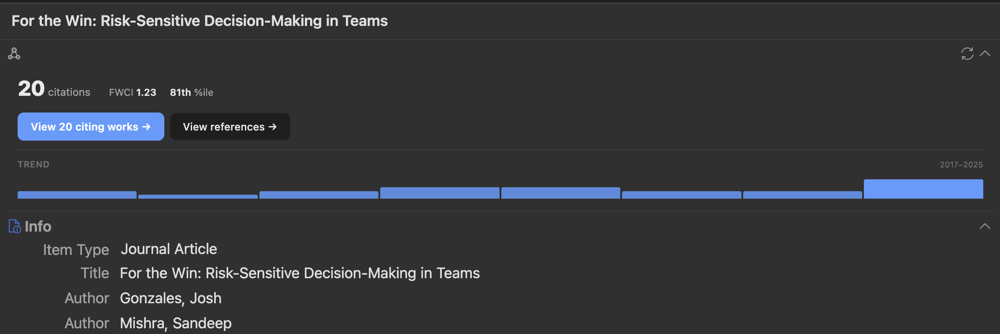
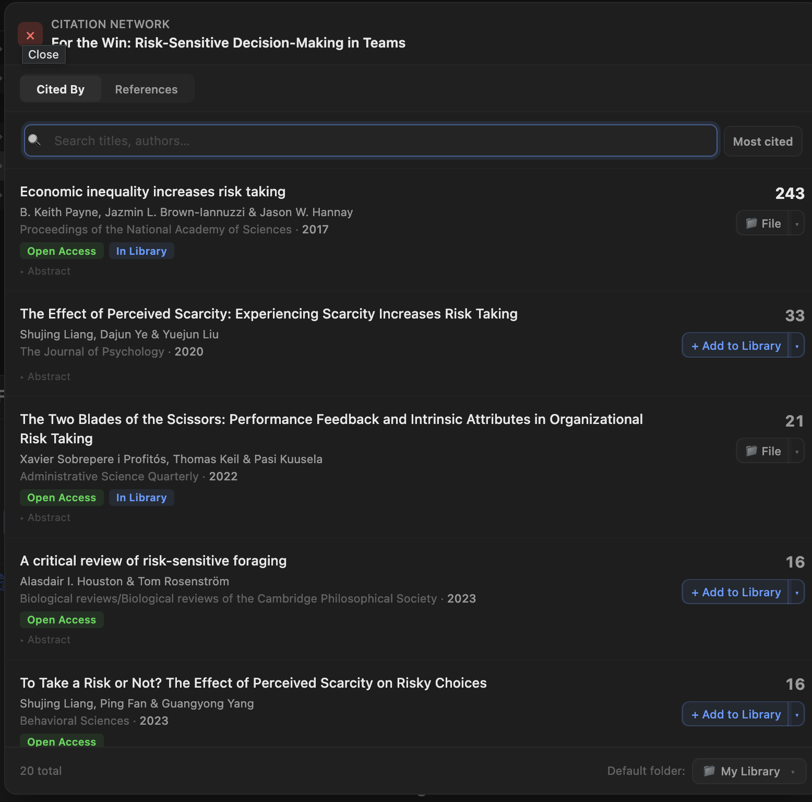

# Summary

Citegeist is a plugin for Zotero 7 that brings citation intelligence directly into the reference manager. For any item with a DOI, Citegeist retrieves data from OpenAlex [@priem2022openalex], a free and open index of over 250 million scholarly works, and displays:

1. **Sortable columns** for citation count, FWCI, and percentile ranking in the item list.
2. A **Citation Intelligence pane** showing contextual metrics — field-weighted citation impact (FWCI), percentile ranking, top 1%/10% badges, and year-over-year citation trends — all explained in plain language within the interface.
3. A **citation network browser** for forward and backward citation chaining, with one-click import of discovered papers into Zotero.

No API key, institutional subscription, or account is required.

# Statement of Need

Citation analysis is a routine part of academic research. Researchers trace how ideas spread by following citation chains forward (who cites this paper?) and backward (what does this paper cite?) — a method known as snowballing [@wohlin2014guidelines]. During tenure cases, grant applications, and hiring decisions, committees examine citation metrics to assess impact. The Leiden Manifesto [@hicks2015leiden] has called for these metrics to be used responsibly, with field-level context rather than raw counts, yet the tools most researchers have access to make contextual comparison difficult.

Raw citation counts alone are misleading across disciplines. Citation norms vary widely between fields [@waltman2016review]: a paper in consumer psychology or marketing with 50 citations may be well above the field average, while the same count in biomedicine may be unremarkable. What researchers need is a field-normalized measure. Field-Weighted Citation Impact (FWCI) provides this by comparing a paper's citation count to the expected average for papers in the same field, year, and document type. An FWCI of 1.0 means exactly the world average; 2.0 means twice the expected citations. Citegeist retrieves FWCI directly from OpenAlex and presents it alongside a percentile ranking (e.g., "85th percentile" means cited more than 85% of comparable papers), making cross-field comparisons immediate and intuitive. Citegeist focuses on article-level metrics; it does not provide author-level indicators (e.g., h-index) or journal-level indicators (e.g., impact factor), which serve different evaluation purposes.

The typical workflow today involves leaving the reference manager, navigating to Web of Science, Scopus, or Google Scholar, searching for each paper individually, and manually recording results. This is especially burdensome during large-scale literature reviews common in fields where review articles are central to the discipline [@palmatier2018review].

Zotero [@zotero] is a widely used free, open-source reference manager, yet it provides no built-in citation metrics. Several existing plugins address parts of this gap, but none combine field-normalized metrics with citation network browsing. \autoref{tab:comparison} summarizes the landscape.

: Comparison of Zotero citation plugins. Only actively maintained plugins with Zotero 7 support are included. \label{tab:comparison}

| Feature | CitationCounts Manager | Citation Tally | Google Scholar Count | scite | Cita | **Citegeist** |
|---|---|---|---|---|---|---|
| Data source | Crossref, Semantic Scholar | Crossref, Semantic Scholar | Google Scholar | scite.ai | Wikidata, OpenAlex | OpenAlex |
| Cost | Free | Free | Free | Paid | Free | Free |
| Raw citation counts | Yes | Yes | Yes | No | No | Yes |
| Sortable FWCI column | No | No | No | No | No | Yes |
| Sortable percentile column | No | No | No | No | No | Yes |
| Citation trend over time | No | No | No | No | No | Yes |
| Citation network browsing | No | No | No | No | Yes (graph) | Yes (list) |
| One-click import to library | No | No | No | No | No | Yes |
| Retraction detection | No | No | No | No | No | Yes |
| Citation context (supporting/contrasting) | No | No | No | Yes | No | No |

Several plugins retrieve raw citation counts: ZoteroCitationCountsManager [@zotero_citationcounts_manager] and zotero-citation-tally [@zotero_citation_tally] use Crossref and Semantic Scholar, while zotero-google-scholar-citation-count [@zotero_google_scholar_count] scrapes Google Scholar with the associated risk of rate limiting and bot detection. These plugins provide counts without field context, offering no way to judge whether a count is high or low for a given discipline. The scite Zotero plugin [@scite_zotero] takes a different approach, classifying citations as supporting, mentioning, or contrasting, but requires a paid subscription and does not provide citation counts or field-normalized metrics. Cita [@zotero_cita] manages citation relationships via Wikidata and visualizes a citation graph, but focuses on metadata curation rather than metrics or literature discovery. The Inciteful plugin [@inciteful_zotero] provides network visualization but launches an external website rather than operating within Zotero.

Citegeist is the only Zotero plugin that combines field-normalized citation metrics with in-Zotero citation network browsing and one-click import. By using OpenAlex — a fully open, free-to-use index — it requires no authentication and no payment. The citation network browser enables the kind of forward and backward citation chaining that is foundational to systematic literature discovery [@wohlin2014guidelines], building on the concept of citation indexing introduced by @garfield1955citation, without leaving Zotero.

# Design

{width="100%"}

{width="80%"}

Citegeist adds three components to Zotero:

**Sortable columns for Citations, FWCI, and Percentile** in the item list display each item's citation count, field-weighted citation impact, and percentile ranking. Clicking any column header sorts the library by that metric, allowing researchers to quickly identify the most-cited or highest-impact papers in a collection. Sorting by FWCI is particularly useful because it surfaces papers that are highly cited relative to their field, rather than papers in high-citation fields.

**A Citation Intelligence pane** appears in the item detail sidebar. It displays the citation count, FWCI (with a plain-language explanation of what the number means), percentile ranking, top 1%/10% badges, and a year-over-year citation trend showing whether a paper's influence is growing or declining.

**A citation network browser** lets researchers explore citing works (forward chaining) and references (backward chaining). Results show title, authors, venue, year, citation count, open-access status, and retraction warnings. Researchers select papers and add them to Zotero with complete metadata in one click. Duplicate detection prevents re-importing items already in the library.

All data is cached in each item's Extra field using namespaced keys (e.g., `Citegeist.citedByCount: 42`), preserving data across sessions and through Zotero Sync.

# Implementation

Citegeist is implemented in TypeScript and built with esbuild. It uses Zotero 7's plugin APIs (`ItemPaneManager` for the sidebar pane, `ItemTreeManager` for the custom column) and communicates with the OpenAlex REST API. To respect rate limits, the plugin performs at most two concurrent requests with 500 ms spacing between batches. Responses are cached locally with a configurable expiration period (default: 7 days). Users can optionally provide an email to access OpenAlex's polite pool for higher rate limits.

It should be noted that FWCI values provided by OpenAlex may differ from those reported by proprietary services such as Scopus or SciVal, because the underlying corpus, field classification, and calculation methodology differ. Citegeist presents OpenAlex's FWCI as provided, without modification.

The plugin is distributed as a standard Zotero `.xpi` file and supports automatic updates via GitHub Releases. Installation requires no command-line tools — researchers download a single file, open it in Zotero, and restart.

The project includes automated tests covering utility functions, OpenAlex response parsing, author formatting, cache read/write logic, and service-layer orchestration (e.g., cache freshness checks), run via Vitest in continuous integration. An integration test validates live communication with the OpenAlex API against a known DOI. Full documentation, including installation instructions and a getting-started guide, is in the project README. Community contribution guidelines are in `CONTRIBUTING.md`.

# Acknowledgements

Citegeist relies on the OpenAlex open bibliometric index. The author thanks the OpenAlex team for providing free, comprehensive access to scholarly metadata and citation data.

# References
